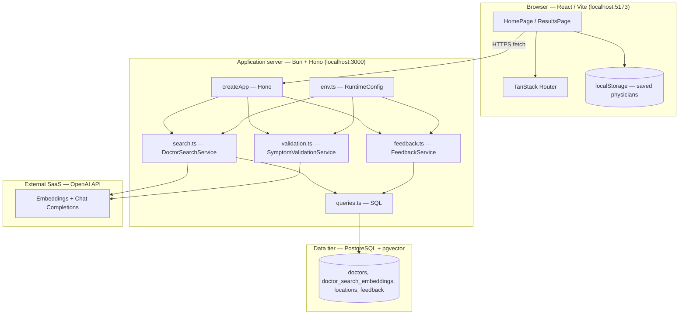

# User Story 1 — Development Specification

**User story:** As a patient seeking care, I want to be matched with the most relevant UPMC physician based on expertise so that I can find the best-qualified doctor for my issue.

**Related issue:** [#1](https://github.com/Yuxiang-Huang/DocSeek/issues/1) (product backlog), documented in [#37](https://github.com/Yuxiang-Huang/DocSeek/issues/37).

---

## Story ownership

| Role | Owner | Notes |
| --- | --- | --- |
| **Primary owner** | acee3 ([@acee3](https://github.com/acee3)) | Story author and Sprint 2 backlog contact (see issue [#37](https://github.com/Yuxiang-Huang/DocSeek/issues/37)); accountable for acceptance criteria and product clarifications. |
| **Secondary owner** | Yuxiang Huang ([@Yuxiang-Huang](https://github.com/Yuxiang-Huang)) | Repository maintainer and engineering lead for DocSeek; accountable for implementation quality and API/client integration for physician matching. |

---

## Merge date on `main`

The physician-matching flow (symptom validation → vector search → LLM re-ranking → results UI) is implemented on `main`. The latest merge to `main` that touched the core User Story 1 paths (`client/src/components/App.tsx`, `api/src/search.ts`, `api/src/queries.ts`) is:

**2026-03-26** (commit `9f25904`, message: *geolocations were never populated for physicians - added data*).

Earlier commits on `main` introduced the embedding search, Hono routes, and results page; this date reflects the last recorded merge affecting those files in the current history.

---

## Architecture diagram

Execution context: the **browser** runs the Vite/React client; the **API** runs on **Bun** (local dev or deploy target); **PostgreSQL** with **pgvector** holds doctor rows and specialty embeddings; **OpenAI** (cloud) provides embeddings, chat-based re-ranking, and symptom-validation completions.



---

## Information flow diagram

Direction of flow shows **what** crosses each boundary (user-entered text, filters, embeddings, ranked doctors, optional geolocation, feedback).

```mermaid
flowchart LR
  subgraph P["Patient / browser"]
    S[symptoms text]
    F[location + accepting-new-patients filters]
    G[browser geolocation optional]
  end

  subgraph C["React client"]
    V[POST /symptoms/validate]
    R[POST /doctors/search]
    FBc[POST /doctors/:id/feedback]
  end

  subgraph A["Bun API"]
    VAL[symptom validation LLM]
    EMB[embedding request]
    SQL[pgvector nearest-neighbor query]
    SORT[LLM re-rank doctor list]
  end

  subgraph O["OpenAI"]
    API[(API)]
  end

  subgraph D["Postgres"]
    PG[(doctor_search_embeddings, doctors, locations)]
    FBt[(feedback table)]
  end

  S --> V
  V --> VAL
  VAL --> API
  API --> VAL
  VAL -->|isDescriptiveEnough + reasoning| C

  S --> R
  F --> R
  R --> EMB
  EMB --> API
  API --> EMB
  EMB --> SQL
  SQL --> PG
  PG -->|DoctorRow[] + match_score + matched_specialty| SORT
  SORT --> API
  API --> SORT
  SORT -->|ordered doctors JSON| C

  G --> C
  C -->|distance display only| C

  FBc --> FBt
```

**Data elements:**

| Data | From | To | Purpose |
| --- | --- | --- | --- |
| Symptoms string | User | API `/symptoms/validate`, `/doctors/search` | Validate descriptiveness; embed for similarity |
| Validation history | Client | API | Multi-turn clarification for vague symptoms |
| Embedding vector | OpenAI | API (then SQL literal) | Nearest-neighbor match against `doctor_search_embeddings` |
| Doctor rows + `match_score`, `matched_specialty`, coordinates | Postgres | API → Client | Ranked list and UI copy |
| Re-ordered doctor IDs | OpenAI chat | API | Expertise-aware ordering on top of vector order |
| Filters (`location`, `onlyAcceptingNewPatients`) | Client | API | SQL `WHERE` clauses |
| Geolocation | Browser | Client only | Haversine distance label on card (not sent to API for search) |
| Feedback (rating, comment) | User | API | Persisted in `feedback` |

---

## Class diagram (types, services, and UI components)

The application is written in **TypeScript** with **functional** modules and **React function components** (no application-level ES6 `classes`). The diagram lists **every interface and type alias** in the User Story 1 flow as UML classes. **Hono** is a framework class. Service types use the `«function type»` stereotype. Types marked `«internal»` are not exported from their module. The API module `search.ts` and the client `App.tsx` each define a type named `SearchFilters`; both appear here as **SearchFiltersApi** and **SearchFiltersClient** so the diagram stays unambiguous.

**Relationships:** TypeScript **intersections** (`A & B`) are modeled as **multiple inheritance** (`--|>`). `SearchHeroProps` is `SearchFormProps` plus extra fields; only the extra fields are listed on `SearchHeroProps`. `ValidateSymptomsOptions` is `SearchDoctorsOptions` plus `history`; only `history` is listed on `ValidateSymptomsOptions`.


---

## Implementation reference: types, modules, and components

Below, **public** means exported from the module; **private** means file-scoped (not exported) or implementation detail inside a closure or component. React components are described with **props** as their public contract and **internal state/handlers** where applicable.

Implementation uses **TypeScript modules** instead of JavaScript `class` declarations; each subsection is one logical unit (comparable to a class for documentation purposes).

---

### `api/src/env.ts` — `RuntimeConfig` and environment loading

**Public**

*Types / configuration (grouped: configuration)*

| Name | Kind | Purpose |
| --- | --- | --- |
| `RuntimeConfig` | type | Holds `port`, `databaseUrl`, `corsAllowedOrigins`, OpenAI key/base URL, and model names for embedding, chat re-ranking, and validation. |

*Functions (grouped: environment)*

| Name | Kind | Purpose |
| --- | --- | --- |
| `loadEnvFile` | function | Optionally reads repo-root `.env` into `process.env` when keys are unset. |
| `getRuntimeConfig` | function | Parses `process.env`, requires `OPENAI_API_KEY`, returns `RuntimeConfig`. |

**Private**

*Constants (grouped: defaults)*

| Name | Purpose |
| --- | --- |
| `DEFAULT_PORT`, `DEFAULT_DATABASE_URL`, `DEFAULT_OPENAI_*` | Default port, Postgres URL, OpenAI base URL and model names when env vars are absent. |

---

### `api/src/search.ts` — embedding search and LLM re-ranking

**Public**

*Types (grouped: domain)*

| Name | Purpose |
| --- | --- |
| `DoctorRow` | API/database row for one physician including `match_score`, `matched_specialty`, coordinates, URLs, and names. |
| `SearchFilters` | Optional `location` substring and `onlyAcceptingNewPatients` flag for SQL filtering. |
| `DoctorSearchService` | Async function type: symptoms + options → `DoctorRow[]`. |

*Functions (grouped: search pipeline)*

| Name | Purpose |
| --- | --- |
| `normalizeSearchLimit` | Coerces `limit` to a default (10), validates positive integer, caps at 50. |
| `formatVectorLiteral` | Formats a number array as a Postgres `vector` literal string for SQL. |
| `requestEmbedding` | Calls OpenAI embeddings API for symptom text; returns embedding vector. |
| `requestDoctorSortFromOpenAI` | Sends symptoms + candidate doctors to chat completion; parses JSON array of doctor IDs to re-order results. |
| `createDoctorSearchService` | Factory: given `SearchRuntimeConfig`, returns a `DoctorSearchService` that embeds, queries SQL, then re-ranks via OpenAI. |

**Private**

*Types (grouped: internal API payloads)*

| Name | Purpose |
| --- | --- |
| `EmbeddingsResponse` | Shape of OpenAI embeddings JSON response. |
| `ChatCompletionResponse` | Shape of OpenAI chat JSON for re-ranking. |
| `SearchDoctorsOptions` | `limit` and `filters` for one search. |
| `SearchDoctorsParams` | `symptoms` plus optional `SearchDoctorsOptions`. |
| `SearchRuntimeConfig` | `databaseUrl` and OpenAI settings used by the service factory (not exported). |

*Constants (grouped: defaults)*

| Name | Purpose |
| --- | --- |
| `DEFAULT_RESULT_LIMIT` | Default result count (10). |

---

### `api/src/queries.ts` — SQL access for vector search

**Public**

*Types (grouped: query filters)*

| Name | Purpose |
| --- | --- |
| `QuerySearchDoctorFilters` | Optional `locationContains` and `onlyAcceptingNewPatients` for typed query helpers (aligned with `SearchFilters` usage in SQL). |

*Functions (grouped: database)*

| Name | Purpose |
| --- | --- |
| `querySearchDoctors` | Runs parameterized SQL: joins `doctor_search_embeddings`, `doctors`, primary `doctor_locations`/`locations`; orders by vector distance; applies location and accepting-new-patients filters; returns `DoctorRow[]`. |

**Private**

_None (all types at module top are exported or inlined in signatures)._

---

### `api/src/index.ts` — HTTP application (`createApp`)

**Public**

*Functions (grouped: HTTP)*

| Name | Purpose |
| --- | --- |
| `createApp` | Constructs a `Hono` app with CORS, `GET /`, `POST /doctors/search`, `POST /doctors/:id/feedback`, `POST /symptoms/validate`; injects search, feedback, and validation services. |

**Private**

*Types (grouped: dependency injection)*

| Name | Purpose |
| --- | --- |
| `AppDependencies` | Optional `port`, services, and CORS origins passed to `createApp`. |

---

### `api/src/validation.ts` — symptom description quality (LLM)

**Public**

*Types (grouped: validation)*

| Name | Purpose |
| --- | --- |
| `SymptomValidationMessage` | Chat message `{ role, content }` for validation history. |
| `SymptomValidationService` | Async function from symptoms (+ optional history) to `SymptomDescriptionAssessment`. |

*Functions (grouped: validation pipeline)*

| Name | Purpose |
| --- | --- |
| `normalizeSymptomAssessment` | Strips/normalizes reasoning when not descriptive enough; supplies default reasoning string when missing. |
| `assessSymptomDescription` | Calls OpenAI chat with JSON schema response for `isDescriptiveEnough` and optional `reasoning`. |
| `createSymptomValidationService` | Factory binding `assessSymptomDescription` to runtime OpenAI config. |

**Private**

*Types (grouped: internal)*

| Name | Purpose |
| --- | --- |
| `SymptomDescriptionAssessment` | `{ isDescriptiveEnough, reasoning? }` parsed from LLM output. |
| `SymptomValidationRuntimeConfig` | OpenAI key, base URL, validation model id. |
| `ChatCompletionsResponse` | OpenAI chat response shape for parsing. |
| `SymptomValidationParams` | `symptoms` and optional `history`. |

*Values / functions (grouped: prompts and parsing)*

| Name | Purpose |
| --- | --- |
| `symptomValidationSystemPrompt` | System prompt instructing the model how strictly to judge descriptions. |
| `extractMessageContent` | Normalizes string or array content from chat response parts to a single string. |

---

### `api/src/feedback.ts` — post-visit feedback persistence

**Public**

*Types (grouped: feedback)*

| Name | Purpose |
| --- | --- |
| `FeedbackService` | Async function inserting feedback for a doctor id. |

*Functions (grouped: feedback)*

| Name | Purpose |
| --- | --- |
| `validateRating` | Ensures rating is integer 1–5. |
| `createFeedbackService` | Factory returning a service that `INSERT`s into `feedback`. |

**Private**

*Types (grouped: internal)*

| Name | Purpose |
| --- | --- |
| `FeedbackParams` | `doctorId`, `rating`, optional `comment`. |
| `FeedbackRuntimeConfig` | `databaseUrl` for `Bun.SQL`. |

---

### `api/src/server.ts` — Bun server entry

**Public**

| Name | Purpose |
| --- | --- |
| Default export object | `{ port, fetch }` for Bun: `fetch` delegates to `createApp(...).fetch`. |

**Private**

_None beyond module-level wiring (`config`, `app`)._

---

### `client/src/components/App.tsx` — search UI, results, API clients

**Public**

*Constants (grouped: configuration)*

| Name | Purpose |
| --- | --- |
| `API_BASE_URL` | Base URL for API calls (from `VITE_API_BASE_URL` or localhost default). |
| `SUGGESTED_SYMPTOMS` | Suggestion chips for the home hero. |

*Types (grouped: domain and API)*

| Name | Purpose |
| --- | --- |
| `Doctor` | Client shape for one physician in the UI (aligned with API `DoctorRow` fields used in the app). |
| `SearchFilters` | Client-side location and accepting-new-patients filters. |
| `DoctorSearchValidation` | Discriminated union for home-page validation outcome (`ok` + normalized string or error message). |
| `SymptomValidationMessage` | Same chat roles as server for validation history. |

*Functions — URL and navigation (grouped: routing)*

| Name | Purpose |
| --- | --- |
| `getDoctorSearchUrl` | Builds `/doctors/search` URL. |
| `getSymptomValidationUrl` | Builds `/symptoms/validate` URL. |
| `getResultsNavigation` | TanStack Router navigation object for `/results` with search params. |

*Functions — normalization and safety (grouped: input)*

| Name | Purpose |
| --- | --- |
| `normalizeSymptoms` | Trims symptom string. |
| `validateSymptomsForDoctorSearch` | Client-side check for non-empty symptoms and emergency phrase heuristic before navigation. |
| `symptomsSuggestEmergencyCare` | Returns true if normalized symptoms contain emergency keywords (heuristic). |

*Functions — doctor display helpers (grouped: presentation)*

| Name | Purpose |
| --- | --- |
| `getNextRecommendationLabel` | Button label for next/previous recommendation. |
| `getFallbackDistanceMiles` | Deterministic pseudo-distance when geolocation or coordinates missing. |
| `direct_to_booking` | Returns profile URL used as booking entry point. |
| `getMatchQualityLabel` | Maps `match_score` to “Strong / Good / Possible” copy. |
| `formatMatchedSpecialties` | Splits `matched_specialty` on `;` for list display. |
| `buildMatchExplanation` | Builds “Why recommended” paragraph from symptoms and specialty. |

*Functions — API clients (grouped: network)*

| Name | Purpose |
| --- | --- |
| `searchDoctors` | `POST /doctors/search` with symptoms and optional filters; returns `Doctor[]`. |
| `validateSymptoms` | `POST /symptoms/validate` with optional history. |
| `resolveSymptomsSubmission` | Orchestrates validation attempts, max attempts, and history updates before allowing navigation. |
| `submitFeedback` | `POST` feedback for a doctor. |

*Components (grouped: layout and pages)*

| Name | Purpose |
| --- | --- |
| `SearchPageShell` | App shell: skip link, optional `AppNav`, background visuals, `#page-content`. |
| `SearchHero` | Brand, headline, `SearchForm`, optional `SearchFiltersForm`, suggestions, emergency alert. |
| `HomePage` | State for symptoms, filters, validation attempts; calls `resolveSymptomsSubmission` and `navigateToResults`. |
| `ResultsPage` | Loads doctors via `searchDoctors`, geolocation, refine filters, `DoctorRecommendationCard` carousel. |
| `ResultsHeader` | Back link, search summary, active filters, title block. |
| `ResultsSearchSummary` | Displays current symptoms string on results. |
| `ResultsActiveFilters` | Shows active filter chips and “Refine filters”. |
| `ResultsRefineFilters` | Inline panel to edit location/accepting and re-navigate. |
| `DoctorRecommendationCard` | Single-doctor card: match explanation, distance, links, `FeedbackForm`, next button. |
| `SearchForm` | Symptoms textarea and submit. |
| `SearchFiltersForm` | Location text and accepting-new-patients checkbox. |
| `EmergencyCareAlert` | Static alert for possible emergency symptoms. |
| `FeedbackForm` | Star rating and comment for the active doctor. |

**Private**

*Types (grouped: props and helpers)*

| Name | Purpose |
| --- | --- |
| `UserLocation` | `{ latitude, longitude }` from `navigator.geolocation`. |
| `DoctorSearchResponse`, `SymptomValidationResponse` | Parsed JSON shapes from API. |
| `SearchDoctorsOptions`, `ValidateSymptomsOptions` | Options for fetch injection and filters. |
| `ValidateSymptomsImplementation`, `ResolveSymptomsSubmissionOptions` | Types for testable validation orchestration. |
| `SearchPageShellProps`, `SearchFormProps`, `SearchHeroProps`, `HomePageProps`, `FeedbackFormProps`, `DoctorRecommendationCardProps`, `ResultsHeaderProps`, `ResultsSearchSummaryProps`, `ResultsActiveFiltersProps`, `ResultsRefineFiltersProps`, `ResultsPageProps` | Component props. |

*Constants (grouped: safety)*

| Name | Purpose |
| --- | --- |
| `EMERGENCY_PHRASES` | Lowercased phrases for heuristic emergency detection. |

*Functions (grouped: internal helpers)*

| Name | Purpose |
| --- | --- |
| `normalizeSymptomsForMatching` | Normalizes apostrophes and spaces for phrase matching. |

*Component internals (grouped: `HomePage`)*

| State/handlers | Purpose |
| --- | --- |
| `symptoms`, `location`, `onlyAcceptingNewPatients`, `errorMessage`, `isValidating`, `validationAttemptCount`, `validationHistory` | React state for form and multi-turn validation. |
| `handleSymptomsChange`, `handleSubmit` | Input change and async submit pipeline. |

*Component internals (grouped: `ResultsPage`)*

| State/effects | Purpose |
| --- | --- |
| `doctors`, `activeDoctorIndex`, `errorMessage`, `isLoading`, refine state, `userLocation` | Results loading, pagination index, geolocation effect, refine panel. |
| `loadDoctors` effect | Calls `searchDoctorsImpl`, handles emergency short-circuit and errors. |

*Component internals (grouped: `FeedbackForm`)*

| State/handlers | Purpose |
| --- | --- |
| `rating`, `comment`, `submitted`, `error`, `handleSubmit` | Local feedback form state and submission. |

---

### `client/src/utils/distance.ts` — haversine distance

**Public**

| Name | Purpose |
| --- | --- |
| `calculateDistance` | Haversine distance in miles between two lat/lon pairs. |
| `formatDistance` | Human-readable distance string (e.g. “X mi away”). |

**Private**

_None._

---

### `client/src/hooks/useSavedPhysicians.ts` — saved doctors hook

**Public**

| Name | Purpose |
| --- | --- |
| `useSavedPhysicians` | Hook returning `savedDoctors`, `addSavedDoctor`, `removeSavedDoctor`, `isSaved`; persists to `localStorage`; listens for `storage` events. |

**Private**

| Name | Purpose |
| --- | --- |
| `STORAGE_KEY` | Key for `localStorage`. |
| `loadSavedDoctors` | Parses saved JSON array safely. |
| `saveDoctors` | Writes JSON array to `localStorage`. |

---

### `client/src/components/AppNav.tsx` — top navigation

**Public**

| Name | Purpose |
| --- | --- |
| `AppNav` | Links to home and saved physicians; shows saved count badge. |

**Private**

_None (uses `useSavedPhysicians` internally)._

---

### `client/src/routes/index.tsx` — home route

**Public**

| Name | Purpose |
| --- | --- |
| `Route` | TanStack file route for `/` exporting `HomeRoute`. |

**Private**

| Name | Purpose |
| --- | --- |
| `HomeRoute` | Wires `HomePage` with `navigate` to results via `getResultsNavigation`. |

---

### `client/src/routes/results.tsx` — results route

**Public**

| Name | Purpose |
| --- | --- |
| `Route` | File route for `/results` with `validateSearch` for query params. |

**Private**

| Name | Purpose |
| --- | --- |
| `ResultsRoutePage` | Maps search params to `ResultsPage` `initialSymptoms` and `initialFilters`. |
| `ResultsSearch` (type) | File-private shape for validated URL search params: `symptoms`, optional `location`, optional `onlyAcceptingNewPatients` (`"true"` string). |

---

## Appendix — Per-type public and private members

Each **type** below is a TypeScript `type` or `interface` (or a function type). Object types have only **public** fields at the type level; there are no TypeScript `private` fields on these shapes. **Function types** are described as a single callable member. **Components** list props as public fields and list internal React state as private where applicable.

### `DoctorRow` (`api/src/search.ts`)

**Public fields (grouped: identity and source)**

| Field | Purpose |
| --- | --- |
| `id` | Primary key for the doctor in the app database. |
| `source_provider_id` | Upstream source system identifier. |
| `npi` | National Provider Identifier when available. |
| `full_name`, `first_name`, `middle_name`, `last_name`, `suffix` | Display and parsing of the physician name. |

**Public fields (grouped: clinical and availability)**

| Field | Purpose |
| --- | --- |
| `primary_specialty` | Declared specialty string for display. |
| `accepting_new_patients` | Whether the provider is marked as accepting new patients. |

**Public fields (grouped: links and location)**

| Field | Purpose |
| --- | --- |
| `profile_url`, `ratings_url`, `book_appointment_url` | UPMC web URLs for profile, ratings, and booking flows. |
| `primary_location`, `primary_phone` | Primary clinic address line and phone. |
| `latitude`, `longitude` | Coordinates from the primary location when populated. |

**Public fields (grouped: search metadata)**

| Field | Purpose |
| --- | --- |
| `created_at` | Row timestamp from the database. |
| `match_score` | Cosine-related similarity score from pgvector (exposed as `1 - distance`). |
| `matched_specialty` | Text from the embedding row describing the matched specialty facet. |

**Public methods:** none (data only).

**Private fields / methods:** none at the type level.

---

### `Doctor` (`client/src/components/App.tsx`)

**Public fields (grouped: UI-facing physician)**

| Field | Purpose |
| --- | --- |
| `id`, `full_name`, `primary_specialty`, `accepting_new_patients` | Core card identity and specialty line. |
| `profile_url`, `book_appointment_url`, `primary_location`, `primary_phone` | Links and contact/locale for the card. |
| `match_score`, `matched_specialty` | Match strength and embedding specialty line for explanations. |
| `latitude`, `longitude` | Optional coordinates for distance when geolocation is available. |

**Public methods:** none.

**Private fields / methods:** none at the type level.

---

### `SearchFiltersApi` (`api/src/search.ts`, exported as `SearchFilters`)

**Public fields (grouped: SQL filters)**

| Field | Purpose |
| --- | --- |
| `location` | Optional substring for `primary_location ILIKE`. |
| `onlyAcceptingNewPatients` | When true, restricts to accepting doctors. |

**Public methods:** none.

**Private fields / methods:** none.

---

### `SearchFiltersClient` (`client/src/components/App.tsx`, exported as `SearchFilters`)

**Public fields (grouped: UI filters)**

| Field | Purpose |
| --- | --- |
| `location` | Optional user-entered location hint sent to the API. |
| `onlyAcceptingNewPatients` | Optional flag sent to the API. |

**Public methods:** none.

**Private fields / methods:** none.

---

### `DoctorSearchService` (function type, `api/src/search.ts`)

**Public methods (grouped: service)**

| Member | Purpose |
| --- | --- |
| `(params: SearchDoctorsParams) => Promise<DoctorRow[]>` | Runs embedding, SQL retrieval, and LLM re-ranking for one search. |

**Public fields:** none.

**Private fields / methods:** none (type is not a class instance).

---

### `SearchDoctorsParams` (`api/src/search.ts`, internal)

**Public fields**

| Field | Purpose |
| --- | --- |
| `symptoms` | Patient symptom text to embed and rank against. |
| `options` | Optional limit and filters. |

**Private fields / methods:** none.

---

### `SearchDoctorsOptionsApi` (`api/src/search.ts`, internal)

**Public fields**

| Field | Purpose |
| --- | --- |
| `limit` | Max rows to fetch from SQL before re-ranking. |
| `filters` | Optional `SearchFiltersApi`. |

**Private fields / methods:** none.

---

### `SearchRuntimeConfig`, `EmbeddingsResponse`, `ChatCompletionResponseSearch` (`api/src/search.ts`, internal)

**`SearchRuntimeConfig` public fields:** `databaseUrl`, `openAiApiKey`, `openAiBaseUrl`, `openAiEmbeddingModel`, `openAiChatModel` — configuration for the search service factory and HTTP calls.

**`EmbeddingsResponse` public fields:** `data` — array of `{ embedding, index }` from OpenAI.

**`ChatCompletionResponseSearch` public fields:** `choices` — chat completion payload for doctor re-ordering.

**Private fields / methods:** none at type level.

---

### `QuerySearchDoctorFilters` (`api/src/queries.ts`)

**Public fields**

| Field | Purpose |
| --- | --- |
| `locationContains` | Documented filter shape (query uses `SearchFilters` from `search.ts` in practice). |
| `onlyAcceptingNewPatients` | Parallel optional filter flag. |

**Private fields / methods:** none.

---

### `AppDependencies` (`api/src/index.ts`, internal)

**Public fields (grouped: DI)**

| Field | Purpose |
| --- | --- |
| `port` | Optional port for health JSON display. |
| `searchService`, `feedbackService`, `symptomValidationService` | Injected services for routes. |
| `corsAllowedOrigins` | Allowed browser origins for CORS. |

**Public methods:** none.

**Private fields / methods:** none.

---

### `Hono` (framework, `hono`)

**Public methods (grouped: HTTP app):** `constructor`, `use`, `get`, `post`, `fetch` — standard Hono API used by `createApp`.

**Private:** implementation is library-internal.

---

### `SymptomDescriptionAssessment`, `SymptomValidationMessageApi`, `SymptomValidationParams`, `SymptomValidationRuntimeConfig`, `ChatCompletionResponseValidation` (`api/src/validation.ts`)

**`SymptomDescriptionAssessment` (internal) public fields:** `isDescriptiveEnough`, optional `reasoning`.

**`SymptomValidationMessageApi` public fields:** `role` (`"user"` \| `"assistant"`), `content`.

**`SymptomValidationParams` public fields:** `symptoms`, optional `history` of `SymptomValidationMessageApi`.

**`SymptomValidationRuntimeConfig` public fields:** OpenAI key, base URL, validation model id.

**`ChatCompletionResponseValidation` public fields:** `choices` with `message.content` string or structured parts.

**Private fields / methods:** none at type level.

---

### `SymptomValidationService` (function type, `api/src/validation.ts`)

**Public methods:** `(params: SymptomValidationParams) => Promise<SymptomDescriptionAssessment>` — validates whether symptom text is specific enough.

**Public fields:** none.

---

### `FeedbackParams`, `FeedbackRuntimeConfig` (`api/src/feedback.ts`, internal)

**`FeedbackParams` public fields:** `doctorId`, `rating`, optional `comment`.

**`FeedbackRuntimeConfig` public fields:** `databaseUrl`.

---

### `FeedbackService` (function type, `api/src/feedback.ts`)

**Public methods:** `(params: FeedbackParams) => Promise<void>` — persists feedback.

---

### `RuntimeConfig` (`api/src/env.ts`)

**Public fields (grouped: server and AI):** `port`, `databaseUrl`, `corsAllowedOrigins`, `openAiApiKey`, `openAiBaseUrl`, `openAiEmbeddingModel`, `openAiChatModel`, `openAiValidationModel`.

**Public methods:** none on the type (loading uses `getRuntimeConfig` at module level).

---

### `UserLocation`, `DoctorSearchResponse`, `SymptomValidationResponse`, `SearchDoctorsOptionsClient` (`client/src/components/App.tsx`, internal)

**`UserLocation` public fields:** `latitude`, `longitude`.

**`DoctorSearchResponse` public fields:** `doctors` — array of `Doctor`.

**`SymptomValidationResponse` public fields:** `isDescriptiveEnough`, optional `reasoning`.

**`SearchDoctorsOptionsClient` public fields:** optional `apiBaseUrl`, `fetchImpl`, `filters` (`SearchFiltersClient`).

---

### `SearchFiltersFormProps`, `SearchPageShellProps`, `SearchFormProps`, `SearchHeroProps`, `HomePageProps`, `DoctorRecommendationCardProps`, `ResultsHeaderProps`, `ResultsSearchSummaryProps`, `ResultsActiveFiltersProps`, `ResultsRefineFiltersProps`, `ResultsPageProps`, `FeedbackFormProps` (`client/src/components/App.tsx`, internal)

These are **React props** types (all fields are required unless optional `?` in source).

**`SearchFiltersFormProps`:** `location`, `onlyAcceptingNewPatients`, `onLocationChange`, `onOnlyAcceptingChange`.

**`SearchPageShellProps`:** `children`, optional `showNav`.

**`SearchFormProps`:** `symptoms`, `onSymptomsChange`, `onSubmit`, optional `isLoading`, optional `validationMessage`.

**`SearchHeroProps`:** all `SearchFormProps` fields plus optional `errorMessage` and optional `filters` (`SearchFiltersFormProps`).

**`HomePageProps`:** `navigateToResults(symptoms, filters?)`.

**`DoctorRecommendationCardProps`:** `doctors`, `activeDoctorIndex`, `onNextDoctor`, optional `symptoms`, optional `isSaved`, optional `onSave` / `onUnsave`, `userLocation`.

**`ResultsHeaderProps`:** optional `includeBackLink`, `initialSymptoms`, optional `activeFilters`, optional `onRefineFilters`.

**`ResultsSearchSummaryProps`:** `symptoms`.

**`ResultsActiveFiltersProps`:** `filters`, `onRefine`.

**`ResultsRefineFiltersProps`:** `location`, `onlyAcceptingNewPatients`, change handlers, `onApply`, `onCancel`, `isRefining`.

**`ResultsPageProps`:** `initialSymptoms`, optional `initialFilters`, optional `searchDoctorsImpl`, optional `includeBackLink`.

**`FeedbackFormProps`:** `doctorId`, optional `submitFeedbackImpl`.

**Private fields / methods:** none on the props types themselves; component **implementations** use internal state (see module sections above).

---

### `ValidateSymptomsOptions`, `ValidateSymptomsImplementation`, `ResolveSymptomsSubmissionOptions` (`client/src/components/App.tsx`, internal)

**`ValidateSymptomsOptions`:** intersection of `SearchDoctorsOptionsClient` with optional `history` (`SymptomValidationMessageClient[]`).

**`ValidateSymptomsImplementation`:** function type `(symptoms, options?) => Promise<SymptomValidationResponse>`.

**`ResolveSymptomsSubmissionOptions`:** optional `attemptCount`, `maxValidationAttempts`, `validationHistory`, `validateSymptomsImpl`.

---

### `DoctorSearchValidation` (`client/src/components/App.tsx`, exported union)

**Public fields (grouped: variants)**

| Variant | Fields |
| --- | --- |
| Success | `ok: true`, `normalized: string` |
| Failure | `ok: false`, `message: string` |

---

### `SymptomValidationMessageClient` (`client/src/components/App.tsx`, exported)

**Public fields:** `role` (`"user"` \| `"assistant"`), `content` — mirrors server validation messages for multi-turn UI state.

---

### `ResultsSearch` (`client/src/routes/results.tsx`, internal)

**Public fields:** `symptoms`, optional `location`, optional `onlyAcceptingNewPatients` (string `"true"` when set).

---

## Summary

This specification documents **User Story 1** as implemented: patients enter symptoms (with optional filters), the API validates descriptiveness via OpenAI, embeds symptoms and retrieves nearest UPMC doctors from **pgvector**, re-ranks with an **OpenAI chat** call for expertise alignment, and the **React** results experience presents ranked physicians with match explanations, optional distance, and feedback. Primary ownership is **acee3** with secondary **Yuxiang Huang**; the referenced merge activity on core files is dated **2026-03-26** as above.
