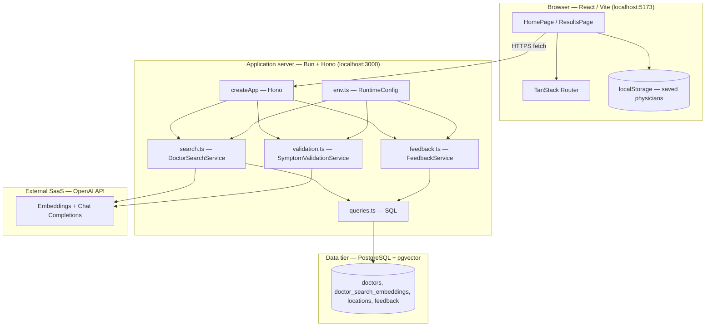
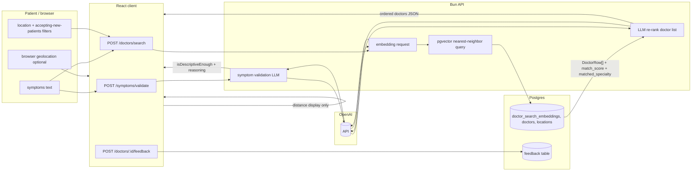

# User Story 1 — Development Specification

**User story:** As a patient seeking care, I want to be matched with the most relevant UPMC physician based on expertise so that I can find the best-qualified doctor for my issue.

**Related issue:** [#1](https://github.com/Yuxiang-Huang/DocSeek/issues/1) (product backlog), documented in [#37](https://github.com/Yuxiang-Huang/DocSeek/issues/37).

---

## Story ownership

| Role | Owner | Notes |
| --- | --- | --- |
| **Primary owner** | acee3 ([@acee3](https://github.com/acee3)) | Story author and Sprint 2 backlog contact (see issue [#37](https://github.com/Yuxiang-Huang/DocSeek/issues/37)); accountable for acceptance criteria and product clarifications. |
| **Secondary owner** | Yuxiang Huang ([@Yuxiang-Huang](https://github.com/Yuxiang-Huang)) | Repository maintainer and engineering lead for DocSeek; accountable for implementation quality and API/client integration for physician matching. |

---

## Merge date on `main`

The physician-matching flow (symptom validation → vector search → LLM re-ranking → results UI) is implemented on `main`. The latest merge to `main` that touched the core User Story 1 paths (`client/src/components/App.tsx`, `api/src/search.ts`, `api/src/queries.ts`) is:

**2026-03-26** (commit `9f25904`, message: *geolocations were never populated for physicians - added data*).

Earlier commits on `main` introduced the embedding search, Hono routes, and results page; this date reflects the last recorded merge affecting those files in the current history.

---

## Architecture diagram

Execution context: the **browser** runs the Vite/React client; the **API** runs on **Bun** (local dev or deploy target); **PostgreSQL** with **pgvector** holds doctor rows and specialty embeddings; **OpenAI** (cloud) provides embeddings, chat-based re-ranking, and symptom-validation completions.

---

## Information flow diagram

Direction of flow shows **what** crosses each boundary (user-entered text, filters, embeddings, ranked doctors, optional geolocation, feedback).

**Data elements:**

| Data | From | To | Purpose |
| --- | --- | --- | --- |
| Symptoms string | User | API `/symptoms/validate`, `/doctors/search` | Validate descriptiveness; embed for similarity |
| Validation history | Client | API | Multi-turn clarification for vague symptoms |
| Embedding vector | OpenAI | API (then SQL literal) | Nearest-neighbor match against `doctor_search_embeddings` |
| Doctor rows + `match_score`, `matched_specialty`, coordinates | Postgres | API → Client | Ranked list and UI copy |
| Re-ordered doctor IDs | OpenAI chat | API | Expertise-aware ordering on top of vector order |
| Filters (`location`, `onlyAcceptingNewPatients`) | Client | API | SQL `WHERE` clauses |
| Geolocation | Browser | Client only | Haversine distance label on card (not sent to API for search) |
| Feedback (rating, comment) | User | API | Persisted in `feedback` |

---

## Class diagram (types, services, and UI components)

The application is written in **TypeScript** with **functional** modules and **React function components** (no application-level ES6 `classes`). The diagram lists **every interface and type alias** in the User Story 1 flow as UML classes. **Hono** is a framework class. Service types use the `«function type»` stereotype. Types marked `«internal»` are not exported from their module. The API module `search.ts` and the client `App.tsx` each define a type named `SearchFilters`; both appear here as **SearchFiltersApi** and **SearchFiltersClient** so the diagram stays unambiguous.

**Relationships:** TypeScript **intersections** (`A & B`) are modeled as **multiple inheritance** (`--|>`). `SearchHeroProps` is `SearchFormProps` plus extra fields; only the extra fields are listed on `SearchHeroProps`. `ValidateSymptomsOptions` is `SearchDoctorsOptions` plus `history`; only `history` is listed on `ValidateSymptomsOptions`.

```mermaid
classDiagram
  direction TB

  class Hono {
    +constructor()
    +use()
    +get()
    +post()
    +fetch()
  }

  class DoctorRow {
    <<api payload>>
  }

  class Doctor {
    <<client model>>
  }

  class SearchFiltersApi {
    <<api search.ts>>
  }

  class SearchFiltersClient {
    <<client App.tsx>>
  }

  class DoctorSearchService {
    <<function type>>
  }

  class SearchDoctorsParams {
    <<internal api>>
  }

  class SearchDoctorsOptionsApi {
    <<internal api>>
  }

  class SearchRuntimeConfig {
    <<internal api>>
  }

  class EmbeddingsResponse {
    <<internal api>>
  }

  class ChatCompletionResponseSearch {
    <<internal api search.ts>>
  }

  class QuerySearchDoctorFilters {
    <<api queries.ts>>
  }

  class AppDependencies {
    <<internal api index.ts>>
  }

  class SymptomDescriptionAssessment {
    <<internal validation.ts>>
  }

  class SymptomValidationMessageApi {
    <<api validation.ts>>
  }

  class SymptomValidationMessageClient {
    <<client App.tsx>>
  }

  class SymptomValidationRuntimeConfig {
    <<internal validation.ts>>
  }

  class SymptomValidationParams {
    <<internal validation.ts>>
  }

  class ChatCompletionResponseValidation {
    <<internal validation.ts>>
  }

  class SymptomValidationService {
    <<function type>>
  }

  class FeedbackParams {
    <<internal feedback.ts>>
  }

  class FeedbackRuntimeConfig {
    <<internal feedback.ts>>
  }

  class FeedbackService {
    <<function type>>
  }

  class RuntimeConfig {
    <<api env.ts>>
  }

  class UserLocation {
    <<internal client>>
  }

  class DoctorSearchResponse {
    <<internal client>>
  }

  class SymptomValidationResponse {
    <<internal client>>
  }

  class SearchDoctorsOptionsClient {
    <<internal client>>
  }

  class SearchFiltersFormProps {
    <<client props>>
  }

  class ValidateSymptomsOptions {
    <<internal client>>
  }

  class ValidateSymptomsImplementation {
    <<function type>>
  }

  class ResolveSymptomsSubmissionOptions {
    <<internal client>>
  }

  class SearchPageShellProps {
    <<client props>>
  }

  class SearchFormProps {
    <<client props>>
  }

  class SearchHeroProps {
    <<client props>>
    +errorMessage optional
    +filters optional
  }

  class HomePageProps {
    <<client props>>
  }

  class DoctorRecommendationCardProps {
    <<client props>>
  }

  class ResultsHeaderProps {
    <<client props>>
  }

  class ResultsSearchSummaryProps {
    <<client props>>
  }

  class ResultsActiveFiltersProps {
    <<client props>>
  }

  class ResultsRefineFiltersProps {
    <<client props>>
  }

  class ResultsPageProps {
    <<client props>>
  }

  class DoctorSearchValidation {
    <<client union type>>
  }

  class FeedbackFormProps {
    <<client props>>
  }

  class ResultsSearch {
    <<client routes results.tsx>>
  }

  Hono <-- AppDependencies : createApp
  DoctorSearchService ..> DoctorRow
  DoctorSearchResponse --> Doctor
  Doctor ..> DoctorRow
  SymptomValidationService ..> SymptomDescriptionAssessment
  SymptomValidationParams --> SymptomValidationMessageApi
  FeedbackService ..> FeedbackParams
  SearchHeroProps --|> SearchFormProps
  ValidateSymptomsOptions --|> SearchDoctorsOptionsClient
  SymptomValidationMessageApi .. SymptomValidationMessageClient : same structure
```

---

## Implementation reference: types, modules, and components

Below, **public** means exported from the module; **private** means file-scoped (not exported) or implementation detail inside a closure or component. React components are described with **props** as their public contract and **internal state/handlers** where applicable.

Implementation uses **TypeScript modules** instead of JavaScript `class` declarations; each subsection is one logical unit (comparable to a class for documentation purposes).

---

### `api/src/env.ts` — `RuntimeConfig` and environment loading

**Public**

*Types / configuration (grouped: configuration)*

| Name | Kind | Purpose |
| --- | --- | --- |
| `RuntimeConfig` | type | Holds `port`, `databaseUrl`, `corsAllowedOrigins`, OpenAI key/base URL, and model names for embedding, chat re-ranking, and validation. |

*Functions (grouped: environment)*

| Name | Kind | Purpose |
| --- | --- | --- |
| `loadEnvFile` | function | Optionally reads repo-root `.env` into `process.env` when keys are unset. |
| `getRuntimeConfig` | function | Parses `process.env`, requires `OPENAI_API_KEY`, returns `RuntimeConfig`. |

**Private**

*Constants (grouped: defaults)*

| Name | Purpose |
| --- | --- |
| `DEFAULT_PORT`, `DEFAULT_DATABASE_URL`, `DEFAULT_OPENAI_*` | Default port, Postgres URL, OpenAI base URL and model names when env vars are absent. |

---

### `api/src/search.ts` — embedding search and LLM re-ranking

**Public**

*Types (grouped: domain)*

| Name | Purpose |
| --- | --- |
| `DoctorRow` | API/database row for one physician including `match_score`, `matched_specialty`, coordinates, URLs, and names. |
| `SearchFilters` | Optional `location` substring and `onlyAcceptingNewPatients` flag for SQL filtering. |
| `DoctorSearchService` | Async function type: symptoms + options → `DoctorRow[]`. |

*Functions (grouped: search pipeline)*

| Name | Purpose |
| --- | --- |
| `normalizeSearchLimit` | Coerces `limit` to a default (10), validates positive integer, caps at 50. |
| `formatVectorLiteral` | Formats a number array as a Postgres `vector` literal string for SQL. |
| `requestEmbedding` | Calls OpenAI embeddings API for symptom text; returns embedding vector. |
| `requestDoctorSortFromOpenAI` | Sends symptoms + candidate doctors to chat completion; parses JSON array of doctor IDs to re-order results. |
| `createDoctorSearchService` | Factory: given `SearchRuntimeConfig`, returns a `DoctorSearchService` that embeds, queries SQL, then re-ranks via OpenAI. |

**Private**

*Types (grouped: internal API payloads)*

| Name | Purpose |
| --- | --- |
| `EmbeddingsResponse` | Shape of OpenAI embeddings JSON response. |
| `ChatCompletionResponse` | Shape of OpenAI chat JSON for re-ranking. |
| `SearchDoctorsOptions` | `limit` and `filters` for one search. |
| `SearchDoctorsParams` | `symptoms` plus optional `SearchDoctorsOptions`. |
| `SearchRuntimeConfig` | `databaseUrl` and OpenAI settings used by the service factory (not exported). |

*Constants (grouped: defaults)*

| Name | Purpose |
| --- | --- |
| `DEFAULT_RESULT_LIMIT` | Default result count (10). |

---

### `api/src/queries.ts` — SQL access for vector search

**Public**

*Types (grouped: query filters)*

| Name | Purpose |
| --- | --- |
| `QuerySearchDoctorFilters` | Optional `locationContains` and `onlyAcceptingNewPatients` for typed query helpers (aligned with `SearchFilters` usage in SQL). |

*Functions (grouped: database)*

| Name | Purpose |
| --- | --- |
| `querySearchDoctors` | Runs parameterized SQL: joins `doctor_search_embeddings`, `doctors`, primary `doctor_locations`/`locations`; orders by vector distance; applies location and accepting-new-patients filters; returns `DoctorRow[]`. |

**Private**

_None (all types at module top are exported or inlined in signatures)._

---

### `api/src/index.ts` — HTTP application (`createApp`)

**Public**

*Functions (grouped: HTTP)*

| Name | Purpose |
| --- | --- |
| `createApp` | Constructs a `Hono` app with CORS, `GET /`, `POST /doctors/search`, `POST /doctors/:id/feedback`, `POST /symptoms/validate`; injects search, feedback, and validation services. |

**Private**

*Types (grouped: dependency injection)*

| Name | Purpose |
| --- | --- |
| `AppDependencies` | Optional `port`, services, and CORS origins passed to `createApp`. |

---

### `api/src/validation.ts` — symptom description quality (LLM)

**Public**

*Types (grouped: validation)*

| Name | Purpose |
| --- | --- |
| `SymptomValidationMessage` | Chat message `{ role, content }` for validation history. |
| `SymptomValidationService` | Async function from symptoms (+ optional history) to `SymptomDescriptionAssessment`. |

*Functions (grouped: validation pipeline)*

| Name | Purpose |
| --- | --- |
| `normalizeSymptomAssessment` | Strips/normalizes reasoning when not descriptive enough; supplies default reasoning string when missing. |
| `assessSymptomDescription` | Calls OpenAI chat with JSON schema response for `isDescriptiveEnough` and optional `reasoning`. |
| `createSymptomValidationService` | Factory binding `assessSymptomDescription` to runtime OpenAI config. |

**Private**

*Types (grouped: internal)*

| Name | Purpose |
| --- | --- |
| `SymptomDescriptionAssessment` | `{ isDescriptiveEnough, reasoning? }` parsed from LLM output. |
| `SymptomValidationRuntimeConfig` | OpenAI key, base URL, validation model id. |
| `ChatCompletionsResponse` | OpenAI chat response shape for parsing. |
| `SymptomValidationParams` | `symptoms` and optional `history`. |

*Values / functions (grouped: prompts and parsing)*

| Name | Purpose |
| --- | --- |
| `symptomValidationSystemPrompt` | System prompt instructing the model how strictly to judge descriptions. |
| `extractMessageContent` | Normalizes string or array content from chat response parts to a single string. |

---

### `api/src/feedback.ts` — post-visit feedback persistence

**Public**

*Types (grouped: feedback)*

| Name | Purpose |
| --- | --- |
| `FeedbackService` | Async function inserting feedback for a doctor id. |

*Functions (grouped: feedback)*

| Name | Purpose |
| --- | --- |
| `validateRating` | Ensures rating is integer 1–5. |
| `createFeedbackService` | Factory returning a service that `INSERT`s into `feedback`. |

**Private**

*Types (grouped: internal)*

| Name | Purpose |
| --- | --- |
| `FeedbackParams` | `doctorId`, `rating`, optional `comment`. |
| `FeedbackRuntimeConfig` | `databaseUrl` for `Bun.SQL`. |

---

### `api/src/server.ts` — Bun server entry

**Public**

| Name | Purpose |
| --- | --- |
| Default export object | `{ port, fetch }` for Bun: `fetch` delegates to `createApp(...).fetch`. |

**Private**

_None beyond module-level wiring (`config`, `app`)._

---

### `client/src/components/App.tsx` — search UI, results, API clients

**Public**

*Constants (grouped: configuration)*

| Name | Purpose |
| --- | --- |
| `API_BASE_URL` | Base URL for API calls (from `VITE_API_BASE_URL` or localhost default). |
| `SUGGESTED_SYMPTOMS` | Suggestion chips for the home hero. |

*Types (grouped: domain and API)*

| Name | Purpose |
| --- | --- |
| `Doctor` | Client shape for one physician in the UI (aligned with API `DoctorRow` fields used in the app). |
| `SearchFilters` | Client-side location and accepting-new-patients filters. |
| `DoctorSearchValidation` | Discriminated union for home-page validation outcome (`ok` + normalized string or error message). |
| `SymptomValidationMessage` | Same chat roles as server for validation history. |

*Functions — URL and navigation (grouped: routing)*

| Name | Purpose |
| --- | --- |
| `getDoctorSearchUrl` | Builds `/doctors/search` URL. |
| `getSymptomValidationUrl` | Builds `/symptoms/validate` URL. |
| `getResultsNavigation` | TanStack Router navigation object for `/results` with search params. |

*Functions — normalization and safety (grouped: input)*

| Name | Purpose |
| --- | --- |
| `normalizeSymptoms` | Trims symptom string. |
| `validateSymptomsForDoctorSearch` | Client-side check for non-empty symptoms and emergency phrase heuristic before navigation. |
| `symptomsSuggestEmergencyCare` | Returns true if normalized symptoms contain emergency keywords (heuristic). |

*Functions — doctor display helpers (grouped: presentation)*

| Name | Purpose |
| --- | --- |
| `getNextRecommendationLabel` | Button label for next/previous recommendation. |
| `getFallbackDistanceMiles` | Deterministic pseudo-distance when geolocation or coordinates missing. |
| `direct_to_booking` | Returns profile URL used as booking entry point. |
| `getMatchQualityLabel` | Maps `match_score` to “Strong / Good / Possible” copy. |
| `formatMatchedSpecialties` | Splits `matched_specialty` on `;` for list display. |
| `buildMatchExplanation` | Builds “Why recommended” paragraph from symptoms and specialty. |

*Functions — API clients (grouped: network)*

| Name | Purpose |
| --- | --- |
| `searchDoctors` | `POST /doctors/search` with symptoms and optional filters; returns `Doctor[]`. |
| `validateSymptoms` | `POST /symptoms/validate` with optional history. |
| `resolveSymptomsSubmission` | Orchestrates validation attempts, max attempts, and history updates before allowing navigation. |
| `submitFeedback` | `POST` feedback for a doctor. |

*Components (grouped: layout and pages)*

| Name | Purpose |
| --- | --- |
| `SearchPageShell` | App shell: skip link, optional `AppNav`, background visuals, `#page-content`. |
| `SearchHero` | Brand, headline, `SearchForm`, optional `SearchFiltersForm`, suggestions, emergency alert. |
| `HomePage` | State for symptoms, filters, validation attempts; calls `resolveSymptomsSubmission` and `navigateToResults`. |
| `ResultsPage` | Loads doctors via `searchDoctors`, geolocation, refine filters, `DoctorRecommendationCard` carousel. |
| `ResultsHeader` | Back link, search summary, active filters, title block. |
| `ResultsSearchSummary` | Displays current symptoms string on results. |
| `ResultsActiveFilters` | Shows active filter chips and “Refine filters”. |
| `ResultsRefineFilters` | Inline panel to edit location/accepting and re-navigate. |
| `DoctorRecommendationCard` | Single-doctor card: match explanation, distance, links, `FeedbackForm`, next button. |
| `SearchForm` | Symptoms textarea and submit. |
| `SearchFiltersForm` | Location text and accepting-new-patients checkbox. |
| `EmergencyCareAlert` | Static alert for possible emergency symptoms. |
| `FeedbackForm` | Star rating and comment for the active doctor. |

**Private**

*Types (grouped: props and helpers)*

| Name | Purpose |
| --- | --- |
| `UserLocation` | `{ latitude, longitude }` from `navigator.geolocation`. |
| `DoctorSearchResponse`, `SymptomValidationResponse` | Parsed JSON shapes from API. |
| `SearchDoctorsOptions`, `ValidateSymptomsOptions` | Options for fetch injection and filters. |
| `ValidateSymptomsImplementation`, `ResolveSymptomsSubmissionOptions` | Types for testable validation orchestration. |
| `SearchPageShellProps`, `SearchFormProps`, `SearchHeroProps`, `HomePageProps`, `FeedbackFormProps`, `DoctorRecommendationCardProps`, `ResultsHeaderProps`, `ResultsSearchSummaryProps`, `ResultsActiveFiltersProps`, `ResultsRefineFiltersProps`, `ResultsPageProps` | Component props. |

*Constants (grouped: safety)*

| Name | Purpose |
| --- | --- |
| `EMERGENCY_PHRASES` | Lowercased phrases for heuristic emergency detection. |

*Functions (grouped: internal helpers)*

| Name | Purpose |
| --- | --- |
| `normalizeSymptomsForMatching` | Normalizes apostrophes and spaces for phrase matching. |

*Component internals (grouped: `HomePage`)*

| State/handlers | Purpose |
| --- | --- |
| `symptoms`, `location`, `onlyAcceptingNewPatients`, `errorMessage`, `isValidating`, `validationAttemptCount`, `validationHistory` | React state for form and multi-turn validation. |
| `handleSymptomsChange`, `handleSubmit` | Input change and async submit pipeline. |

*Component internals (grouped: `ResultsPage`)*

| State/effects | Purpose |
| --- | --- |
| `doctors`, `activeDoctorIndex`, `errorMessage`, `isLoading`, refine state, `userLocation` | Results loading, pagination index, geolocation effect, refine panel. |
| `loadDoctors` effect | Calls `searchDoctorsImpl`, handles emergency short-circuit and errors. |

*Component internals (grouped: `FeedbackForm`)*

| State/handlers | Purpose |
| --- | --- |
| `rating`, `comment`, `submitted`, `error`, `handleSubmit` | Local feedback form state and submission. |

---

### `client/src/utils/distance.ts` — haversine distance

**Public**

| Name | Purpose |
| --- | --- |
| `calculateDistance` | Haversine distance in miles between two lat/lon pairs. |
| `formatDistance` | Human-readable distance string (e.g. “X mi away”). |

**Private**

_None._

---

### `client/src/hooks/useSavedPhysicians.ts` — saved doctors hook

**Public**

| Name | Purpose |
| --- | --- |
| `useSavedPhysicians` | Hook returning `savedDoctors`, `addSavedDoctor`, `removeSavedDoctor`, `isSaved`; persists to `localStorage`; listens for `storage` events. |

**Private**

| Name | Purpose |
| --- | --- |
| `STORAGE_KEY` | Key for `localStorage`. |
| `loadSavedDoctors` | Parses saved JSON array safely. |
| `saveDoctors` | Writes JSON array to `localStorage`. |

---

### `client/src/components/AppNav.tsx` — top navigation

**Public**

| Name | Purpose |
| --- | --- |
| `AppNav` | Links to home and saved physicians; shows saved count badge. |

**Private**

_None (uses `useSavedPhysicians` internally)._

---

### `client/src/routes/index.tsx` — home route

**Public**

| Name | Purpose |
| --- | --- |
| `Route` | TanStack file route for `/` exporting `HomeRoute`. |

**Private**

| Name | Purpose |
| --- | --- |
| `HomeRoute` | Wires `HomePage` with `navigate` to results via `getResultsNavigation`. |

---

### `client/src/routes/results.tsx` — results route

**Public**

| Name | Purpose |
| --- | --- |
| `Route` | File route for `/results` with `validateSearch` for query params. |

**Private**

| Name | Purpose |
| --- | --- |
| `ResultsRoutePage` | Maps search params to `ResultsPage` `initialSymptoms` and `initialFilters`. |
| `ResultsSearch` (type) | File-private shape for validated URL search params: `symptoms`, optional `location`, optional `onlyAcceptingNewPatients` (`"true"` string). |

---

## Appendix — Per-type public and private members

Each **type** below is a TypeScript `type` or `interface` (or a function type). Object types have only **public** fields at the type level; there are no TypeScript `private` fields on these shapes. **Function types** are described as a single callable member. **Components** list props as public fields and list internal React state as private where applicable.

### `DoctorRow` (`api/src/search.ts`)

**Public fields (grouped: identity and source)**

| Field | Purpose |
| --- | --- |
| `id` | Primary key for the doctor in the app database. |
| `source_provider_id` | Upstream source system identifier. |
| `npi` | National Provider Identifier when available. |
| `full_name`, `first_name`, `middle_name`, `last_name`, `suffix` | Display and parsing of the physician name. |

**Public fields (grouped: clinical and availability)**

| Field | Purpose |
| --- | --- |
| `primary_specialty` | Declared specialty string for display. |
| `accepting_new_patients` | Whether the provider is marked as accepting new patients. |

**Public fields (grouped: links and location)**

| Field | Purpose |
| --- | --- |
| `profile_url`, `ratings_url`, `book_appointment_url` | UPMC web URLs for profile, ratings, and booking flows. |
| `primary_location`, `primary_phone` | Primary clinic address line and phone. |
| `latitude`, `longitude` | Coordinates from the primary location when populated. |

**Public fields (grouped: search metadata)**

| Field | Purpose |
| --- | --- |
| `created_at` | Row timestamp from the database. |
| `match_score` | Cosine-related similarity score from pgvector (exposed as `1 - distance`). |
| `matched_specialty` | Text from the embedding row describing the matched specialty facet. |

**Public methods:** none (data only).

**Private fields / methods:** none at the type level.

---

### `Doctor` (`client/src/components/App.tsx`)

**Public fields (grouped: UI-facing physician)**

| Field | Purpose |
| --- | --- |
| `id`, `full_name`, `primary_specialty`, `accepting_new_patients` | Core card identity and specialty line. |
| `profile_url`, `book_appointment_url`, `primary_location`, `primary_phone` | Links and contact/locale for the card. |
| `match_score`, `matched_specialty` | Match strength and embedding specialty line for explanations. |
| `latitude`, `longitude` | Optional coordinates for distance when geolocation is available. |

**Public methods:** none.

**Private fields / methods:** none at the type level.

---

### `SearchFiltersApi` (`api/src/search.ts`, exported as `SearchFilters`)

**Public fields (grouped: SQL filters)**

| Field | Purpose |
| --- | --- |
| `location` | Optional substring for `primary_location ILIKE`. |
| `onlyAcceptingNewPatients` | When true, restricts to accepting doctors. |

**Public methods:** none.

**Private fields / methods:** none.

---

### `SearchFiltersClient` (`client/src/components/App.tsx`, exported as `SearchFilters`)

**Public fields (grouped: UI filters)**

| Field | Purpose |
| --- | --- |
| `location` | Optional user-entered location hint sent to the API. |
| `onlyAcceptingNewPatients` | Optional flag sent to the API. |

**Public methods:** none.

**Private fields / methods:** none.

---

### `DoctorSearchService` (function type, `api/src/search.ts`)

**Public methods (grouped: service)**

| Member | Purpose |
| --- | --- |
| `(params: SearchDoctorsParams) => Promise<DoctorRow[]>` | Runs embedding, SQL retrieval, and LLM re-ranking for one search. |

**Public fields:** none.

**Private fields / methods:** none (type is not a class instance).

---

### `SearchDoctorsParams` (`api/src/search.ts`, internal)

**Public fields**

| Field | Purpose |
| --- | --- |
| `symptoms` | Patient symptom text to embed and rank against. |
| `options` | Optional limit and filters. |

**Private fields / methods:** none.

---

### `SearchDoctorsOptionsApi` (`api/src/search.ts`, internal)

**Public fields**

| Field | Purpose |
| --- | --- |
| `limit` | Max rows to fetch from SQL before re-ranking. |
| `filters` | Optional `SearchFiltersApi`. |

**Private fields / methods:** none.

---

### `SearchRuntimeConfig`, `EmbeddingsResponse`, `ChatCompletionResponseSearch` (`api/src/search.ts`, internal)

**`SearchRuntimeConfig` public fields:** `databaseUrl`, `openAiApiKey`, `openAiBaseUrl`, `openAiEmbeddingModel`, `openAiChatModel` — configuration for the search service factory and HTTP calls.

**`EmbeddingsResponse` public fields:** `data` — array of `{ embedding, index }` from OpenAI.

**`ChatCompletionResponseSearch` public fields:** `choices` — chat completion payload for doctor re-ordering.

**Private fields / methods:** none at type level.

---

### `QuerySearchDoctorFilters` (`api/src/queries.ts`)

**Public fields**

| Field | Purpose |
| --- | --- |
| `locationContains` | Documented filter shape (query uses `SearchFilters` from `search.ts` in practice). |
| `onlyAcceptingNewPatients` | Parallel optional filter flag. |

**Private fields / methods:** none.

---

### `AppDependencies` (`api/src/index.ts`, internal)

**Public fields (grouped: DI)**

| Field | Purpose |
| --- | --- |
| `port` | Optional port for health JSON display. |
| `searchService`, `feedbackService`, `symptomValidationService` | Injected services for routes. |
| `corsAllowedOrigins` | Allowed browser origins for CORS. |

**Public methods:** none.

**Private fields / methods:** none.

---

### `Hono` (framework, `hono`)

**Public methods (grouped: HTTP app):** `constructor`, `use`, `get`, `post`, `fetch` — standard Hono API used by `createApp`.

**Private:** implementation is library-internal.

---

### `SymptomDescriptionAssessment`, `SymptomValidationMessageApi`, `SymptomValidationParams`, `SymptomValidationRuntimeConfig`, `ChatCompletionResponseValidation` (`api/src/validation.ts`)

**`SymptomDescriptionAssessment` (internal) public fields:** `isDescriptiveEnough`, optional `reasoning`.

**`SymptomValidationMessageApi` public fields:** `role` (`"user"` \| `"assistant"`), `content`.

**`SymptomValidationParams` public fields:** `symptoms`, optional `history` of `SymptomValidationMessageApi`.

**`SymptomValidationRuntimeConfig` public fields:** OpenAI key, base URL, validation model id.

**`ChatCompletionResponseValidation` public fields:** `choices` with `message.content` string or structured parts.

**Private fields / methods:** none at type level.

---

### `SymptomValidationService` (function type, `api/src/validation.ts`)

**Public methods:** `(params: SymptomValidationParams) => Promise<SymptomDescriptionAssessment>` — validates whether symptom text is specific enough.

**Public fields:** none.

---

### `FeedbackParams`, `FeedbackRuntimeConfig` (`api/src/feedback.ts`, internal)

**`FeedbackParams` public fields:** `doctorId`, `rating`, optional `comment`.

**`FeedbackRuntimeConfig` public fields:** `databaseUrl`.

---

### `FeedbackService` (function type, `api/src/feedback.ts`)

**Public methods:** `(params: FeedbackParams) => Promise<void>` — persists feedback.

---

### `RuntimeConfig` (`api/src/env.ts`)

**Public fields (grouped: server and AI):** `port`, `databaseUrl`, `corsAllowedOrigins`, `openAiApiKey`, `openAiBaseUrl`, `openAiEmbeddingModel`, `openAiChatModel`, `openAiValidationModel`.

**Public methods:** none on the type (loading uses `getRuntimeConfig` at module level).

---

### `UserLocation`, `DoctorSearchResponse`, `SymptomValidationResponse`, `SearchDoctorsOptionsClient` (`client/src/components/App.tsx`, internal)

**`UserLocation` public fields:** `latitude`, `longitude`.

**`DoctorSearchResponse` public fields:** `doctors` — array of `Doctor`.

**`SymptomValidationResponse` public fields:** `isDescriptiveEnough`, optional `reasoning`.

**`SearchDoctorsOptionsClient` public fields:** optional `apiBaseUrl`, `fetchImpl`, `filters` (`SearchFiltersClient`).

---

### `SearchFiltersFormProps`, `SearchPageShellProps`, `SearchFormProps`, `SearchHeroProps`, `HomePageProps`, `DoctorRecommendationCardProps`, `ResultsHeaderProps`, `ResultsSearchSummaryProps`, `ResultsActiveFiltersProps`, `ResultsRefineFiltersProps`, `ResultsPageProps`, `FeedbackFormProps` (`client/src/components/App.tsx`, internal)

These are **React props** types (all fields are required unless optional `?` in source).

**`SearchFiltersFormProps`:** `location`, `onlyAcceptingNewPatients`, `onLocationChange`, `onOnlyAcceptingChange`.

**`SearchPageShellProps`:** `children`, optional `showNav`.

**`SearchFormProps`:** `symptoms`, `onSymptomsChange`, `onSubmit`, optional `isLoading`, optional `validationMessage`.

**`SearchHeroProps`:** all `SearchFormProps` fields plus optional `errorMessage` and optional `filters` (`SearchFiltersFormProps`).

**`HomePageProps`:** `navigateToResults(symptoms, filters?)`.

**`DoctorRecommendationCardProps`:** `doctors`, `activeDoctorIndex`, `onNextDoctor`, optional `symptoms`, optional `isSaved`, optional `onSave` / `onUnsave`, `userLocation`.

**`ResultsHeaderProps`:** optional `includeBackLink`, `initialSymptoms`, optional `activeFilters`, optional `onRefineFilters`.

**`ResultsSearchSummaryProps`:** `symptoms`.

**`ResultsActiveFiltersProps`:** `filters`, `onRefine`.

**`ResultsRefineFiltersProps`:** `location`, `onlyAcceptingNewPatients`, change handlers, `onApply`, `onCancel`, `isRefining`.

**`ResultsPageProps`:** `initialSymptoms`, optional `initialFilters`, optional `searchDoctorsImpl`, optional `includeBackLink`.

**`FeedbackFormProps`:** `doctorId`, optional `submitFeedbackImpl`.

**Private fields / methods:** none on the props types themselves; component **implementations** use internal state (see module sections above).

---

### `ValidateSymptomsOptions`, `ValidateSymptomsImplementation`, `ResolveSymptomsSubmissionOptions` (`client/src/components/App.tsx`, internal)

**`ValidateSymptomsOptions`:** intersection of `SearchDoctorsOptionsClient` with optional `history` (`SymptomValidationMessageClient[]`).

**`ValidateSymptomsImplementation`:** function type `(symptoms, options?) => Promise<SymptomValidationResponse>`.

**`ResolveSymptomsSubmissionOptions`:** optional `attemptCount`, `maxValidationAttempts`, `validationHistory`, `validateSymptomsImpl`.

---

### `DoctorSearchValidation` (`client/src/components/App.tsx`, exported union)

**Public fields (grouped: variants)**

| Variant | Fields |
| --- | --- |
| Success | `ok: true`, `normalized: string` |
| Failure | `ok: false`, `message: string` |

---

### `SymptomValidationMessageClient` (`client/src/components/App.tsx`, exported)

**Public fields:** `role` (`"user"` \| `"assistant"`), `content` — mirrors server validation messages for multi-turn UI state.

---

### `ResultsSearch` (`client/src/routes/results.tsx`, internal)

**Public fields:** `symptoms`, optional `location`, optional `onlyAcceptingNewPatients` (string `"true"` when set).

---

## Technologies, libraries, and APIs

Every dependency used in User Story 1 that the team did not write itself is listed below. Version numbers are the minimum required (from `package.json` / `pyproject.toml` / `compose.yml`).

### Runtime environment

| Technology | Version | Purpose | Why chosen | Source / Docs |
| --- | --- | --- | --- | --- |
| **Bun** | 1.x | JavaScript runtime and package manager for the API and client build | Single-binary runtime with built-in SQL client, fast startup, and native TypeScript support — eliminates the need for a separate Node.js + package manager setup | Author: Jarred Sumner / Oven. [https://bun.sh](https://bun.sh) · [Docs](https://bun.sh/docs) |
| **PostgreSQL** | 16 | Relational database storing doctor records, embeddings, and feedback | Mature, open-source RDBMS with robust support for extensions (pgvector), ACID guarantees, and wide hosting availability | [https://www.postgresql.org](https://www.postgresql.org) · [Docs](https://www.postgresql.org/docs/16/) |
| **pgvector** | bundled with `pgvector/pgvector:pg16` image | PostgreSQL extension enabling vector storage and cosine-similarity nearest-neighbor search (`<=>` operator) | Only production-ready native Postgres vector extension; keeps embeddings co-located with doctor rows, avoiding a separate vector database | Author: Andrew Kane. [https://github.com/pgvector/pgvector](https://github.com/pgvector/pgvector) |
| **Docker / Docker Compose** | any recent stable | Orchestrates Postgres, API, and client containers in local dev and deployment | Ensures reproducible environment across developer machines; single `docker compose up` command | [https://docs.docker.com/compose/](https://docs.docker.com/compose/) |

### API (server-side — TypeScript / Bun)

| Technology | Version | Purpose | Why chosen | Source / Docs |
| --- | --- | --- | --- | --- |
| **Hono** | ^4.12.8 | HTTP framework for routing and CORS middleware on Bun | Lightweight, edge-compatible framework with first-class Bun support, minimal overhead, and a clean middleware model | Author: Yusuke Wada. [https://hono.dev](https://hono.dev) · [npm](https://www.npmjs.com/package/hono) |
| **TypeScript** | ^5.7.2 | Typed superset of JavaScript used for all API source files | Type safety for OpenAI responses, database rows, and service interfaces; catches shape mismatches at compile time | [https://www.typescriptlang.org](https://www.typescriptlang.org) · [Docs](https://www.typescriptlang.org/docs/) |
| **@types/bun** | latest | TypeScript type declarations for Bun's built-in APIs (`Bun.SQL`, etc.) | Required for type-checking Bun-specific globals | [https://www.npmjs.com/package/@types/bun](https://www.npmjs.com/package/@types/bun) |
| **OpenAI API** | REST (no pinned SDK version; accessed via `fetch`) | (1) `text-embedding-3-small` embeddings for symptom and specialty vectors; (2) chat completions for symptom validation and doctor re-ranking | Highest-quality general-purpose embedding and completion API with structured JSON output mode; models configurable via env vars | [https://platform.openai.com/docs](https://platform.openai.com/docs) |

### Client (browser — React / Vite)

| Technology | Version | Purpose | Why chosen | Source / Docs |
| --- | --- | --- | --- | --- |
| **React** | ^19.2.0 | UI component library for the search and results pages | Industry-standard library with a large ecosystem; function components and hooks map cleanly to the search-flow state machine | [https://react.dev](https://react.dev) · [npm](https://www.npmjs.com/package/react) |
| **react-dom** | ^19.2.0 | React renderer for the browser DOM | Required companion to React for browser environments | [https://react.dev](https://react.dev) · [npm](https://www.npmjs.com/package/react-dom) |
| **Vite** | ^7.3.1 | Build tool and dev server for the client | Sub-second HMR, native ES module dev server, and Bun compatibility; significantly faster than webpack/CRA | [https://vitejs.dev](https://vitejs.dev) · [Docs](https://vitejs.dev/guide/) |
| **@vitejs/plugin-react** | ^5.1.4 | Vite plugin enabling React Fast Refresh and JSX transform | Official plugin required for React + Vite integration | [https://github.com/vitejs/vite-plugin-react](https://github.com/vitejs/vite-plugin-react) |
| **@tanstack/react-router** | latest | File-based type-safe client-side routing | Provides full TypeScript inference for route params and search params; chosen over React Router for its type-safety and file-route convention | [https://tanstack.com/router](https://tanstack.com/router) · [Docs](https://tanstack.com/router/latest/docs/framework/react/overview) |
| **@tanstack/react-start** | latest | SSR / full-stack adapter for TanStack Router | Provides server-rendered entry points when deploying beyond static hosting | [https://tanstack.com/start](https://tanstack.com/start) |
| **@tanstack/react-query** | latest | Server-state caching and async data fetching | Manages doctor-list fetch, loading/error states, and background refetch; chosen over manual `useEffect` patterns for reliability | [https://tanstack.com/query](https://tanstack.com/query) · [Docs](https://tanstack.com/query/latest/docs/framework/react/overview) |
| **@tanstack/router-plugin** | ^1.132.0 | Vite plugin for TanStack Router code generation | Generates route tree from file-based routes at build time | [https://tanstack.com/router](https://tanstack.com/router) |
| **Tailwind CSS** | ^4.1.18 | Utility-first CSS framework for styling all components | Enables rapid, consistent styling without custom CSS files; v4 integrates directly with Vite | [https://tailwindcss.com](https://tailwindcss.com) · [Docs](https://tailwindcss.com/docs) |
| **@tailwindcss/vite** | ^4.1.18 | Vite plugin for Tailwind CSS v4 | Required Vite integration for Tailwind 4 (replaces PostCSS plugin) | [https://github.com/tailwindlabs/tailwindcss](https://github.com/tailwindlabs/tailwindcss) |
| **@tailwindcss/typography** | ^0.5.16 | Tailwind plugin for prose/typography styles | Used for readable text blocks in doctor profile descriptions | [https://github.com/tailwindlabs/tailwindcss-typography](https://github.com/tailwindlabs/tailwindcss-typography) |
| **lucide-react** | ^0.545.0 | Icon library (SVG icons as React components) | Lightweight, tree-shakeable, and comprehensive icon set used for UI icons (search, save, arrow, etc.) | [https://lucide.dev](https://lucide.dev) · [npm](https://www.npmjs.com/package/lucide-react) |
| **TypeScript** | ^5.7.2 | Typed JavaScript for all client source files | Shared with API to enforce type-safe API contracts and component props | [https://www.typescriptlang.org](https://www.typescriptlang.org) |
| **vite-tsconfig-paths** | ^5.1.4 | Vite plugin resolving TypeScript path aliases (`#/*`) | Allows `#/components/...` imports without relative path traversal | [https://github.com/aleclarson/vite-tsconfig-paths](https://github.com/aleclarson/vite-tsconfig-paths) |
| **Vitest** | ^3.0.5 | Unit and integration test framework | Native Vite integration, Jest-compatible API; runs fast in the same toolchain | [https://vitest.dev](https://vitest.dev) |
| **@testing-library/react** | ^16.3.0 | React component testing utilities | DOM-centric testing approach that tests user-visible behavior rather than implementation details | [https://testing-library.com/react](https://testing-library.com/react) |
| **@testing-library/dom** | ^10.4.1 | DOM testing utilities (dependency of @testing-library/react) | Required companion for DOM queries | [https://testing-library.com](https://testing-library.com) |
| **jsdom** | ^28.1.0 | Browser DOM simulation for Vitest | Provides a browser-like environment for component tests running in Node/Bun | [https://github.com/jsdom/jsdom](https://github.com/jsdom/jsdom) |
| **Biome** | 2.4.5 | Linter and formatter for TypeScript/JavaScript | Single fast tool replacing ESLint + Prettier; enforces consistent code style across client and API | [https://biomejs.dev](https://biomejs.dev) · [Docs](https://biomejs.dev/guides/getting-started/) |

### Data scripts (Python)

| Technology | Version | Purpose | Why chosen | Source / Docs |
| --- | --- | --- | --- | --- |
| **Python** | >=3.12 | Runtime for scraping, data loading, and embedding generation scripts | Mature ecosystem for web scraping and data processing; Selenium and BeautifulSoup are Python-native | [https://www.python.org](https://www.python.org) · [Docs](https://docs.python.org/3.12/) |
| **Selenium** | >=4.41.0 | Headless browser automation for scraping UPMC doctor pages | Required because UPMC doctor pages render data via JavaScript; static HTTP fetching returns empty content | [https://www.selenium.dev](https://www.selenium.dev) · [PyPI](https://pypi.org/project/selenium/) |
| **BeautifulSoup4** | >=4.14.3 | HTML parsing of scraped UPMC pages | Simple, battle-tested HTML parser with CSS selector support; used to extract doctor fields from rendered DOM | Author: Leonard Richardson. [https://www.crummy.com/software/BeautifulSoup/](https://www.crummy.com/software/BeautifulSoup/) · [PyPI](https://pypi.org/project/beautifulsoup4/) |
| **lxml** | >=6.0.2 | Fast XML/HTML parser used as BeautifulSoup backend | Significantly faster than Python's built-in html.parser for large pages | [https://lxml.de](https://lxml.de) · [PyPI](https://pypi.org/project/lxml/) |
| **httpx** | >=0.28.1 | Async HTTP client for calling the OpenAI embeddings API from Python scripts | Modern async-capable HTTP client with a clean API; chosen over `requests` for async embedding batch calls | [https://www.python-httpx.org](https://www.python-httpx.org) · [PyPI](https://pypi.org/project/httpx/) |
| **psycopg** | >=3.3.3 | PostgreSQL database adapter for Python (psycopg3 with binary extras) | Modern async-capable Postgres driver; psycopg3 binary variant avoids needing libpq system library | [https://www.psycopg.org](https://www.psycopg.org) · [PyPI](https://pypi.org/project/psycopg/) |
| **pytest** | >=9.0.2 | Python test framework for data script unit tests | Canonical Python testing framework with minimal boilerplate | [https://docs.pytest.org](https://docs.pytest.org) · [PyPI](https://pypi.org/project/pytest/) |
| **uv** | any recent | Python package and environment manager for data scripts | Extremely fast dependency resolver and virtualenv manager; replaces pip + venv | [https://github.com/astral-sh/uv](https://github.com/astral-sh/uv) |

---

## Database schema and storage

### Table: `doctors`

Primary record for each physician scraped from UPMC.

| Field | Type | Purpose | Storage (bytes) |
| --- | --- | --- | --- |
| `id` | `BIGSERIAL` | Auto-generated surrogate primary key | 8 |
| `source_provider_id` | `BIGINT` | UPMC-assigned provider ID (unique, used to detect duplicates on re-scrape) | 8 |
| `npi` | `TEXT` | National Provider Identifier — unique 10-digit number assigned by CMS to each US healthcare provider | ~12 |
| `full_name` | `TEXT` | Display name shown in the UI | ~30 |
| `first_name` | `TEXT` | Given name | ~12 |
| `middle_name` | `TEXT` | Middle name or initial | ~6 |
| `last_name` | `TEXT` | Family name | ~12 |
| `suffix` | `TEXT` | Credentials suffix (e.g., "MD", "DO", "PhD") | ~6 |
| `primary_specialty` | `TEXT` | Doctor's primary specialty as listed by UPMC | ~30 |
| `accepting_new_patients` | `BOOLEAN` | Whether the doctor is currently accepting new patients — used as a search filter | 1 |
| `profile_url` | `TEXT` | URL to the doctor's UPMC profile page | ~80 |
| `ratings_url` | `TEXT` | URL to the ratings page for this doctor | ~80 |
| `book_appointment_url` | `TEXT` | URL to the online appointment booking page | ~80 |
| `primary_location` | `TEXT` | Human-readable primary practice location string | ~50 |
| `primary_phone` | `TEXT` | Contact phone number for the primary practice location | ~15 |
| `created_at` | `TIMESTAMPTZ` | Timestamp when the row was inserted | 8 |

**Estimated bytes per doctor row:** ~440 bytes (excluding TOAST overhead for long text fields).

---

### Table: `hospitals`

Lookup table for hospital names affiliated with doctors.

| Field | Type | Purpose | Storage (bytes) |
| --- | --- | --- | --- |
| `id` | `BIGSERIAL` | Surrogate PK | 8 |
| `name` | `TEXT` | Hospital name (unique) | ~40 |

---

### Table: `specialties`

Lookup table for specialty names.

| Field | Type | Purpose | Storage (bytes) |
| --- | --- | --- | --- |
| `id` | `BIGSERIAL` | Surrogate PK | 8 |
| `name` | `TEXT` | Specialty name (unique) | ~30 |

---

### Table: `age_groups`

Lookup table for patient age groups a doctor serves.

| Field | Type | Purpose | Storage (bytes) |
| --- | --- | --- | --- |
| `id` | `BIGSERIAL` | Surrogate PK | 8 |
| `name` | `TEXT` | Age group label (e.g., "Adults", "Pediatric") | ~15 |

---

### Table: `tags`

Lookup table for free-form tags scraped from UPMC profiles.

| Field | Type | Purpose | Storage (bytes) |
| --- | --- | --- | --- |
| `id` | `BIGSERIAL` | Surrogate PK | 8 |
| `name` | `TEXT` | Tag label (unique) | ~20 |

---

### Table: `locations`

Practice location records (one row per unique UPMC location).

| Field | Type | Purpose | Storage (bytes) |
| --- | --- | --- | --- |
| `id` | `BIGSERIAL` | Surrogate PK | 8 |
| `source_location_id` | `BIGINT` | UPMC-assigned location ID | 8 |
| `name` | `TEXT` | Location display name | ~40 |
| `street1` | `TEXT` | Street address line 1 | ~30 |
| `street2` | `TEXT` | Street address line 2 | ~15 |
| `suite` | `TEXT` | Suite or floor number | ~8 |
| `city` | `TEXT` | City | ~15 |
| `state` | `TEXT` | State abbreviation | 2 |
| `zip_code` | `TEXT` | ZIP code | 5 |
| `phone` | `TEXT` | Location phone number | ~15 |
| `latitude` | `DOUBLE PRECISION` | Geographic latitude for distance calculation | 8 |
| `longitude` | `DOUBLE PRECISION` | Geographic longitude for distance calculation | 8 |

**Estimated bytes per location row:** ~170 bytes.

---

### Join tables

| Table | Fields | Purpose | Bytes per row |
| --- | --- | --- | --- |
| `doctor_hospitals` | `doctor_id BIGINT`, `hospital_id BIGINT` | Many-to-many: which hospitals a doctor is affiliated with | 16 |
| `doctor_specialties` | `doctor_id BIGINT`, `specialty_id BIGINT` | Many-to-many: all specialties for a doctor | 16 |
| `doctor_age_groups` | `doctor_id BIGINT`, `age_group_id BIGINT` | Many-to-many: age groups a doctor treats | 16 |
| `doctor_tags` | `doctor_id BIGINT`, `tag_id BIGINT` | Many-to-many: tags associated with a doctor | 16 |
| `doctor_locations` | `doctor_id BIGINT`, `location_id BIGINT`, `rank INTEGER`, `is_primary BOOLEAN` | Many-to-many: locations where a doctor practices, with primary flag | 21 |

---

### Table: `feedback`

User-submitted feedback on doctor search results.

| Field | Type | Purpose | Storage (bytes) |
| --- | --- | --- | --- |
| `id` | `BIGSERIAL` | Surrogate PK | 8 |
| `doctor_id` | `BIGINT` | Foreign key to the doctor being rated | 8 |
| `rating` | `INTEGER` | 1–5 star rating submitted by the user | 4 |
| `comment` | `TEXT` | Optional free-text comment from the user | ~100 (typical) |
| `created_at` | `TIMESTAMPTZ` | Timestamp of submission | 8 |

**Estimated bytes per feedback row:** ~130 bytes.

---

### Table: `doctor_search_embeddings`

Stores the OpenAI embedding vector used for nearest-neighbor specialty search.

| Field | Type | Purpose | Storage (bytes) |
| --- | --- | --- | --- |
| `doctor_id` | `BIGINT` | PK and FK to `doctors` | 8 |
| `content` | `TEXT` | Plain-text specialty string that was embedded (e.g., `"Specialty: Cardiology"`) | ~30 |
| `source_field` | `TEXT` | Indicates which field produced the embedding (default: `"specialty"`) | ~10 |
| `embedding_model` | `TEXT` | OpenAI model ID used to produce the vector (e.g., `"text-embedding-3-small"`) | ~25 |
| `embedding` | `vector(1536)` | 1536-dimensional float32 embedding vector; `1536 × 4 = 6 144` bytes | 6 144 |
| `updated_at` | `TIMESTAMPTZ` | Timestamp of last embedding regeneration | 8 |

**Estimated bytes per embedding row:** ~6 225 bytes.

---

## Failure-mode effects

### Frontend process crash

**User-visible:** The browser tab shows an error page or blank screen. Any in-progress symptom text and filter selections are lost. The user must reload the page.

**Internally visible:** No server-side side-effects; the API and database are unaffected. No in-flight requests are aborted server-side beyond normal TCP close.

---

### Loss of all runtime state (e.g., hot reload clears React state)

**User-visible:** The symptom search field is cleared, selected filters reset, and any results carousel position is lost. Saved physicians stored in `localStorage` are preserved (they are persisted separately). The user must re-enter their symptoms and re-run the search.

**Internally visible:** The TanStack Query cache is dropped; any in-progress API calls that completed are no longer visible. No data loss in the database.

---

### All stored data erased (database wiped)

**User-visible:** All search results return empty lists regardless of symptom input. The UI renders a "no results" state. Feedback that users previously submitted is gone. Saved physician IDs stored in `localStorage` still appear in the Saved Physicians list but the API cannot resolve them to doctor records.

**Internally visible:** All doctor rows, embeddings, locations, feedback, and lookup tables are gone. The embedding vectors must be regenerated from scratch using the scraping and embedding scripts before the service is usable again.

---

### Corrupt data detected in the database

**User-visible:** Corrupt doctor rows may appear in search results with missing names, empty specialty fields, or broken profile links. If an embedding vector is corrupt, the affected doctor may be ranked incorrectly or not returned. There is currently no client-side detection or flagging of corrupt records.

**Internally visible:** pgvector may return an error for malformed vector literals, causing the search query to fail entirely (500 response to the client). Partial corruption of text fields is silent and surfaces only as missing UI content.

---

### Remote procedure call (API call) failed

**User-visible:** The symptom validation step shows a validation error state or the results page shows an error message. The UI does not crash; the user can retry the search. Specific OpenAI call failures (embedding or re-ranking) propagate as a 500 from the API, which the client surfaces as a generic error.

**Internally visible:** The Hono API returns an HTTP error to the client. If the OpenAI embedding call fails, no database query is executed. If the re-ranking call fails, the vector-ordered results are returned without re-ranking (depending on error handling in the current implementation).

---

### Client overloaded (too many concurrent users / browser tabs)

**User-visible:** The React UI may become sluggish or unresponsive on low-end devices if many re-renders occur. Individual search requests to the API are still independent; one slow tab does not affect others.

**Internally visible:** The Bun API has no built-in rate limiting. Under high concurrency, the API makes multiple simultaneous requests to OpenAI (embedding + validation + re-ranking), which may hit OpenAI rate limits and return 429 errors. PostgreSQL connection pressure increases; Bun's SQL pool manages this, but queries may queue.

---

### Client out of RAM

**User-visible:** The browser may kill the tab (OOM). All unsaved runtime state (current symptoms, results) is lost. Saved physicians in `localStorage` are preserved.

**Internally visible:** The API is unaffected. Any in-flight API request from the killed tab is abandoned; the server-side processing completes but the response is discarded.

---

### Database out of space

**User-visible:** New feedback submissions fail silently or show an error. Search results are unaffected as long as existing data (doctors, embeddings) is already stored. If the disk fills completely, PostgreSQL may refuse all writes including autovacuum, potentially degrading read performance over time.

**Internally visible:** `INSERT` statements (feedback, any re-scrape) fail with a disk-full error. Bun's SQL client propagates the error; the Hono route returns a 500. No data corruption of existing rows occurs from a write failure.

---

### Lost network connectivity (client ↔ API)

**User-visible:** The search request hangs until the browser's fetch timeout, then shows a network error state. The symptom input and selected filters remain visible. Saved physicians in `localStorage` are unaffected.

**Internally visible:** No API or database activity occurs because the request never reaches the server.

---

### Lost access to the database (API ↔ Postgres)

**User-visible:** All search requests return errors (500). The home page loads normally (static UI), but submitting any symptom search fails. Feedback submissions also fail.

**Internally visible:** Bun's SQL client throws connection errors. The Hono API surfaces these as 500 responses. OpenAI calls for embedding and validation may still execute before the database query is attempted, consuming API quota unnecessarily.

---

### Bot signs up and spams users

**User-visible / impact:** DocSeek has no user account system — there is no sign-up, login, or user-to-user messaging. Bots cannot spam other users through DocSeek. The only write path is the anonymous feedback endpoint (`POST /feedback`), which a bot could spam with fake ratings and comments.

**Internally visible:** Spam feedback rows accumulate in the `feedback` table, consuming disk space and skewing any future analytics. There is currently no CAPTCHA, rate limiting, or authentication on the feedback endpoint.

---

## Personally Identifying Information (PII)

### PII stored in long-term storage

The system stores **no PII about patients or application users**. The database contains only publicly available information about UPMC physicians (names, NPI numbers, specialties, practice locations, phone numbers, and profile URLs), all of which is scraped from the publicly accessible UPMC Find a Doctor website. No user accounts, login credentials, or patient health information are collected.

The `feedback` table stores anonymous ratings and optional free-text comments. No IP address, session identifier, user name, or any linkage to the submitting individual is stored alongside feedback rows.

#### Data stored that relates to physicians (public figures in their professional capacity)

| Data item | Justification for storage | How stored | How it entered the system | Data path into storage | Data path out of storage | Responsible team members |
| --- | --- | --- | --- | --- | --- | --- |
| Physician full name, first name, middle name, last name, suffix | Required to display doctor identity to the patient seeking care | Plaintext `TEXT` fields in the `doctors` table in PostgreSQL | Scraped from publicly accessible UPMC physician profile pages by `data-scripts/scrape_doctors.py` | `scrape_doctors.py` → UPMC DOM via Selenium → BeautifulSoup parsing → `repopulate_database.py` → psycopg `INSERT` → `doctors` table | `querySearchDoctors` (`api/src/queries.ts`) → `DoctorRow` → JSON API response → `ResultsPage` / `DoctorRecommendationCard` (`client/src/components/App.tsx`) | Yuxiang Huang ([@Yuxiang-Huang](https://github.com/Yuxiang-Huang)) |
| NPI (National Provider Identifier) | NPI is a public, government-issued number for verifying provider identity; stored to support future verification or linking to external registries | Plaintext `TEXT` in `doctors.npi` | Same scraping pipeline as above | Same path as above | Same query path as above; not currently exposed in the UI | Yuxiang Huang ([@Yuxiang-Huang](https://github.com/Yuxiang-Huang)) |
| Practice location (address, city, state, ZIP, phone, lat/lon) | Required to support location-based filtering and distance display to the patient | Plaintext fields in the `locations` table | Scraped from UPMC; coordinates added via migration `001-add-location-coordinates.sql` | `scrape_doctors.py` → `repopulate_database.py` → `locations` table | `querySearchDoctors` JOIN on `locations` → `DoctorRow.latitude/longitude` → `calculateDistance` (`client/src/utils/distance.ts`) → distance label in UI | Yuxiang Huang ([@Yuxiang-Huang](https://github.com/Yuxiang-Huang)) |
| Profile URL, ratings URL, booking URL | Required to direct patients to the correct UPMC pages for more information and appointment booking | Plaintext `TEXT` in `doctors` table | Scraped from UPMC | Same scraping path | `DoctorRow` → client `Doctor` type → rendered as anchor links in `DoctorRecommendationCard` | Yuxiang Huang ([@Yuxiang-Huang](https://github.com/Yuxiang-Huang)) |

#### Feedback data

The `feedback` table stores a `doctor_id`, a 1–5 star rating, an optional comment, and a timestamp. No submitter identity is recorded. **This is not PII** because it cannot be linked back to any individual. However, a submitted comment field could theoretically contain self-identifying information typed by the user; no technical control currently prevents this.

---

### Auditing procedures

**Routine access:** Database access requires credentials set in the `DATABASE_URL` environment variable. In the Docker Compose environment, the credentials (`docseek` / `docseek`) are shared among the API container and any developer running data scripts. No automated audit logging of query-level access is configured.

**Non-routine access:** Any developer with the `DATABASE_URL` can connect directly to Postgres (e.g., via `psql` or a GUI client). There is no formal access-review procedure beyond reviewing who has access to the repository and deployment environment. Yuxiang Huang ([@Yuxiang-Huang](https://github.com/Yuxiang-Huang)) holds primary responsibility for database security.

---

### Minors' PII

**Is the PII of a minor under the age of 18 solicited or stored by the system?**

No. DocSeek does not collect any information from users (patients). It only stores publicly available professional information about licensed UPMC physicians, all of whom are adults in their professional capacity.

**Why?** The system is a physician-matching search tool. It does not require user registration, authentication, or any personal information from the person using the search.

**Guardian permission:** Not applicable — no user PII of any age is collected.

**Policy for preventing access by persons convicted or suspected of child abuse:** Not applicable. The system stores no minors' PII. The physician data it stores (names, specialties, contact information) is publicly available on UPMC's own website. No special access controls beyond standard database credentials are applied, and no such policy is needed given the nature of the data.

---

## Summary

This specification documents **User Story 1** as implemented: patients enter symptoms (with optional filters), the API validates descriptiveness via OpenAI, embeds symptoms and retrieves nearest UPMC doctors from **pgvector**, re-ranks with an **OpenAI chat** call for expertise alignment, and the **React** results experience presents ranked physicians with match explanations, optional distance, and feedback. Primary ownership is **acee3** with secondary **Yuxiang Huang**; the referenced merge activity on core files is dated **2026-03-26** as above.
