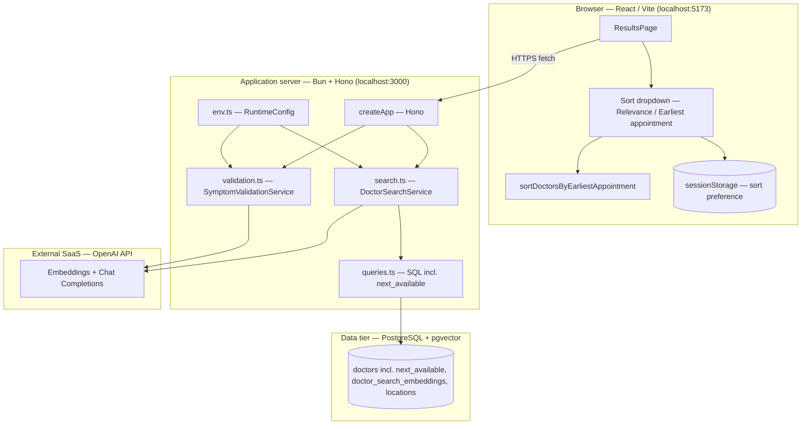
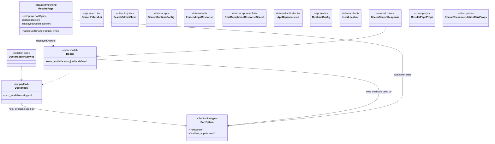

# User Story 100 — Development Specification

**User story:** As a patient who is often busy throughout the day, I want to sort recommendations by the earliest available appointment so that I can get care sooner.

**Related issue:** [#100](https://github.com/Yuxiang-Huang/DocSeek/issues/100) (parent user story), implementation [#116](https://github.com/Yuxiang-Huang/DocSeek/issues/116), tests [#117](https://github.com/Yuxiang-Huang/DocSeek/issues/117), dev spec [#118](https://github.com/Yuxiang-Huang/DocSeek/issues/118).

---

## Story ownership

| Role | Owner | Notes |
| --- | --- | --- |
| **Primary owner** | TBD | Story author; accountable for acceptance criteria and product clarifications. |
| **Secondary owner** | Yuxiang Huang ([@Yuxiang-Huang](https://github.com/Yuxiang-Huang)) | Repository maintainer and engineering lead for DocSeek; accountable for implementation quality and client integration. |

---

## Merge date on `main`

The sort-by-earliest-appointment feature (sort dropdown, `sortDoctorsByEarliestAppointment`, `loadSortOption`, `saveSortOption`, `formatNextAvailable`, and `next_available` on `Doctor` / `DoctorRow`) is implemented and tested on `main` via PR #119.

**2026-04-19** — sort-by-earliest-appointment feature merged; `client/src/components/App.tsx`, `api/src/queries.ts`, and `api/src/search.ts` updated with `next_available` field and client-side sort logic.

---

## Architecture diagram

Execution context: the **browser** runs the Vite/React client; the **API** runs on **Bun** (local dev or deployment target); **PostgreSQL** with **pgvector** holds doctor rows (including `next_available`), specialty embeddings, and locations; **OpenAI** (cloud) provides embeddings and chat-based re-ranking. Sorting by earliest appointment is **entirely client-side** — no additional API call is needed once doctors are loaded.



---

## Information flow diagram

Flow shows how the **sort preference** and **next_available datetime** travel through the system.

```mermaid
flowchart LR
  subgraph P["Patient / browser"]
    T[symptom text]
    SO[sort option selection]
  end

  subgraph C["React client"]
    V[POST /symptoms/validate]
    R[POST /doctors/search]
    SORT[sortDoctorsByEarliestAppointment — client only]
    SS[(sessionStorage)]
  end

  subgraph A["Bun API"]
    VAL[assessSymptomDescription]
    EMB[requestEmbedding]
    SQL[querySearchDoctors — returns next_available]
    RANK[requestDoctorSortFromOpenAI]
  end

  subgraph O["OpenAI"]
    API[(REST API)]
  end

  subgraph D["Postgres"]
    PG[(doctors.next_available + embeddings)]
  end

  T --> V
  V --> VAL
  VAL --> API
  API --> VAL
  VAL -->|isDescriptiveEnough| C

  T --> R
  R --> EMB
  EMB --> API
  API --> EMB
  EMB --> SQL
  SQL --> PG
  PG -->|DoctorRow[] incl. next_available| RANK
  RANK --> API
  API --> RANK
  RANK -->|Doctor[] incl. next_available| C

  SO --> SS
  SO --> SORT
  SORT -->|reordered Doctor[]| C
```

**Data elements:**

| Data | From | To | Purpose |
| --- | --- | --- | --- |
| Symptom string | User | `/symptoms/validate`, `/doctors/search` | Validate descriptiveness; embed for similarity |
| Validation history | Client | `/symptoms/validate` | Multi-turn clarification for vague symptoms |
| Embedding vector | OpenAI | API → SQL | Nearest-neighbor match in `doctor_search_embeddings` |
| Doctor rows + `match_score`, `matched_specialty`, `next_available`, coordinates | Postgres | API → Client | Ranked list with availability data for UI display and client-side sort |
| Re-ordered doctor IDs | OpenAI chat | API | Expertise-aware ordering on top of vector order |
| Sort option (`relevance` \| `earliest_appointment`) | Client | `sessionStorage` | Persists sort preference within the browser session |
| Sorted `Doctor[]` | `sortDoctorsByEarliestAppointment` | `ResultsPage` | Reorders the relevance-ranked list by ascending `next_available` |

---

## Class diagram (types, services, and UI components)

The codebase uses **TypeScript** with **functional** modules and **React function components**. This story introduces `SortOption`, `loadSortOption`, `saveSortOption`, `formatNextAvailable`, and `sortDoctorsByEarliestAppointment` in the client, and adds `next_available` to `DoctorRow` (API) and `Doctor` (client). All other types below were already present and are included for completeness.



---

## Implementation reference: types, modules, and components

Below, **public** means exported from the module; **private** means file-scoped or an implementation detail inside a closure or component.

---

### `api/src/queries.ts` — SQL access for vector search (updated)

**Public**

*Functions (grouped: database)*

| Name | Purpose |
| --- | --- |
| `querySearchDoctors` | Parameterized SQL: joins `doctor_search_embeddings`, `doctors`, primary `doctor_locations`/`locations`; orders by vector distance; applies location and accepting-new-patients filters; **now selects `d.next_available`**; returns `DoctorRow[]`. |
| `queryGetDoctorById` | Fetches a single doctor row by `id`; **now selects `d.next_available`**. |

**Private**

_None (all types at module top are exported or inlined in signatures)._

---

### `api/src/search.ts` — embedding search and LLM re-ranking (updated)

**Public**

*Types (grouped: domain)*

| Name | Purpose |
| --- | --- |
| `DoctorRow` | API/database row for one physician; **now includes `next_available: string \| null`** — the earliest available appointment datetime ISO string from the database. |
| `SearchFilters` | Optional `location` substring and `onlyAcceptingNewPatients` flag for SQL filtering. Unchanged. |
| `DoctorSearchService` | Async function type: symptoms + options → `DoctorRow[]`. Unchanged. |

*Functions (grouped: search pipeline)*

| Name | Purpose |
| --- | --- |
| `normalizeSearchLimit` | Coerces `limit` to a default (10), validates positive integer, caps at 50. Unchanged. |
| `formatVectorLiteral` | Formats a number array as a Postgres `vector` literal string for SQL. Unchanged. |
| `requestEmbedding` | Calls OpenAI embeddings API for symptom text; returns embedding vector. Unchanged. |
| `requestDoctorSortFromOpenAI` | Sends symptoms + candidate doctors to chat completion; parses JSON array of doctor IDs to re-order results. Unchanged. |
| `createDoctorSearchService` | Factory: given `SearchRuntimeConfig`, returns a `DoctorSearchService` that embeds, queries SQL, then re-ranks via OpenAI. Unchanged. |

**Private**

_No changes to private types or constants._

---

### `client/src/components/App.tsx` — search UI, results, sort logic (new additions highlighted)

**Public**

*Constants (grouped: configuration)*

| Name | Purpose |
| --- | --- |
| `API_BASE_URL` | Base URL for API calls. Unchanged. |
| `SUGGESTED_SYMPTOMS` | Suggestion chips for the home hero. Unchanged. |

*Types (grouped: domain and API)*

| Name | Purpose |
| --- | --- |
| `Doctor` | Client shape for one physician; **now includes `next_available?: string \| null`** for display and sort. |
| `SortOption` | **New** — union type `"relevance" \| "earliest_appointment"` controlling the active sort in `ResultsPage`. |
| `SearchFilters` | Client-side location and accepting-new-patients filters. Unchanged. |
| `DoctorSearchValidation` | Discriminated union for home-page validation outcome. Unchanged. |
| `SymptomValidationMessage` | Chat roles for validation history. Unchanged. |

*Constants (grouped: sort persistence)*

| Name | Purpose |
| --- | --- |
| `SORT_STORAGE_KEY` | **New** — `sessionStorage` key (`"docseek-sort-option"`) used by `loadSortOption` and `saveSortOption`. |

*Functions — sort and availability display (grouped: presentation)*

| Name | Purpose |
| --- | --- |
| `loadSortOption` | **New** — reads `sessionStorage[SORT_STORAGE_KEY]`; returns `"earliest_appointment"` if stored, otherwise `"relevance"`. Handles `sessionStorage` unavailability gracefully. |
| `saveSortOption` | **New** — writes the selected `SortOption` to `sessionStorage[SORT_STORAGE_KEY]`. Handles `sessionStorage` unavailability gracefully. |
| `formatNextAvailable` | **New** — formats a `next_available` ISO string using `toLocaleString` with month/day/year/hour/minute and timezone name; returns `"No appointment data"` for null, undefined, or unparseable values. |
| `sortDoctorsByEarliestAppointment` | **New** — partitions `Doctor[]` into those with and without a parseable `next_available`; sorts the former ascending by timestamp; secondary sort is `match_score` descending for determinism when two datetimes are equal; appends doctors with no date at the end. |

*Functions — doctor display helpers (grouped: presentation)*

| Name | Purpose |
| --- | --- |
| `getNextRecommendationLabel` | Button label for next/previous recommendation. Unchanged. |
| `getFallbackDistanceMiles` | Deterministic pseudo-distance fallback. Unchanged. |
| `direct_to_booking` | Profile URL as booking entry point. Unchanged. |
| `getMatchQualityLabel` | Maps `match_score` to badge copy. Unchanged. |
| `formatMatchedSpecialties` | Parses `matched_specialty` string. Unchanged. |
| `buildMatchExplanation` | "Why recommended" paragraph. Unchanged. |

*Functions — URL and navigation (grouped: routing)*

| Name | Purpose |
| --- | --- |
| `getDoctorSearchUrl`, `getSymptomValidationUrl`, `getResultsNavigation` | URL builders and navigation object. Unchanged. |

*Functions — normalization and safety (grouped: input)*

| Name | Purpose |
| --- | --- |
| `normalizeSymptoms`, `validateSymptomsForDoctorSearch`, `symptomsSuggestEmergencyCare` | Input validation helpers. Unchanged. |

*Functions — API clients (grouped: network)*

| Name | Purpose |
| --- | --- |
| `searchDoctors` | `POST /doctors/search`; returns `Doctor[]` including `next_available`. |
| `validateSymptoms`, `resolveSymptomsSubmission`, `submitFeedback` | Unchanged. |

*Components (grouped: layout and pages)*

| Name | Purpose |
| --- | --- |
| `ResultsPage` | **Updated** — now reads `loadSortOption()` as initial sort state, renders the sort dropdown (Relevance / Earliest appointment), calls `sortDoctorsByEarliestAppointment` when sort is `"earliest_appointment"`, and displays `formatNextAvailable` on the doctor card. |
| `DoctorRecommendationCard` | **Updated** — renders the "Next available:" line using `formatNextAvailable(activeDoctor.next_available)`; applies `next-available-unavailable` class when no data. |
| `SearchPageShell`, `SearchHero`, `HomePage`, `ResultsHeader`, `ResultsSearchSummary`, `ResultsActiveFilters`, `ResultsRefineFilters`, `SearchForm`, `SearchFiltersForm`, `EmergencyCareAlert`, `FeedbackForm` | Unchanged. |

**Private**

*Types (grouped: props and helpers)*

| Name | Purpose |
| --- | --- |
| `UserLocation` | `{ latitude, longitude }` from `navigator.geolocation`. Unchanged. |
| `DoctorSearchResponse`, `SymptomValidationResponse` | Parsed JSON shapes from API. Unchanged. |
| `SearchDoctorsOptions`, `ValidateSymptomsOptions` | Options for fetch injection and filters. Unchanged. |
| `ValidateSymptomsImplementation`, `ResolveSymptomsSubmissionOptions` | Types for testable validation orchestration. Unchanged. |
| All component props types | Unchanged. |

*Constants (grouped: safety and sort)*

| Name | Purpose |
| --- | --- |
| `EMERGENCY_PHRASES` | Lowercased phrases for emergency detection. Unchanged. |

*Component internals (grouped: `ResultsPage`)*

| State/effects | Purpose |
| --- | --- |
| `sortOption` | **New** React state initialized from `loadSortOption()`; updated via `handleSortChange`. |
| `displayedDoctors` | **New** derived value — `sortDoctorsByEarliestAppointment(doctors)` when `sortOption === "earliest_appointment"`, otherwise the raw `doctors` array. |
| `handleSortChange` | **New** handler — calls `setSortOption`, `saveSortOption`, and resets `activeDoctorIndex` to `0`. |
| `doctors`, `activeDoctorIndex`, `errorMessage`, `isLoading`, refine state, `userLocation` | Unchanged; `loadDoctors` effect populates `doctors` from the API. |

---

### `api/src/env.ts` — `RuntimeConfig` and environment loading

**Public** — unchanged. `RuntimeConfig`, `loadEnvFile`, `getRuntimeConfig` are unmodified by this story.

---

### `api/src/validation.ts` — symptom description quality (LLM)

**Public** — unchanged by this story.

---

### `api/src/index.ts` — HTTP application (`createApp`)

**Public** — unchanged by this story.

---

### `api/src/server.ts` — Bun server entry

**Public** — unchanged by this story.

---

### `client/src/utils/distance.ts` — haversine distance

**Public** — unchanged by this story.

---

### `client/src/hooks/useSavedPhysicians.ts` — saved physicians hook

**Public** — unchanged by this story.

---

### `client/src/routes/results.tsx` — `/results` route

**Public** — unchanged by this story.

---

### `client/src/routes/index.tsx` — `/` route

**Public** — unchanged by this story.

---

## Technologies table

No new external dependencies were introduced by this story. The sort feature is implemented entirely with browser-native APIs (`sessionStorage`, `Date`, `Array.prototype.sort`, `toLocaleString`). All dependencies were already present in the codebase.

| Technology | Version | Purpose | Why chosen | Docs |
| --- | --- | --- | --- | --- |
| _(no new dependencies)_ | — | — | — | — |

---

## Database schema

The `doctors` table gains one column used directly by this story.

### Modified table: `doctors`

| Field | Type | Purpose | Storage (bytes) |
| --- | --- | --- | --- |
| `next_available` | `TIMESTAMPTZ` (nullable) | ISO datetime of the physician's next available appointment slot. `NULL` when no availability data is present. Selected by both `querySearchDoctors` and `queryGetDoctorById`. | 8 when present; `NULL` otherwise |

All other tables (`doctor_search_embeddings`, `locations`, `doctor_locations`, `feedback`, lookup tables) are **unchanged** by this story.

---

## Failure-mode effects

### Sort dropdown interaction fails (JS error in `sortDoctorsByEarliestAppointment`)

**User-visible:** The results page may show an error boundary or fall back to the unsorted list depending on where the error is caught. The symptom search result is not lost; the user can reload the page and retry.

**Internally visible:** A JavaScript exception propagates from `sortDoctorsByEarliestAppointment` inside the `ResultsPage` render path. No API or database side-effects occur; sorting is entirely client-side.

---

### `sessionStorage` unavailable (private browsing mode, storage quota exceeded)

**User-visible:** The sort preference is not remembered across page navigations within the session. The dropdown defaults to "Relevance" on every page load. No visible error is shown; the feature degrades gracefully because `loadSortOption` and `saveSortOption` catch `sessionStorage` exceptions.

**Internally visible:** `saveSortOption` and `loadSortOption` silently catch exceptions from `sessionStorage` access and fall back to the `"relevance"` default.

---

### `next_available` is `NULL` for all returned doctors

**User-visible:** When the user selects "Earliest appointment", all doctors appear in the same order as "Relevance" (since all fall into the "no date" bucket). Each doctor card shows "Next available: No appointment data". The sort option still works without error.

**Internally visible:** `sortDoctorsByEarliestAppointment` places all doctors in the `withoutDate` array; `withDate` is empty and the sort step is skipped. The result is the original array order appended after an empty sorted set.

---

### `next_available` contains an invalid/unparseable datetime string

**User-visible:** The affected doctor is treated as having no date (placed at the end of an earliest-appointment sort) and their card shows "Next available: No appointment data". Other doctors with valid datetimes are sorted correctly.

**Internally visible:** `new Date(d.next_available).getTime()` returns `NaN` for an invalid string. The `Number.isNaN(t)` guard in `sortDoctorsByEarliestAppointment` and the `Number.isNaN(date.getTime())` guard in `formatNextAvailable` both catch this and degrade gracefully.

---

### Two doctors have identical `next_available` datetime

**User-visible:** The tie is broken deterministically by `match_score` descending (higher relevance shown first). The user sees a stable, consistent ordering that does not change on re-sort.

**Internally visible:** The secondary sort condition `sB - sA` (where `a.match_score ?? -1`) is evaluated when `tA === tB`. This is pure arithmetic with no side-effects.

---

### API returns doctors without a `next_available` field (older API version / schema mismatch)

**User-visible:** All doctors lack availability data; sorting by earliest appointment shows them in their original relevance order. Each card shows "Next available: No appointment data".

**Internally visible:** The `Doctor` type defines `next_available` as optional (`next_available?: string | null`), so missing keys on the deserialized JSON are treated as `undefined`. Both `sortDoctorsByEarliestAppointment` (`d.next_available ? ...` guard) and `formatNextAvailable` (`if (!value)` guard) handle `undefined` gracefully.

---

### Frontend process crash

**User-visible:** The browser tab shows an error page or blank screen. Sort preference stored in `sessionStorage` is preserved for the next load; in-flight symptom text is lost.

**Internally visible:** No server-side side-effects.

---

### Lost network connectivity (client ↔ API)

**User-visible:** The search request hangs until the browser's fetch timeout, then shows a network error state. The sort dropdown is not rendered because no doctors are loaded.

**Internally visible:** No API or database activity occurs because the request never reaches the server.

---

### Lost access to the database (API ↔ Postgres)

**User-visible:** All search requests return 500 errors. The sort feature is never reached because no doctors are loaded.

**Internally visible:** Bun's SQL client throws connection errors; the Hono API surfaces them as 500 responses.

---

## Personally Identifying Information (PII)

**No new PII is collected, stored, or transmitted by this story.**

The `next_available` field is a physician availability datetime sourced from publicly accessible UPMC scheduling data (as part of the doctor scraping pipeline). It describes the physician's schedule, not the patient's identity or health information.

The sort preference (`"relevance"` or `"earliest_appointment"`) is stored in `sessionStorage` on the user's own device. It is not transmitted to the API, not stored in the database, and not associated with any user identity. It is cleared automatically when the browser session ends.

All other PII characteristics documented in User Story 1 continue to apply unchanged.

---

## Summary

User Story 100 adds a **Sort: Earliest appointment** option to the DocSeek results page, allowing busy patients to reorder physician recommendations by their next available appointment slot. The implementation is entirely client-side: `sortDoctorsByEarliestAppointment` partitions doctors into those with and without a `next_available` datetime, sorts the former ascending by timestamp with `match_score` as a deterministic secondary key, and appends the latter at the end. The selected sort option is persisted to `sessionStorage` (key `"docseek-sort-option"`) within the session. The `next_available` field was added to `DoctorRow` (`api/src/search.ts`) and the `Doctor` client type, and is now selected in both `querySearchDoctors` and `queryGetDoctorById` (`api/src/queries.ts`). On the card, `formatNextAvailable` renders the datetime with locale-aware month/day/year/hour/minute/timezone format, displaying "No appointment data" when the field is absent. No new external dependencies, no new database tables, and no API endpoint changes were required; the story builds entirely on the existing physician-matching infrastructure. Primary ownership is **TBD** with secondary **Yuxiang Huang**; the feature was merged into `main` on **2026-04-19**.
