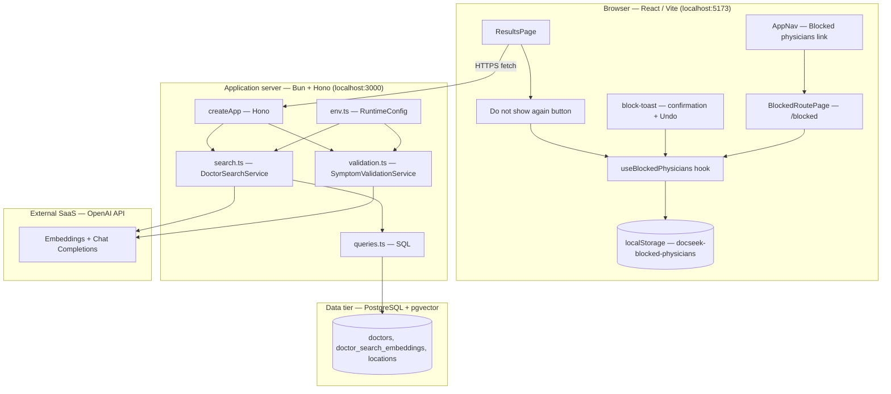
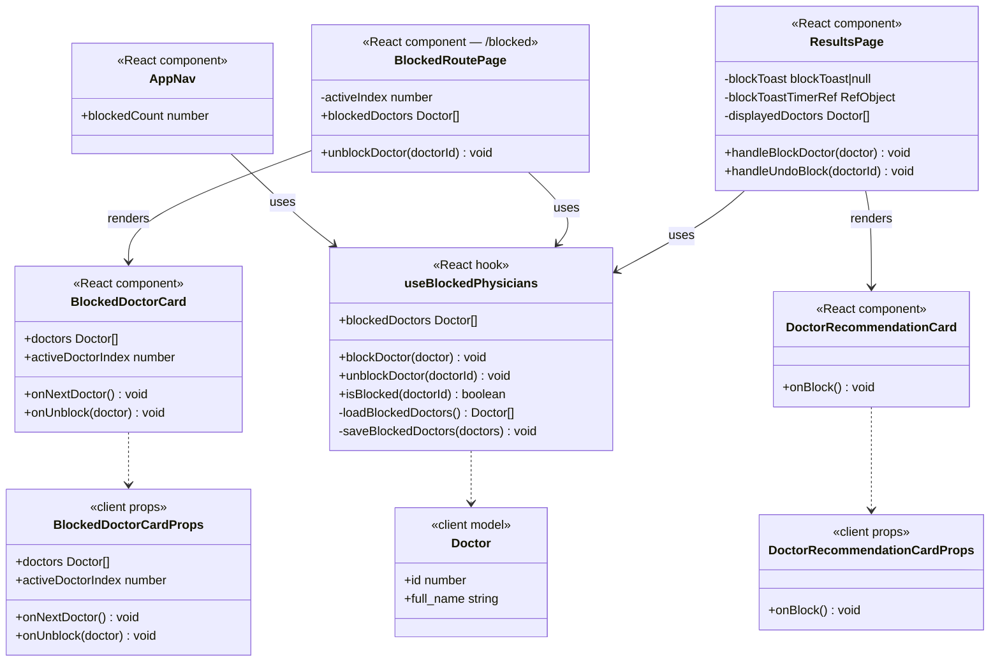

# User Story 101 — Development Specification

**User story:** As an efficient patient, I want to be able to have the option to block a physician so that I no longer see options for doctors who do not fit my needs.

**Related issue:** [#101](https://github.com/Yuxiang-Huang/DocSeek/issues/101) (parent user story), implementation [#122](https://github.com/Yuxiang-Huang/DocSeek/issues/122), tests [#123](https://github.com/Yuxiang-Huang/DocSeek/issues/123), dev spec [#124](https://github.com/Yuxiang-Huang/DocSeek/issues/124).

---

## Story ownership

| Role | Owner | Notes |
| --- | --- | --- |
| **Primary owner** | TBD | Story author; accountable for acceptance criteria and product clarifications. |
| **Secondary owner** | Yuxiang Huang ([@Yuxiang-Huang](https://github.com/Yuxiang-Huang)) | Repository maintainer and engineering lead for DocSeek; accountable for implementation quality and client integration. |

---

## Merge date on `main`

The block-physician feature (`useBlockedPhysicians`, `BlockedRoutePage`, `BlockedDoctorCard`, "Do not show again" button, block-toast with Undo, `AppNav` blocked-list link, and `localStorage` persistence) is implemented and tested on `main` via PR #125.

**2026-04-19** — block-physician feature merged; `client/src/hooks/useBlockedPhysicians.ts`, `client/src/routes/blocked.tsx`, `client/src/components/App.tsx`, and `client/src/components/AppNav.tsx` updated with full block, unblock, toast-undo, and management-page logic.

---

## Architecture diagram

Execution context: the **browser** runs the Vite/React client; the **API** runs on **Bun** (local dev or deployment target); **PostgreSQL** with **pgvector** holds doctor rows; **OpenAI** (cloud) provides embeddings and chat-based re-ranking. The block feature is **entirely client-side** — no additional API call is made. Blocked state is persisted in `localStorage` on the user's device.



---

## Information flow diagram

Flow shows how **block actions** and **blocked state** travel through the client.

```mermaid
flowchart LR
  subgraph P["Patient / browser"]
    T[symptom text]
    BA[block action click]
    UA[undo action click]
  end

  subgraph C["React client"]
    V[POST /symptoms/validate]
    R[POST /doctors/search]
    FILTER[displayedDoctors filter — isBlocked]
    TOAST[block-toast + 5 s auto-dismiss]
    BPAGE[/blocked page — BlockedRoutePage]
  end

  subgraph H["useBlockedPhysicians hook"]
    BLK[blockDoctor]
    UBLK[unblockDoctor]
    ISBLK[isBlocked]
    LS[(localStorage)]
  end

  subgraph A["Bun API"]
    EMB[requestEmbedding]
    SQL[querySearchDoctors]
    RANK[requestDoctorSortFromOpenAI]
  end

  subgraph O["OpenAI"]
    API[(REST API)]
  end

  subgraph D["Postgres"]
    PG[(doctors + embeddings)]
  end

  T --> V
  T --> R
  R --> EMB --> API --> EMB --> SQL --> PG
  PG -->|Doctor[]| RANK --> API --> RANK -->|Doctor[]| C

  BA --> BLK --> LS
  BA --> FILTER
  BA --> TOAST
  UA --> UBLK --> LS
  UA --> TOAST
  ISBLK --> FILTER
  FILTER -->|non-blocked Doctor[]| C
  BPAGE --> ISBLK
  BPAGE --> UBLK
```

**Data elements:**

| Data | From | To | Purpose |
| --- | --- | --- | --- |
| Symptom string | User | `/symptoms/validate`, `/doctors/search` | Validate descriptiveness; embed for similarity |
| Doctor rows (id, name, specialty, etc.) | Postgres → API | Client | Displayed in results and stored on block |
| Block action | User click | `useBlockedPhysicians.blockDoctor` | Adds doctor to local blocked list |
| Undo action | User click | `useBlockedPhysicians.unblockDoctor` | Removes doctor from local blocked list |
| Blocked list (`Doctor[]`) | `localStorage["docseek-blocked-physicians"]` | `useBlockedPhysicians` | Persists blocked doctors across sessions |
| `isBlocked(id)` result | `useBlockedPhysicians` | `ResultsPage.displayedDoctors` | Filters blocked doctors from displayed results |
| Block toast | `ResultsPage` state | DOM (`role="status"`) | Confirms block to user; offers 5-second Undo window |
| Blocked count | `useBlockedPhysicians` | `AppNav` badge | Shows number of blocked physicians in nav |

---

## Class diagram (types, services, and UI components)

The codebase uses **TypeScript** with **functional** modules and **React function components**. This story introduces `useBlockedPhysicians`, `BlockedRoutePage`, `BlockedDoctorCard`, the `onBlock` prop on `DoctorRecommendationCard`, a `blockToast` state in `ResultsPage`, and a new `/blocked` route. The `AppNav` is updated to show a blocked-count badge and link to `/blocked`.



---

## Implementation reference: types, modules, and components

Below, **public** means exported from the module; **private** means file-scoped or an implementation detail inside a closure or component.

---

### `client/src/hooks/useBlockedPhysicians.ts` — blocked-physician persistence hook (new)

**Public**

*Functions (grouped: hook)*

| Name | Purpose |
| --- | --- |
| `useBlockedPhysicians` | **New** — React hook that loads the blocked list from `localStorage` on mount, subscribes to `storage` events for cross-tab sync, and returns `{ blockedDoctors, blockDoctor, unblockDoctor, isBlocked }`. |

**Private**

*Constants (grouped: storage)*

| Name | Purpose |
| --- | --- |
| `STORAGE_KEY` | `"docseek-blocked-physicians"` — key used to read/write the serialised `Doctor[]` in `localStorage`. |

*Functions (grouped: storage)*

| Name | Purpose |
| --- | --- |
| `loadBlockedDoctors` | Reads `localStorage[STORAGE_KEY]`, JSON-parses and validates it as an array, and returns `Doctor[]`; returns `[]` on any error. |
| `saveBlockedDoctors` | JSON-serialises a `Doctor[]` and writes it to `localStorage[STORAGE_KEY]`. |

---

### `client/src/routes/blocked.tsx` — `/blocked` route and management page (new)

**Public**

*Constants (grouped: routing)*

| Name | Purpose |
| --- | --- |
| `Route` | TanStack Router file route for `/blocked`; component is `BlockedRoutePage`. |

*Components (grouped: pages)*

| Name | Purpose |
| --- | --- |
| `BlockedRoutePage` | **New** — page component for `/blocked`; reads `useBlockedPhysicians`, shows an empty state or a `BlockedDoctorCard` with Unblock actions; adjusts `activeIndex` when the list shrinks. |
| `BlockedDoctorCard` | **New** — card component displaying one blocked doctor at a time with an Unblock button and Next navigation. |

*Types (grouped: props)*

| Name | Purpose |
| --- | --- |
| `BlockedDoctorCardProps` | Props for `BlockedDoctorCard`: `doctors`, `activeDoctorIndex`, `onNextDoctor`, `onUnblock`. |

---

### `client/src/components/App.tsx` — search UI and results (updated)

**Public**

*Types (grouped: domain)*

| Name | Purpose |
| --- | --- |
| `Doctor` | Client shape for one physician. Unchanged; used as the stored type in the blocked list. |
| `SortOption` | Union type controlling active sort. Unchanged by this story. |

*Components (grouped: pages)*

| Name | Purpose |
| --- | --- |
| `ResultsPage` | **Updated** — imports `useBlockedPhysicians`; derives `displayedDoctors` by filtering `sortedDoctors` through `blockedPhysicians.isBlocked`; adds `blockToast` state and `blockToastTimerRef`; implements `handleBlockDoctor` (blocks + shows toast with 5-second auto-dismiss) and `handleUndoBlock` (unblocks + clears toast); passes `onBlock` to `DoctorRecommendationCard`. |
| `DoctorRecommendationCard` | **Updated** — accepts new optional `onBlock` prop; when provided, renders a "Do not show again" button (`EyeOff` icon, `aria-label` identifies the physician). |

*Types (grouped: props)*

| Name | Purpose |
| --- | --- |
| `DoctorRecommendationCardProps` | **Updated** — adds optional `onBlock?: () => void`. |

**Private**

*Component internals (grouped: `ResultsPage`)*

| State/effect | Purpose |
| --- | --- |
| `blockedPhysicians` | `useBlockedPhysicians()` instance — provides `blockDoctor`, `unblockDoctor`, `isBlocked`. |
| `sortedDoctors` | Derived value from sort (unchanged from story #100). |
| `displayedDoctors` | **New** derived value — `sortedDoctors` filtered by `!blockedPhysicians.isBlocked(d.id)`; used everywhere cards are rendered. |
| `blockToast` | **New** React state `{ doctorName, doctorId } | null`; set on block, cleared on undo or timeout. |
| `blockToastTimerRef` | **New** `useRef` holding the active `setTimeout` handle for auto-dismiss; cleared on unmount. |
| `handleBlockDoctor(doctor)` | **New** — calls `blockedPhysicians.blockDoctor`, schedules toast auto-dismiss (5 s), and adjusts `activeDoctorIndex` to stay in bounds. |
| `handleUndoBlock(doctorId)` | **New** — calls `blockedPhysicians.unblockDoctor`, clears the pending timer, and hides the toast immediately. |

---

### `client/src/components/AppNav.tsx` — main navigation bar (updated)

**Public**

*Components (grouped: navigation)*

| Name | Purpose |
| --- | --- |
| `AppNav` | **Updated** — imports `useBlockedPhysicians`; adds a "Blocked physicians" `<Link>` to `/blocked` with `EyeOff` icon and a count badge (`app-nav-count-blocked`) when `blockedCount > 0`. Renames `count` locals to `savedCount` / `blockedCount` for clarity. |

---

### `api/src/queries.ts` — SQL access for vector search

**Public** — unchanged by this story.

---

### `api/src/search.ts` — embedding search and LLM re-ranking

**Public** — unchanged by this story.

---

### `api/src/env.ts` — `RuntimeConfig` and environment loading

**Public** — unchanged by this story.

---

### `api/src/validation.ts` — symptom description quality (LLM)

**Public** — unchanged by this story.

---

### `api/src/index.ts` — HTTP application (`createApp`)

**Public** — unchanged by this story.

---

### `api/src/server.ts` — Bun server entry

**Public** — unchanged by this story.

---

### `client/src/utils/distance.ts` — haversine distance

**Public** — unchanged by this story.

---

### `client/src/hooks/useSavedPhysicians.ts` — saved physicians hook

**Public** — unchanged by this story.

---

### `client/src/routes/results.tsx` — `/results` route

**Public** — unchanged by this story.

---

### `client/src/routes/index.tsx` — `/` route

**Public** — unchanged by this story.

---

## Technologies table

No new external dependencies were introduced by this story. The block feature is implemented entirely with browser-native APIs (`localStorage`, `JSON`, `setTimeout`, `clearTimeout`, `addEventListener`/`removeEventListener`). All other dependencies were already present in the codebase.

| Technology | Version | Purpose | Why chosen | Docs |
| --- | --- | --- | --- | --- |
| _(no new dependencies)_ | — | — | — | — |

---

## Database schema

No schema changes in this story.

Blocked physicians are stored exclusively in the **browser's `localStorage`** under the key `"docseek-blocked-physicians"`, serialised as a JSON array of `Doctor` objects. No new columns, tables, or migrations are required in PostgreSQL.

---

## Failure-mode effects

### Block button clicked and `localStorage` is unavailable (quota exceeded / private mode / origin policy)

**User-visible:** The "Do not show again" button appears to work (the doctor disappears from the current view because React state is updated), but the block is not persisted. On page reload the blocked doctor reappears in results. No visible error is shown.

**Internally visible:** `saveBlockedDoctors` calls `localStorage.setItem`, which throws a `DOMException`. The exception is not currently caught; the React state (`blockedDoctors`) still updates in memory, so the in-session filter works but the write to disk is lost silently.

---

### Block toast timer fires after component unmount (navigation away during 5-second window)

**User-visible:** No visible effect — the toast was already hidden by the navigation.

**Internally visible:** The `useEffect` cleanup in `ResultsPage` calls `clearTimeout(blockToastTimerRef.current)` on unmount, preventing stale `setState` calls on an unmounted component.

---

### User blocks all returned doctors

**User-visible:** The results area shows no doctor cards. The user can still see the loading/error states, refine filters, or start a new search. The sort dropdown is also hidden (it is only shown when `doctors.length > 0`).

**Internally visible:** `displayedDoctors` becomes an empty array. Rendering guards (`displayedDoctors.length > 0`) prevent card rendering. `activeDoctorIndex` is adjusted to `Math.max(0, displayedDoctors.length - 2)` after each block, which resolves to `0` and then stays `0` for an empty list.

---

### User clicks "Do not show again" rapidly on multiple doctors (toast race)

**User-visible:** Each block replaces the previous toast immediately; the user always sees the most-recently-blocked doctor's name with a fresh 5-second Undo window.

**Internally visible:** `handleBlockDoctor` clears any existing `blockToastTimerRef.current` before scheduling a new timeout, preventing multiple concurrent timers.

---

### `localStorage` contains malformed or non-array JSON

**User-visible:** The blocked list starts empty; no previously blocked doctors are excluded from results on that session.

**Internally visible:** `loadBlockedDoctors` wraps `JSON.parse` in a `try/catch` and checks `Array.isArray(parsed)`; any parse error or non-array value returns `[]` without throwing.

---

### Cross-tab sync: user blocks a doctor in one tab while another tab is open

**User-visible:** The `storage` event fires in the second tab; `useBlockedPhysicians` updates `blockedDoctors` from `localStorage`, and `displayedDoctors` is recomputed. The blocked doctor disappears from the second tab's current results without requiring a reload.

**Internally visible:** The `window.addEventListener("storage", handleStorage)` listener in `useBlockedPhysicians` calls `loadBlockedDoctors()` when `e.key === STORAGE_KEY` and updates React state.

---

### Frontend process crash

**User-visible:** The browser tab shows an error page or blank screen. Blocked-list data written to `localStorage` before the crash is preserved for the next load.

**Internally visible:** No server-side side-effects.

---

### Lost network connectivity (client ↔ API)

**User-visible:** The search request fails; no doctor cards are shown. The blocked list management page (`/blocked`) is still accessible and fully functional (it reads only from `localStorage`).

**Internally visible:** No API or database activity occurs for the blocked-list feature because it is entirely client-side.

---

## Personally Identifying Information (PII)

**No new PII is collected, stored, or transmitted by this story.**

The blocked list stores `Doctor` objects (physician names, specialties, locations, phone numbers) sourced from publicly accessible UPMC physician data. These describe physicians, not the patient.

The blocked list is stored in `localStorage` on the user's **own device**. It is not transmitted to the API, not stored in the database, and not associated with any user identity or session token on the server. It persists until the user clears browser storage or explicitly unblocks physicians via the `/blocked` management page.

All other PII characteristics documented in User Story 1 continue to apply unchanged.

---

## Summary

This specification documents **User Story 101** as implemented: patients can click **"Do not show again"** on any physician card in `ResultsPage`; the doctor is immediately removed from the displayed list (client-side filter via `blockedPhysicians.isBlocked`), a **block-toast** confirmation appears with a **5-second Undo** button, and the physician is persisted to **`localStorage`** via `useBlockedPhysicians` so that future searches automatically exclude them. The `AppNav` gains a **"Blocked physicians"** link (with count badge) to `/blocked`, where `BlockedRoutePage` and `BlockedDoctorCard` let users review and **Unblock** any previously blocked physician. The feature is entirely **client-side** — no API or database changes are required. **Primary owner:** TBD. **Secondary owner:** Yuxiang Huang ([@Yuxiang-Huang](https://github.com/Yuxiang-Huang)). **Merge to `main` for PR #125:** **2026-04-19**.
