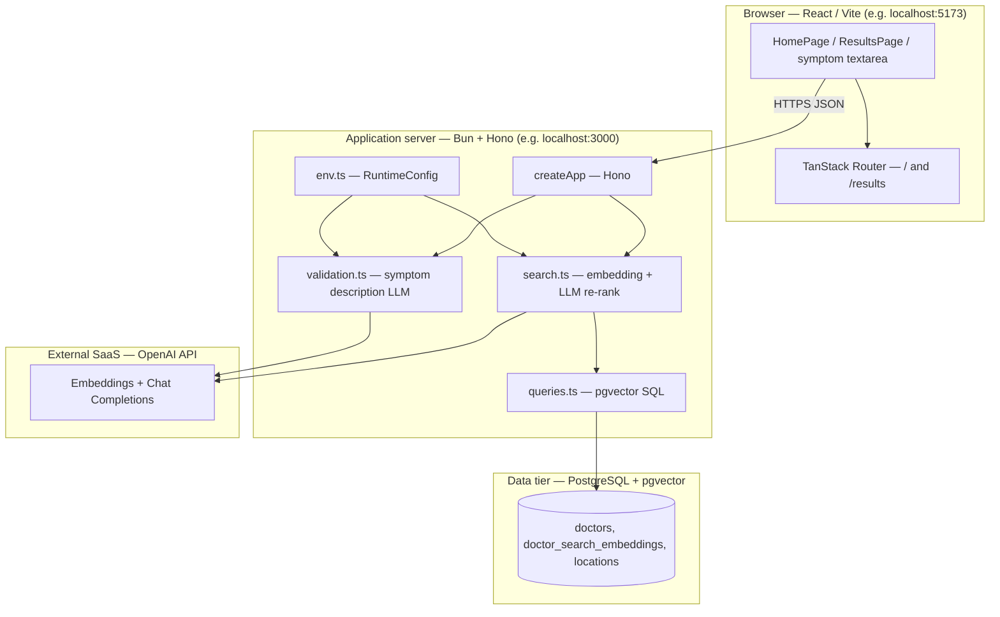
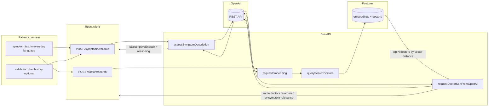

# User Story 2 — Development Specification

**User story:** As a sick person with no medical knowledge, I want to type my symptoms in plain language so that I do not need medical terminology to begin seeking care.

**Related issue:** [#3](https://github.com/Yuxiang-Huang/DocSeek/issues/3) (product backlog), documented in [#38](https://github.com/Yuxiang-Huang/DocSeek/issues/38).

**Engineering reference:** [PR #12](https://github.com/Yuxiang-Huang/DocSeek/pull/12) — adds OpenAI **chat completion** re-ranking of vector-search candidates using the patient’s free-text symptoms (`requestDoctorSortFromOpenAI`, `OPENAI_CHAT_MODEL` / `openAiChatModel`). The same user story also relies on **embedding-based** similarity (natural-language symptoms → vector) and optional **LLM symptom validation** (whether the description is concrete enough to search), which landed on `main` alongside or before that merge.

---

## Story ownership

| Role | Owner | Notes |
| --- | --- | --- |
| **Primary owner** | Yuxiang Huang ([@Yuxiang-Huang](https://github.com/Yuxiang-Huang)) | Author of [PR #12](https://github.com/Yuxiang-Huang/DocSeek/pull/12); implemented LLM re-ranking and tests in `api/src/search.ts` / `api/src/search.test.ts`, plus runtime config for `OPENAI_CHAT_MODEL`. |
| **Secondary owner** | axue3 ([@axue3](https://github.com/axue3)) | Requested reviewer on PR #12 (review request for acee3 was later removed); approved the changes before merge. |

---

## Merge date on `main`

The changes introduced by **PR #12** were merged into `main` on:

**2026-03-26** — merge commit [`973117f`](https://github.com/Yuxiang-Huang/DocSeek/commit/973117f) (*Merge pull request #12 from Yuxiang-Huang/feature/openai-doctor-resort*).

---

## Architecture diagram

Execution context: the **browser** runs the Vite/React client where the patient enters **plain-language** symptoms; the **API** runs on **Bun** (local dev or deployment target); **PostgreSQL** with **pgvector** stores specialty embeddings and doctor rows; **OpenAI** (cloud) provides **embeddings** (semantic match without medical terms), **chat completions** for symptom **quality checks**, and **chat completions** for **re-ranking** the short list returned by vector search.

---

## Information flow diagram

Flow shows **plain-language symptom text** from the patient, **optional validation history**, **embedding vectors**, **candidate doctors** from pgvector, and **LLM-ordered** results back to the client.

**Data elements:**

| Data | From | To | Purpose |
| --- | --- | --- | --- |
| Symptom string (plain language) | User | `/symptoms/validate`, `/doctors/search` | Judge descriptiveness; embed for similarity; prompt for re-ranking |
| Validation message history | Client | `/symptoms/validate` | Multi-turn clarification when input is vague |
| Embedding vector | OpenAI | API → SQL | Nearest-neighbor match in `doctor_search_embeddings` |
| Doctor rows + `match_score`, `matched_specialty` | Postgres | API | Candidate set (up to `limit`, default 10) |
| JSON array of doctor IDs | OpenAI chat | API | Re-order candidates by relevance to **verbatim** symptom text |
| Filters (`location`, `onlyAcceptingNewPatients`) | Client | `/doctors/search` | SQL `WHERE` clauses |

---

## Class diagram (types, services, and UI components)

The codebase uses **TypeScript** with **functional** modules and **React function components** (no application-level ES6 `class` declarations). The diagram lists **every interface and type alias** on the plain-language symptom path as UML classes. **Hono** is a framework class. Service types use the `«function type»` stereotype. Types marked `«internal»` are not exported from their module. The API module `search.ts` and the client `App.tsx` each define a type named `SearchFilters`; they appear as **SearchFiltersApi** and **SearchFiltersClient**. **ChatCompletionResponse** exists separately in `search.ts` and `validation.ts`; they appear as **ChatCompletionResponseSearch** and **ChatCompletionResponseValidation**.

**Relationships:** TypeScript **intersections** are modeled as **multiple inheritance** (`--|>`). `SearchHeroProps` extends `SearchFormProps`; only the extra fields are listed on `SearchHeroProps`. `ValidateSymptomsOptions` extends `SearchDoctorsOptionsClient` with `history`.

```mermaid
classDiagram
  direction TB

  class Hono {
    +constructor()
    +use()
    +get()
    +post()
    +fetch()
  }

  class RuntimeConfig {
    <<api env.ts>>
  }

  class DoctorRow {
    <<api payload>>
  }

  class SearchFiltersApi {
    <<api search.ts>>
  }

  class SearchFiltersClient {
    <<client App.tsx>>
  }

  class DoctorSearchService {
    <<function type>>
  }

  class SearchDoctorsParams {
    <<internal api>>
  }

  class SearchDoctorsOptionsApi {
    <<internal api>>
  }

  class SearchRuntimeConfig {
    <<internal api>>
  }

  class EmbeddingsResponse {
    <<internal api>>
  }

  class ChatCompletionResponseSearch {
    <<internal api search.ts>>
  }

  class QuerySearchDoctorFilters {
    <<api queries.ts>>
  }

  class AppDependencies {
    <<internal api index.ts>>
  }

  class SymptomDescriptionAssessment {
    <<internal validation.ts>>
  }

  class SymptomValidationMessageApi {
    <<api validation.ts>>
  }

  class SymptomValidationMessageClient {
    <<client App.tsx>>
  }

  class SymptomValidationRuntimeConfig {
    <<internal validation.ts>>
  }

  class SymptomValidationParams {
    <<internal validation.ts>>
  }

  class ChatCompletionResponseValidation {
    <<internal validation.ts>>
  }

  class SymptomValidationService {
    <<function type>>
  }

  class Doctor {
    <<client model>>
  }

  class DoctorSearchResponse {
    <<internal client App.tsx>>
  }

  class SymptomValidationResponse {
    <<internal client App.tsx>>
  }

  class UserLocation {
    <<internal client>>
  }

  class DoctorSearchValidation {
    <<client union type>>
  }

  class SearchDoctorsOptionsClient {
    <<internal client>>
  }

  class SearchFiltersFormProps {
    <<client props>>
  }

  class ValidateSymptomsOptions {
    <<internal client>>
  }

  class ValidateSymptomsImplementation {
    <<function type>>
  }

  class ResolveSymptomsSubmissionOptions {
    <<internal client>>
  }

  class SearchPageShellProps {
    <<client props>>
  }

  class SearchFormProps {
    <<client props>>
  }

  class SearchHeroProps {
    <<client props>>
    +errorMessage optional
    +filters optional
  }

  class HomePageProps {
    <<client props>>
  }

  class DoctorRecommendationCardProps {
    <<client props>>
  }

  class FeedbackFormProps {
    <<client props>>
  }

  class ResultsHeaderProps {
    <<client props>>
  }

  class ResultsSearchSummaryProps {
    <<client props>>
  }

  class ResultsActiveFiltersProps {
    <<client props>>
  }

  class ResultsRefineFiltersProps {
    <<client props>>
  }

  class ResultsPageProps {
    <<client props>>
  }

  class ResultsSearch {
    <<client routes/results.tsx>>
  }

  Hono <-- AppDependencies : createApp
  DoctorSearchService ..> DoctorRow
  DoctorSearchResponse --> Doctor
  SymptomValidationService ..> SymptomDescriptionAssessment
  SymptomValidationParams --> SymptomValidationMessageApi
  SearchHeroProps --|> SearchFormProps
  ValidateSymptomsOptions --|> SearchDoctorsOptionsClient
  SymptomValidationMessageApi .. SymptomValidationMessageClient : same structure
```

---

## Implementation reference: types, modules, and components

Below, **public** means exported from the module; **private** means file-scoped (not exported) or implementation detail inside a closure or component. React components are described with **props** as their public contract and **internal state/handlers** where applicable.

---

### `api/src/env.ts` — `RuntimeConfig` and environment loading

**Public**

*Types / configuration (grouped: configuration)*

| Name | Kind | Purpose |
| --- | --- | --- |
| `RuntimeConfig` | type | Includes `openAiChatModel` (default `gpt-4o-mini`) used by `requestDoctorSortFromOpenAI`, plus embedding and validation model ids, DB URL, CORS, API key. |

*Functions (grouped: environment)*

| Name | Kind | Purpose |
| --- | --- | --- |
| `loadEnvFile` | function | Optionally loads repo-root `.env` when keys are unset. |
| `getRuntimeConfig` | function | Parses `process.env`; requires `OPENAI_API_KEY`; supplies defaults for models including `OPENAI_CHAT_MODEL`. |

**Private**

*Constants (grouped: defaults)*

| Name | Purpose |
| --- | --- |
| `DEFAULT_PORT`, `DEFAULT_DATABASE_URL`, `DEFAULT_OPENAI_*` | Defaults when env vars are absent; `DEFAULT_OPENAI_CHAT_MODEL` is `gpt-4o-mini`. |

---

### `api/src/search.ts` — Plain-language symptoms → embedding → vector candidates → LLM re-rank

**Public**

*Types (grouped: domain)*

| Name | Purpose |
| --- | --- |
| `DoctorRow` | One physician row returned to the client, including `match_score`, `matched_specialty`, and coordinates. |
| `SearchFilters` | Optional `location` substring and `onlyAcceptingNewPatients` for SQL. |
| `DoctorSearchService` | Async function: symptoms + options → `DoctorRow[]` (after embedding query **and** `requestDoctorSortFromOpenAI`). |

*Functions (grouped: search pipeline)*

| Name | Purpose |
| --- | --- |
| `normalizeSearchLimit` | Default 10, validates positive integer, caps at 50. |
| `formatVectorLiteral` | Formats embedding array as Postgres `vector` literal for SQL. |
| `requestEmbedding` | Calls OpenAI embeddings API with the **raw symptom string** so colloquial wording maps to a semantic vector. |
| `requestDoctorSortFromOpenAI` | Sends **patient symptoms** and a numbered list of candidate doctors to the chat API; parses a JSON array of doctor IDs to re-order results (PR #12). |
| `createDoctorSearchService` | Returns a service that embeds, runs `querySearchDoctors`, then re-ranks with `requestDoctorSortFromOpenAI`. |

**Private**

*Types (grouped: internal API payloads)*

| Name | Purpose |
| --- | --- |
| `EmbeddingsResponse` | OpenAI embeddings JSON shape. |
| `ChatCompletionResponse` | OpenAI chat JSON shape for re-ranking responses. |
| `SearchDoctorsOptions` | `limit` and `filters` for one search. |
| `SearchDoctorsParams` | `symptoms` plus optional `SearchDoctorsOptions`. |
| `SearchRuntimeConfig` | `databaseUrl` and OpenAI settings for the factory closure. |

*Constants (grouped: defaults)*

| Name | Purpose |
| --- | --- |
| `DEFAULT_RESULT_LIMIT` | Default candidate count (10) before re-ranking. |

---

### `api/src/queries.ts` — SQL for vector similarity

**Public**

*Types (grouped: query filters)*

| Name | Purpose |
| --- | --- |
| `QuerySearchDoctorFilters` | Typed filters mirroring `SearchFilters` for query helpers (optional `locationContains`, `onlyAcceptingNewPatients`). |

*Functions (grouped: database)*

| Name | Purpose |
| --- | --- |
| `querySearchDoctors` | Parameterized SQL: joins embeddings and doctors; orders by distance to the symptom embedding; returns up to `limit` rows. |

**Private**

_None._

---

### `api/src/validation.ts` — LLM check that plain-language input is specific enough

**Public**

*Types (grouped: validation)*

| Name | Purpose |
| --- | --- |
| `SymptomValidationMessage` | `{ role, content }` for validation chat history. |
| `SymptomValidationService` | Async function from symptoms (+ optional history) to `SymptomDescriptionAssessment`. |

*Functions (grouped: validation pipeline)*

| Name | Purpose |
| --- | --- |
| `normalizeSymptomAssessment` | Strips reasoning when acceptable; supplies default guidance when vague. |
| `assessSymptomDescription` | Calls OpenAI chat with JSON schema output for `isDescriptiveEnough` / `reasoning`. |
| `createSymptomValidationService` | Factory binding `assessSymptomDescription` to validation model config. |

**Private**

*Types (grouped: internal)*

| Name | Purpose |
| --- | --- |
| `SymptomDescriptionAssessment` | Parsed LLM result: `isDescriptiveEnough`, optional `reasoning`. |
| `SymptomValidationRuntimeConfig` | OpenAI key, base URL, validation model id. |
| `ChatCompletionsResponse` | Chat response shape for parsing. |
| `SymptomValidationParams` | `symptoms` and optional `history`. |

*Values / functions (grouped: prompts and parsing)*

| Name | Purpose |
| --- | --- |
| `symptomValidationSystemPrompt` | Instructs the model how strictly to judge **non-clinical** descriptions. |
| `extractMessageContent` | Normalizes message content from string or structured parts. |

---

### `api/src/index.ts` — HTTP application (`createApp`)

**Public**

*Functions (grouped: HTTP)*

| Name | Purpose |
| --- | --- |
| `createApp` | Hono app with CORS, `POST /doctors/search` (symptoms body → `searchService`), `POST /symptoms/validate` (symptoms + history → `symptomValidationService`). |

**Private**

*Types (grouped: dependency injection)*

| Name | Purpose |
| --- | --- |
| `AppDependencies` | Optional `searchService`, `symptomValidationService`, `feedbackService` (used by other flows; not central to US2), CORS origins, `port`. |

---

### `api/src/server.ts` — Bun server entry

**Public**

| Name | Purpose |
| --- | --- |
| Default export `{ port, fetch }` | Bun entry: `fetch` delegates to `createApp` with `createDoctorSearchService(config)` and `createSymptomValidationService(config)`. |

**Private**

_Module-level `config` and `app` wiring._

---

### `client/src/components/App.tsx` — Symptom entry, validation client, doctor search client, results UI

**Public**

*Constants (grouped: configuration)*

| Name | Kind | Purpose |
| --- | --- | --- |
| `API_BASE_URL` | const | Base URL for API calls. |
| `SUGGESTED_SYMPTOMS` | const | Example chips for plain-language ideas. |

*Types (grouped: domain and API)*

| Name | Purpose |
| --- | --- |
| `Doctor` | Client physician model aligned with API fields used in the UI. |
| `SearchFilters` | Client filters for location and accepting-new-patients. |
| `DoctorSearchValidation` | Union: client-side validation ok/fail before navigation. |
| `SymptomValidationMessage` | Matches server validation message shape for history. |

*Functions — URLs (grouped: routing)*

| Name | Purpose |
| --- | --- |
| `getDoctorSearchUrl` | `/doctors/search` URL builder. |
| `getSymptomValidationUrl` | `/symptoms/validate` URL builder. |
| `getResultsNavigation` | TanStack navigation to `/results` with symptom and filter search params. |

*Functions — normalization and safety (grouped: input)*

| Name | Purpose |
| --- | --- |
| `normalizeSymptoms` | Trims symptom text. |
| `validateSymptomsForDoctorSearch` | Non-empty check and emergency keyword heuristic. |
| `symptomsSuggestEmergencyCare` | Blocks search when phrasing suggests emergency care. |

*Functions — API clients (grouped: network)*

| Name | Purpose |
| --- | --- |
| `searchDoctors` | `POST /doctors/search` with symptom string; receives **LLM-reordered** list from server. |
| `validateSymptoms` | `POST /symptoms/validate` with optional history. |
| `resolveSymptomsSubmission` | Orchestrates validation attempts and history updates before navigation. |

*Functions — display helpers (grouped: presentation)*

| Name | Purpose |
| --- | --- |
| `getNextRecommendationLabel` | Next-doctor button label. |
| `getFallbackDistanceMiles` | Deterministic distance fallback. |
| `direct_to_booking` | Profile URL for booking. |
| `getMatchQualityLabel` | Badge text from `match_score`. |
| `formatMatchedSpecialties` | Parses `matched_specialty` string. |
| `buildMatchExplanation` | Explains match using **user’s symptom quote** and specialty. |

*Components (grouped: layout and search)*

| Name | Purpose |
| --- | --- |
| `EmergencyCareAlert` | Banner when emergency phrases detected. |
| `SearchPageShell` | Page chrome and skip link. |
| `SearchForm` | Textarea for **plain-language** symptoms and submit. |
| `SearchFiltersForm` | Location and availability filters. |
| `SearchHero` | Hero copy, `SearchForm`, optional filters, suggestions, emergency alert. |
| `HomePage` | Wires symptom state to `resolveSymptomsSubmission` then `navigateToResults`. |

*Components (grouped: results)*

| Name | Purpose |
| --- | --- |
| `ResultsSearchSummary` | Shows current symptom query on results. |
| `ResultsActiveFilters` | Active filter chips. |
| `ResultsRefineFilters` | Inline filter refinement panel. |
| `ResultsHeader` | Back link, summary, filter strip, title. |
| `ResultsPage` | Loads doctors via `searchDoctorsImpl`, shows cards and loading/error. |
| `DoctorRecommendationCard` | Single-doctor view with match explanation quoting symptoms. |
| `FeedbackForm` | Post-visit rating (optional on results card). |

*Functions — feedback (grouped: network)*

| Name | Purpose |
| --- | --- |
| `submitFeedback` | `POST` feedback for a doctor (secondary to symptom entry). |

**Private**

*Types (grouped: internal client)*

| Name | Purpose |
| --- | --- |
| `UserLocation` | Browser geolocation coordinates. |
| `DoctorSearchResponse` | `{ doctors: Doctor[] }` from search API. |
| `SymptomValidationResponse` | Validation API success shape. |
| `SearchDoctorsOptions` | Options for `searchDoctors` / `submitFeedback`. |
| `SearchFiltersFormProps` | Props for filter controls. |
| `ValidateSymptomsOptions` | Extends search options with `history`. |
| `ValidateSymptomsImplementation` | Injectable validation function type. |
| `ResolveSymptomsSubmissionOptions` | Options for `resolveSymptomsSubmission`. |
| `SearchPageShellProps` | Shell props. |
| `SearchFormProps` | Form props. |
| `SearchHeroProps` | Extends `SearchFormProps` with error and filters. |
| `HomePageProps` | Navigation callback prop. |
| `DoctorRecommendationCardProps` | Card props. |
| `FeedbackFormProps` | Feedback injectable impl. |
| `ResultsHeaderProps`, `ResultsSearchSummaryProps`, `ResultsActiveFiltersProps`, `ResultsRefineFiltersProps`, `ResultsPageProps` | Results subtree props. |

*Constants / functions (grouped: heuristics)*

| Name | Purpose |
| --- | --- |
| `EMERGENCY_PHRASES` | Keyword list for triage heuristic; lowercased phrases matched after `normalizeSymptomsForMatching`. |
| `normalizeSymptomsForMatching` | Normalizes apostrophes and spaces for phrase matching against `EMERGENCY_PHRASES`. |

*Component internals (grouped: `HomePage`)*

| State/handlers | Purpose |
| --- | --- |
| `symptoms`, `location`, `onlyAcceptingNewPatients`, `errorMessage`, `isValidating`, `validationAttemptCount`, `validationHistory` | React state for plain-language input and multi-turn LLM validation. |
| `handleSymptomsChange`, `handleSubmit` | Clears errors on edit; submit runs `resolveSymptomsSubmission` then `navigateToResults` with filters. |

*Component internals (grouped: `ResultsPage`)*

| State/effects | Purpose |
| --- | --- |
| `doctors`, `activeDoctorIndex`, `errorMessage`, `isLoading`, refine panel state, `userLocation` | Loads **LLM-reordered** doctors via `searchDoctorsImpl`, geolocation for distance, refine re-navigation. |
| `loadDoctors` effect | Calls `searchDoctorsImpl`, short-circuits on emergency phrases, handles errors and empty sets. |

*Component internals (grouped: `FeedbackForm`)*

| State/handlers | Purpose |
| --- | --- |
| `rating`, `comment`, `submitted`, `error`, `handleSubmit` | Optional post-visit feedback on the recommendation card. |

*Component internals (grouped: `DoctorRecommendationCard`)*

| Derived values | Purpose |
| --- | --- |
| `activeDoctor`, `hasNextDoctor`, Haversine or fallback distance, `matchedSpecialties`, `bookingUrl` | Renders one doctor; `buildMatchExplanation` ties UI copy to the user’s symptom text. |

---

### `client/src/utils/distance.ts` — haversine distance

**Public**

| Name | Purpose |
| --- | --- |
| `calculateDistance` | Haversine distance in miles between two lat/lon pairs. |
| `formatDistance` | Human-readable distance string (e.g. “X mi away”). |

**Private**

_None._

---

### `client/src/hooks/useSavedPhysicians.ts` — saved physicians persistence

**Public**

| Name | Purpose |
| --- | --- |
| `useSavedPhysicians` | Hook: `savedDoctors`, `addSavedDoctor`, `removeSavedDoctor`, `isSaved`; persists to `localStorage`; listens for `storage` events. |

**Private**

| Name | Purpose |
| --- | --- |
| `STORAGE_KEY` | `localStorage` key for saved doctors. |
| `loadSavedDoctors` | Parses saved JSON safely. |
| `saveDoctors` | Writes JSON array to `localStorage`. |

---

### `client/src/components/AppNav.tsx` — top navigation

**Public**

| Name | Purpose |
| --- | --- |
| `AppNav` | Links to home and saved physicians; optional saved count (rendered inside `SearchPageShell`). |

**Private**

_None (uses `useSavedPhysicians` internally)._

---

### `client/src/routes/results.tsx` — `/results` route

**Public**

| Name | Kind | Purpose |
| --- | --- | --- |
| `Route` | TanStack file route | Validates URL search params into `ResultsSearch`, renders `ResultsPage` with `initialSymptoms` and `initialFilters`. |

**Private**

*Types (grouped: search params)*

| Name | Purpose |
| --- | --- |
| `ResultsSearch` | `symptoms`, optional `location`, optional `onlyAcceptingNewPatients` flag as string. |

*Functions*

| Name | Purpose |
| --- | --- |
| `ResultsRoutePage` | Maps route search to `ResultsPage` props. |

---

### `client/src/routes/index.tsx` — `/` route

**Public**

| Name | Purpose |
| --- | --- |
| `Route` | File route for home; renders `HomePage` with `navigateToResults` using `getResultsNavigation`. |

**Private**

| Name | Purpose |
| --- | --- |
| `HomeRoute` | Connects TanStack `navigate` to `HomePage`. |

---

## Traceability summary

| User-facing need | Mechanism in code |
| --- | --- |
| No medical terminology required | `requestEmbedding` + `querySearchDoctors` match **natural language** to specialty embeddings; `requestDoctorSortFromOpenAI` re-orders by the same free-text symptoms. |
| Plain language still “good enough” to search | `assessSymptomDescription` / `resolveSymptomsSubmission` loop asks for more detail when the LLM judges the text too vague. |
| PR #12 deliverable | `requestDoctorSortFromOpenAI`, `openAiChatModel` / `OPENAI_CHAT_MODEL`, tests in `api/src/search.test.ts`. |

---

## Appendix — Per-type public and private members

Each **type** below is a TypeScript `type` or `interface` (or a function type). Object types have only **public** fields at the type level. **Function types** are described as a single callable member. **Components** list props as public fields and internal React state as **private** where applicable.

### `DoctorRow` (`api/src/search.ts`)

**Public fields (grouped: identity and source)**

| Field | Purpose |
| --- | --- |
| `id` | Primary key for the doctor in the app database. |
| `source_provider_id` | Upstream source system identifier. |
| `npi` | National Provider Identifier when available. |
| `full_name`, `first_name`, `middle_name`, `last_name`, `suffix` | Display and parsing of the physician name. |

**Public fields (grouped: clinical and availability)**

| Field | Purpose |
| --- | --- |
| `primary_specialty` | Declared specialty string for display. |
| `accepting_new_patients` | Whether the provider is marked as accepting new patients. |

**Public fields (grouped: links and location)**

| Field | Purpose |
| --- | --- |
| `profile_url`, `ratings_url`, `book_appointment_url` | UPMC web URLs for profile, ratings, and booking flows. |
| `primary_location`, `primary_phone` | Primary clinic address line and phone. |
| `latitude`, `longitude` | Coordinates from the primary location when populated. |

**Public fields (grouped: search metadata)**

| Field | Purpose |
| --- | --- |
| `created_at` | Row timestamp from the database. |
| `match_score` | Cosine-related similarity score from pgvector (exposed as `1 - distance`). |
| `matched_specialty` | Text from the embedding row describing the matched specialty facet. |

**Public methods:** none (data only).

**Private fields / methods:** none at the type level.

---

### `Doctor` (`client/src/components/App.tsx`)

**Public fields (grouped: UI-facing physician)**

| Field | Purpose |
| --- | --- |
| `id`, `full_name`, `primary_specialty`, `accepting_new_patients` | Core card identity and specialty line. |
| `profile_url`, `book_appointment_url`, `primary_location`, `primary_phone` | Links and contact/locale for the card. |
| `match_score`, `matched_specialty` | Match strength and embedding specialty line for explanations. |
| `latitude`, `longitude` | Optional coordinates for distance when geolocation is available. |

**Public methods:** none.

**Private fields / methods:** none at the type level.

---

### `SearchFiltersApi` (`api/src/search.ts`, exported as `SearchFilters`)

**Public fields (grouped: SQL filters)**

| Field | Purpose |
| --- | --- |
| `location` | Optional substring for `primary_location ILIKE`. |
| `onlyAcceptingNewPatients` | When true, restricts to accepting doctors. |

**Public methods:** none.

**Private fields / methods:** none.

---

### `SearchFiltersClient` (`client/src/components/App.tsx`, exported as `SearchFilters`)

**Public fields (grouped: UI filters)**

| Field | Purpose |
| --- | --- |
| `location` | Optional user-entered location hint sent to the API. |
| `onlyAcceptingNewPatients` | Optional flag sent to the API. |

**Public methods:** none.

**Private fields / methods:** none.

---

### `DoctorSearchService` (function type, `api/src/search.ts`)

**Public methods (grouped: service)**

| Member | Purpose |
| --- | --- |
| `(params: SearchDoctorsParams) => Promise<DoctorRow[]>` | Runs embedding, SQL retrieval, and LLM re-ranking for one search. |

**Public fields:** none.

**Private fields / methods:** none (type is not a class instance).

---

### `SearchDoctorsParams` (`api/src/search.ts`, internal)

**Public fields**

| Field | Purpose |
| --- | --- |
| `symptoms` | Patient symptom text in **plain language** to embed and rank against. |
| `options` | Optional limit and filters. |

**Private fields / methods:** none.

---

### `SearchDoctorsOptionsApi` (`api/src/search.ts`, internal)

**Public fields**

| Field | Purpose |
| --- | --- |
| `limit` | Max rows to fetch from SQL before re-ranking. |
| `filters` | Optional `SearchFiltersApi`. |

**Private fields / methods:** none.

---

### `SearchRuntimeConfig`, `EmbeddingsResponse`, `ChatCompletionResponseSearch` (`api/src/search.ts`, internal)

**`SearchRuntimeConfig` public fields:** `databaseUrl`, `openAiApiKey`, `openAiBaseUrl`, `openAiEmbeddingModel`, `openAiChatModel` — configuration for the search service factory and HTTP calls (including PR #12 chat re-ranking).

**`EmbeddingsResponse` public fields:** `data` — array of `{ embedding, index }` from OpenAI embeddings API.

**`ChatCompletionResponseSearch` public fields:** `choices` — chat completion payload for doctor ID re-ordering.

**Private fields / methods:** none at type level.

---

### `QuerySearchDoctorFilters` (`api/src/queries.ts`)

**Public fields**

| Field | Purpose |
| --- | --- |
| `locationContains` | Documented filter shape (query uses `SearchFilters` from `search.ts` in practice). |
| `onlyAcceptingNewPatients` | Parallel optional filter flag. |

**Private fields / methods:** none.

---

### `AppDependencies` (`api/src/index.ts`, internal)

**Public fields (grouped: DI)**

| Field | Purpose |
| --- | --- |
| `port` | Optional port for health JSON display. |
| `searchService`, `symptomValidationService` | Injected services for plain-language symptom search and validation. |
| `feedbackService` | Injected service for `/doctors/:id/feedback` (outside US2’s core scope). |
| `corsAllowedOrigins` | Allowed browser origins for CORS. |

**Public methods:** none.

**Private fields / methods:** none.

---

### `Hono` (framework, `hono`)

**Public methods (grouped: HTTP app):** `constructor`, `use`, `get`, `post`, `fetch` — standard Hono API used by `createApp`.

**Private:** implementation is library-internal.

---

### `SymptomDescriptionAssessment`, `SymptomValidationMessageApi`, `SymptomValidationParams`, `SymptomValidationRuntimeConfig`, `ChatCompletionResponseValidation` (`api/src/validation.ts`)

**`SymptomDescriptionAssessment` (internal) public fields:** `isDescriptiveEnough`, optional `reasoning`.

**`SymptomValidationMessageApi` public fields:** `role` (`"user"` \| `"assistant"`), `content`.

**`SymptomValidationParams` public fields:** `symptoms`, optional `history` of `SymptomValidationMessageApi`.

**`SymptomValidationRuntimeConfig` public fields:** OpenAI key, base URL, validation model id.

**`ChatCompletionResponseValidation` public fields:** `choices` with `message.content` string or structured parts.

**Private fields / methods:** none at type level.

---

### `SymptomValidationService` (function type, `api/src/validation.ts`)

**Public methods:** `(params: SymptomValidationParams) => Promise<SymptomDescriptionAssessment>` — validates whether symptom text is specific enough for a useful search.

**Public fields:** none.

---

### `RuntimeConfig` (`api/src/env.ts`)

**Public fields (grouped: server and AI):** `port`, `databaseUrl`, `corsAllowedOrigins`, `openAiApiKey`, `openAiBaseUrl`, `openAiEmbeddingModel`, `openAiChatModel`, `openAiValidationModel`.

**Public methods:** none on the type (loading uses `getRuntimeConfig` at module level).

---

### `UserLocation`, `DoctorSearchResponse`, `SymptomValidationResponse`, `SearchDoctorsOptionsClient` (`client/src/components/App.tsx`, internal)

**`UserLocation` public fields:** `latitude`, `longitude`.

**`DoctorSearchResponse` public fields:** `doctors` — array of `Doctor`.

**`SymptomValidationResponse` public fields:** `isDescriptiveEnough`, optional `reasoning`.

**`SearchDoctorsOptionsClient` public fields:** optional `apiBaseUrl`, `fetchImpl`, `filters` (`SearchFiltersClient`).

---

### `SearchFiltersFormProps`, `SearchPageShellProps`, `SearchFormProps`, `SearchHeroProps`, `HomePageProps`, `DoctorRecommendationCardProps`, `ResultsHeaderProps`, `ResultsSearchSummaryProps`, `ResultsActiveFiltersProps`, `ResultsRefineFiltersProps`, `ResultsPageProps`, `FeedbackFormProps` (`client/src/components/App.tsx`, internal)

These are **React props** types (all fields are required unless optional `?` in source).

**`SearchFiltersFormProps`:** `location`, `onlyAcceptingNewPatients`, `onLocationChange`, `onOnlyAcceptingChange`.

**`SearchPageShellProps`:** `children`, optional `showNav`.

**`SearchFormProps`:** `symptoms`, `onSymptomsChange`, `onSubmit`, optional `isLoading`, optional `validationMessage`.

**`SearchHeroProps`:** all `SearchFormProps` fields plus optional `errorMessage` and optional `filters` (`SearchFiltersFormProps`).

**`HomePageProps`:** `navigateToResults(symptoms, filters?)`.

**`DoctorRecommendationCardProps`:** `doctors`, `activeDoctorIndex`, `onNextDoctor`, optional `symptoms`, optional `isSaved`, optional `onSave` / `onUnsave`, `userLocation`.

**`ResultsHeaderProps`:** optional `includeBackLink`, `initialSymptoms`, optional `activeFilters`, optional `onRefineFilters`.

**`ResultsSearchSummaryProps`:** `symptoms`.

**`ResultsActiveFiltersProps`:** `filters`, `onRefine`.

**`ResultsRefineFiltersProps`:** `location`, `onlyAcceptingNewPatients`, change handlers, `onApply`, `onCancel`, `isRefining`.

**`ResultsPageProps`:** `initialSymptoms`, optional `initialFilters`, optional `searchDoctorsImpl`, optional `includeBackLink`.

**`FeedbackFormProps`:** `doctorId`, optional `submitFeedbackImpl`.

**Private fields / methods:** none on the props types themselves; component **implementations** use internal state (see module sections above).

---

### `ValidateSymptomsOptions`, `ValidateSymptomsImplementation`, `ResolveSymptomsSubmissionOptions` (`client/src/components/App.tsx`, internal)

**`ValidateSymptomsOptions`:** intersection of `SearchDoctorsOptionsClient` with optional `history` (`SymptomValidationMessageClient[]`).

**`ValidateSymptomsImplementation`:** function type `(symptoms, options?) => Promise<SymptomValidationResponse>`.

**`ResolveSymptomsSubmissionOptions`:** optional `attemptCount`, `maxValidationAttempts`, `validationHistory`, `validateSymptomsImpl`.

---

### `DoctorSearchValidation` (`client/src/components/App.tsx`, exported union)

**Public fields (grouped: variants)**

| Variant | Fields |
| --- | --- |
| Success | `ok: true`, `normalized: string` |
| Failure | `ok: false`, `message: string` |

---

### `SymptomValidationMessageClient` (`client/src/components/App.tsx`, exported)

**Public fields:** `role` (`"user"` \| `"assistant"`), `content` — mirrors server validation messages for multi-turn UI state.

---

### `ResultsSearch` (`client/src/routes/results.tsx`, internal)

**Public fields:** `symptoms`, optional `location`, optional `onlyAcceptingNewPatients` (string `"true"` when set).

---

## Summary

This specification documents **User Story 2** as implemented: patients type **plain-language** symptoms; the API may **validate descriptiveness** via OpenAI, **embed** the text for pgvector similarity, **re-rank** the short candidate list with an OpenAI **chat** call keyed on the same symptom string ([PR #12](https://github.com/Yuxiang-Huang/DocSeek/pull/12)), and the **React** experience shows ranked doctors with explanations that quote the user’s wording. **Primary owner:** Yuxiang Huang (PR author). **Secondary owner:** axue3 (requested reviewer). **Merge to `main` for PR #12:** **2026-03-26** (commit `973117f`).
