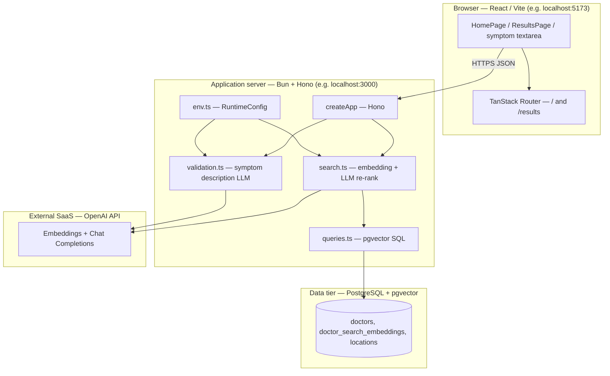
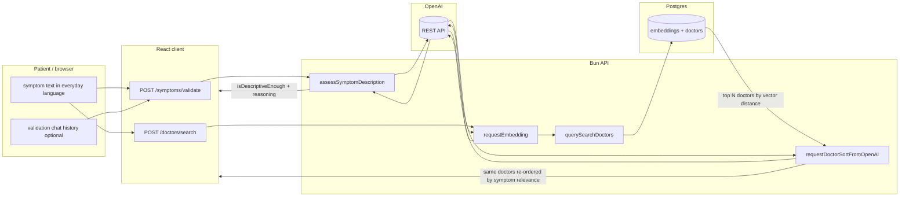

# User Story 2 — Development Specification

**User story:** As a sick person with no medical knowledge, I want to type my symptoms in plain language so that I do not need medical terminology to begin seeking care.

**Related issue:** [#3](https://github.com/Yuxiang-Huang/DocSeek/issues/3) (product backlog), documented in [#38](https://github.com/Yuxiang-Huang/DocSeek/issues/38).

**Engineering reference:** [PR #12](https://github.com/Yuxiang-Huang/DocSeek/pull/12) — adds OpenAI **chat completion** re-ranking of vector-search candidates using the patient’s free-text symptoms (`requestDoctorSortFromOpenAI`, `OPENAI_CHAT_MODEL` / `openAiChatModel`). The same user story also relies on **embedding-based** similarity (natural-language symptoms → vector) and optional **LLM symptom validation** (whether the description is concrete enough to search), which landed on `main` alongside or before that merge.

---

## Story ownership

| Role | Owner | Notes |
| --- | --- | --- |
| **Primary owner** | Yuxiang Huang ([@Yuxiang-Huang](https://github.com/Yuxiang-Huang)) | Author of [PR #12](https://github.com/Yuxiang-Huang/DocSeek/pull/12); implemented LLM re-ranking and tests in `api/src/search.ts` / `api/src/search.test.ts`, plus runtime config for `OPENAI_CHAT_MODEL`. |
| **Secondary owner** | axue3 ([@axue3](https://github.com/axue3)) | Requested reviewer on PR #12 (review request for acee3 was later removed); approved the changes before merge. |

---

## Merge date on `main`

The changes introduced by **PR #12** were merged into `main` on:

**2026-03-26** — merge commit [`973117f`](https://github.com/Yuxiang-Huang/DocSeek/commit/973117f) (*Merge pull request #12 from Yuxiang-Huang/feature/openai-doctor-resort*).

---

## Architecture diagram

Execution context: the **browser** runs the Vite/React client where the patient enters **plain-language** symptoms; the **API** runs on **Bun** (local dev or deployment target); **PostgreSQL** with **pgvector** stores specialty embeddings and doctor rows; **OpenAI** (cloud) provides **embeddings** (semantic match without medical terms), **chat completions** for symptom **quality checks**, and **chat completions** for **re-ranking** the short list returned by vector search.

---

## Information flow diagram

Flow shows **plain-language symptom text** from the patient, **optional validation history**, **embedding vectors**, **candidate doctors** from pgvector, and **LLM-ordered** results back to the client.

**Data elements:**

| Data | From | To | Purpose |
| --- | --- | --- | --- |
| Symptom string (plain language) | User | `/symptoms/validate`, `/doctors/search` | Judge descriptiveness; embed for similarity; prompt for re-ranking |
| Validation message history | Client | `/symptoms/validate` | Multi-turn clarification when input is vague |
| Embedding vector | OpenAI | API → SQL | Nearest-neighbor match in `doctor_search_embeddings` |
| Doctor rows + `match_score`, `matched_specialty` | Postgres | API | Candidate set (up to `limit`, default 10) |
| JSON array of doctor IDs | OpenAI chat | API | Re-order candidates by relevance to **verbatim** symptom text |
| Filters (`location`, `onlyAcceptingNewPatients`) | Client | `/doctors/search` | SQL `WHERE` clauses |

---

## Class diagram (types, services, and UI components)

The codebase uses **TypeScript** with **functional** modules and **React function components** (no application-level ES6 `class` declarations). The diagram lists **every interface and type alias** on the plain-language symptom path as UML classes. **Hono** is a framework class. Service types use the `«function type»` stereotype. Types marked `«internal»` are not exported from their module. The API module `search.ts` and the client `App.tsx` each define a type named `SearchFilters`; they appear as **SearchFiltersApi** and **SearchFiltersClient**. **ChatCompletionResponse** exists separately in `search.ts` and `validation.ts`; they appear as **ChatCompletionResponseSearch** and **ChatCompletionResponseValidation**.

**Relationships:** TypeScript **intersections** are modeled as **multiple inheritance** (`--|>`). `SearchHeroProps` extends `SearchFormProps`; only the extra fields are listed on `SearchHeroProps`. `ValidateSymptomsOptions` extends `SearchDoctorsOptionsClient` with `history`.

---

## Implementation reference: types, modules, and components

Below, **public** means exported from the module; **private** means file-scoped (not exported) or implementation detail inside a closure or component. React components are described with **props** as their public contract and **internal state/handlers** where applicable.

---

### `api/src/env.ts` — `RuntimeConfig` and environment loading

**Public**

*Types / configuration (grouped: configuration)*

| Name | Kind | Purpose |
| --- | --- | --- |
| `RuntimeConfig` | type | Includes `openAiChatModel` (default `gpt-4o-mini`) used by `requestDoctorSortFromOpenAI`, plus embedding and validation model ids, DB URL, CORS, API key. |

*Functions (grouped: environment)*

| Name | Kind | Purpose |
| --- | --- | --- |
| `loadEnvFile` | function | Optionally loads repo-root `.env` when keys are unset. |
| `getRuntimeConfig` | function | Parses `process.env`; requires `OPENAI_API_KEY`; supplies defaults for models including `OPENAI_CHAT_MODEL`. |

**Private**

*Constants (grouped: defaults)*

| Name | Purpose |
| --- | --- |
| `DEFAULT_PORT`, `DEFAULT_DATABASE_URL`, `DEFAULT_OPENAI_*` | Defaults when env vars are absent; `DEFAULT_OPENAI_CHAT_MODEL` is `gpt-4o-mini`. |

---

### `api/src/search.ts` — Plain-language symptoms → embedding → vector candidates → LLM re-rank

**Public**

*Types (grouped: domain)*

| Name | Purpose |
| --- | --- |
| `DoctorRow` | One physician row returned to the client, including `match_score`, `matched_specialty`, and coordinates. |
| `SearchFilters` | Optional `location` substring and `onlyAcceptingNewPatients` for SQL. |
| `DoctorSearchService` | Async function: symptoms + options → `DoctorRow[]` (after embedding query **and** `requestDoctorSortFromOpenAI`). |

*Functions (grouped: search pipeline)*

| Name | Purpose |
| --- | --- |
| `normalizeSearchLimit` | Default 10, validates positive integer, caps at 50. |
| `formatVectorLiteral` | Formats embedding array as Postgres `vector` literal for SQL. |
| `requestEmbedding` | Calls OpenAI embeddings API with the **raw symptom string** so colloquial wording maps to a semantic vector. |
| `requestDoctorSortFromOpenAI` | Sends **patient symptoms** and a numbered list of candidate doctors to the chat API; parses a JSON array of doctor IDs to re-order results (PR #12). |
| `createDoctorSearchService` | Returns a service that embeds, runs `querySearchDoctors`, then re-ranks with `requestDoctorSortFromOpenAI`. |

**Private**

*Types (grouped: internal API payloads)*

| Name | Purpose |
| --- | --- |
| `EmbeddingsResponse` | OpenAI embeddings JSON shape. |
| `ChatCompletionResponse` | OpenAI chat JSON shape for re-ranking responses. |
| `SearchDoctorsOptions` | `limit` and `filters` for one search. |
| `SearchDoctorsParams` | `symptoms` plus optional `SearchDoctorsOptions`. |
| `SearchRuntimeConfig` | `databaseUrl` and OpenAI settings for the factory closure. |

*Constants (grouped: defaults)*

| Name | Purpose |
| --- | --- |
| `DEFAULT_RESULT_LIMIT` | Default candidate count (10) before re-ranking. |

---

### `api/src/queries.ts` — SQL for vector similarity

**Public**

*Types (grouped: query filters)*

| Name | Purpose |
| --- | --- |
| `QuerySearchDoctorFilters` | Typed filters mirroring `SearchFilters` for query helpers (optional `locationContains`, `onlyAcceptingNewPatients`). |

*Functions (grouped: database)*

| Name | Purpose |
| --- | --- |
| `querySearchDoctors` | Parameterized SQL: joins embeddings and doctors; orders by distance to the symptom embedding; returns up to `limit` rows. |

**Private**

_None._

---

### `api/src/validation.ts` — LLM check that plain-language input is specific enough

**Public**

*Types (grouped: validation)*

| Name | Purpose |
| --- | --- |
| `SymptomValidationMessage` | `{ role, content }` for validation chat history. |
| `SymptomValidationService` | Async function from symptoms (+ optional history) to `SymptomDescriptionAssessment`. |

*Functions (grouped: validation pipeline)*

| Name | Purpose |
| --- | --- |
| `normalizeSymptomAssessment` | Strips reasoning when acceptable; supplies default guidance when vague. |
| `assessSymptomDescription` | Calls OpenAI chat with JSON schema output for `isDescriptiveEnough` / `reasoning`. |
| `createSymptomValidationService` | Factory binding `assessSymptomDescription` to validation model config. |

**Private**

*Types (grouped: internal)*

| Name | Purpose |
| --- | --- |
| `SymptomDescriptionAssessment` | Parsed LLM result: `isDescriptiveEnough`, optional `reasoning`. |
| `SymptomValidationRuntimeConfig` | OpenAI key, base URL, validation model id. |
| `ChatCompletionsResponse` | Chat response shape for parsing. |
| `SymptomValidationParams` | `symptoms` and optional `history`. |

*Values / functions (grouped: prompts and parsing)*

| Name | Purpose |
| --- | --- |
| `symptomValidationSystemPrompt` | Instructs the model how strictly to judge **non-clinical** descriptions. |
| `extractMessageContent` | Normalizes message content from string or structured parts. |

---

### `api/src/index.ts` — HTTP application (`createApp`)

**Public**

*Functions (grouped: HTTP)*

| Name | Purpose |
| --- | --- |
| `createApp` | Hono app with CORS, `POST /doctors/search` (symptoms body → `searchService`), `POST /symptoms/validate` (symptoms + history → `symptomValidationService`). |

**Private**

*Types (grouped: dependency injection)*

| Name | Purpose |
| --- | --- |
| `AppDependencies` | Optional `searchService`, `symptomValidationService`, `feedbackService` (used by other flows; not central to US2), CORS origins, `port`. |

---

### `api/src/server.ts` — Bun server entry

**Public**

| Name | Purpose |
| --- | --- |
| Default export `{ port, fetch }` | Bun entry: `fetch` delegates to `createApp` with `createDoctorSearchService(config)` and `createSymptomValidationService(config)`. |

**Private**

_Module-level `config` and `app` wiring._

---

### `client/src/components/App.tsx` — Symptom entry, validation client, doctor search client, results UI

**Public**

*Constants (grouped: configuration)*

| Name | Kind | Purpose |
| --- | --- | --- |
| `API_BASE_URL` | const | Base URL for API calls. |
| `SUGGESTED_SYMPTOMS` | const | Example chips for plain-language ideas. |

*Types (grouped: domain and API)*

| Name | Purpose |
| --- | --- |
| `Doctor` | Client physician model aligned with API fields used in the UI. |
| `SearchFilters` | Client filters for location and accepting-new-patients. |
| `DoctorSearchValidation` | Union: client-side validation ok/fail before navigation. |
| `SymptomValidationMessage` | Matches server validation message shape for history. |

*Functions — URLs (grouped: routing)*

| Name | Purpose |
| --- | --- |
| `getDoctorSearchUrl` | `/doctors/search` URL builder. |
| `getSymptomValidationUrl` | `/symptoms/validate` URL builder. |
| `getResultsNavigation` | TanStack navigation to `/results` with symptom and filter search params. |

*Functions — normalization and safety (grouped: input)*

| Name | Purpose |
| --- | --- |
| `normalizeSymptoms` | Trims symptom text. |
| `validateSymptomsForDoctorSearch` | Non-empty check and emergency keyword heuristic. |
| `symptomsSuggestEmergencyCare` | Blocks search when phrasing suggests emergency care. |

*Functions — API clients (grouped: network)*

| Name | Purpose |
| --- | --- |
| `searchDoctors` | `POST /doctors/search` with symptom string; receives **LLM-reordered** list from server. |
| `validateSymptoms` | `POST /symptoms/validate` with optional history. |
| `resolveSymptomsSubmission` | Orchestrates validation attempts and history updates before navigation. |

*Functions — display helpers (grouped: presentation)*

| Name | Purpose |
| --- | --- |
| `getNextRecommendationLabel` | Next-doctor button label. |
| `getFallbackDistanceMiles` | Deterministic distance fallback. |
| `direct_to_booking` | Profile URL for booking. |
| `getMatchQualityLabel` | Badge text from `match_score`. |
| `formatMatchedSpecialties` | Parses `matched_specialty` string. |
| `buildMatchExplanation` | Explains match using **user’s symptom quote** and specialty. |

*Components (grouped: layout and search)*

| Name | Purpose |
| --- | --- |
| `EmergencyCareAlert` | Banner when emergency phrases detected. |
| `SearchPageShell` | Page chrome and skip link. |
| `SearchForm` | Textarea for **plain-language** symptoms and submit. |
| `SearchFiltersForm` | Location and availability filters. |
| `SearchHero` | Hero copy, `SearchForm`, optional filters, suggestions, emergency alert. |
| `HomePage` | Wires symptom state to `resolveSymptomsSubmission` then `navigateToResults`. |

*Components (grouped: results)*

| Name | Purpose |
| --- | --- |
| `ResultsSearchSummary` | Shows current symptom query on results. |
| `ResultsActiveFilters` | Active filter chips. |
| `ResultsRefineFilters` | Inline filter refinement panel. |
| `ResultsHeader` | Back link, summary, filter strip, title. |
| `ResultsPage` | Loads doctors via `searchDoctorsImpl`, shows cards and loading/error. |
| `DoctorRecommendationCard` | Single-doctor view with match explanation quoting symptoms. |
| `FeedbackForm` | Post-visit rating (optional on results card). |

*Functions — feedback (grouped: network)*

| Name | Purpose |
| --- | --- |
| `submitFeedback` | `POST` feedback for a doctor (secondary to symptom entry). |

**Private**

*Types (grouped: internal client)*

| Name | Purpose |
| --- | --- |
| `UserLocation` | Browser geolocation coordinates. |
| `DoctorSearchResponse` | `{ doctors: Doctor[] }` from search API. |
| `SymptomValidationResponse` | Validation API success shape. |
| `SearchDoctorsOptions` | Options for `searchDoctors` / `submitFeedback`. |
| `SearchFiltersFormProps` | Props for filter controls. |
| `ValidateSymptomsOptions` | Extends search options with `history`. |
| `ValidateSymptomsImplementation` | Injectable validation function type. |
| `ResolveSymptomsSubmissionOptions` | Options for `resolveSymptomsSubmission`. |
| `SearchPageShellProps` | Shell props. |
| `SearchFormProps` | Form props. |
| `SearchHeroProps` | Extends `SearchFormProps` with error and filters. |
| `HomePageProps` | Navigation callback prop. |
| `DoctorRecommendationCardProps` | Card props. |
| `FeedbackFormProps` | Feedback injectable impl. |
| `ResultsHeaderProps`, `ResultsSearchSummaryProps`, `ResultsActiveFiltersProps`, `ResultsRefineFiltersProps`, `ResultsPageProps` | Results subtree props. |

*Constants / functions (grouped: heuristics)*

| Name | Purpose |
| --- | --- |
| `EMERGENCY_PHRASES` | Keyword list for triage heuristic; lowercased phrases matched after `normalizeSymptomsForMatching`. |
| `normalizeSymptomsForMatching` | Normalizes apostrophes and spaces for phrase matching against `EMERGENCY_PHRASES`. |

*Component internals (grouped: `HomePage`)*

| State/handlers | Purpose |
| --- | --- |
| `symptoms`, `location`, `onlyAcceptingNewPatients`, `errorMessage`, `isValidating`, `validationAttemptCount`, `validationHistory` | React state for plain-language input and multi-turn LLM validation. |
| `handleSymptomsChange`, `handleSubmit` | Clears errors on edit; submit runs `resolveSymptomsSubmission` then `navigateToResults` with filters. |

*Component internals (grouped: `ResultsPage`)*

| State/effects | Purpose |
| --- | --- |
| `doctors`, `activeDoctorIndex`, `errorMessage`, `isLoading`, refine panel state, `userLocation` | Loads **LLM-reordered** doctors via `searchDoctorsImpl`, geolocation for distance, refine re-navigation. |
| `loadDoctors` effect | Calls `searchDoctorsImpl`, short-circuits on emergency phrases, handles errors and empty sets. |

*Component internals (grouped: `FeedbackForm`)*

| State/handlers | Purpose |
| --- | --- |
| `rating`, `comment`, `submitted`, `error`, `handleSubmit` | Optional post-visit feedback on the recommendation card. |

*Component internals (grouped: `DoctorRecommendationCard`)*

| Derived values | Purpose |
| --- | --- |
| `activeDoctor`, `hasNextDoctor`, Haversine or fallback distance, `matchedSpecialties`, `bookingUrl` | Renders one doctor; `buildMatchExplanation` ties UI copy to the user’s symptom text. |

---

### `client/src/utils/distance.ts` — haversine distance

**Public**

| Name | Purpose |
| --- | --- |
| `calculateDistance` | Haversine distance in miles between two lat/lon pairs. |
| `formatDistance` | Human-readable distance string (e.g. “X mi away”). |

**Private**

_None._

---

### `client/src/hooks/useSavedPhysicians.ts` — saved physicians persistence

**Public**

| Name | Purpose |
| --- | --- |
| `useSavedPhysicians` | Hook: `savedDoctors`, `addSavedDoctor`, `removeSavedDoctor`, `isSaved`; persists to `localStorage`; listens for `storage` events. |

**Private**

| Name | Purpose |
| --- | --- |
| `STORAGE_KEY` | `localStorage` key for saved doctors. |
| `loadSavedDoctors` | Parses saved JSON safely. |
| `saveDoctors` | Writes JSON array to `localStorage`. |

---

### `client/src/components/AppNav.tsx` — top navigation

**Public**

| Name | Purpose |
| --- | --- |
| `AppNav` | Links to home and saved physicians; optional saved count (rendered inside `SearchPageShell`). |

**Private**

_None (uses `useSavedPhysicians` internally)._

---

### `client/src/routes/results.tsx` — `/results` route

**Public**

| Name | Kind | Purpose |
| --- | --- | --- |
| `Route` | TanStack file route | Validates URL search params into `ResultsSearch`, renders `ResultsPage` with `initialSymptoms` and `initialFilters`. |

**Private**

*Types (grouped: search params)*

| Name | Purpose |
| --- | --- |
| `ResultsSearch` | `symptoms`, optional `location`, optional `onlyAcceptingNewPatients` flag as string. |

*Functions*

| Name | Purpose |
| --- | --- |
| `ResultsRoutePage` | Maps route search to `ResultsPage` props. |

---

### `client/src/routes/index.tsx` — `/` route

**Public**

| Name | Purpose |
| --- | --- |
| `Route` | File route for home; renders `HomePage` with `navigateToResults` using `getResultsNavigation`. |

**Private**

| Name | Purpose |
| --- | --- |
| `HomeRoute` | Connects TanStack `navigate` to `HomePage`. |

---

## Traceability summary

| User-facing need | Mechanism in code |
| --- | --- |
| No medical terminology required | `requestEmbedding` + `querySearchDoctors` match **natural language** to specialty embeddings; `requestDoctorSortFromOpenAI` re-orders by the same free-text symptoms. |
| Plain language still “good enough” to search | `assessSymptomDescription` / `resolveSymptomsSubmission` loop asks for more detail when the LLM judges the text too vague. |
| PR #12 deliverable | `requestDoctorSortFromOpenAI`, `openAiChatModel` / `OPENAI_CHAT_MODEL`, tests in `api/src/search.test.ts`. |

---

## Appendix — Per-type public and private members

Each **type** below is a TypeScript `type` or `interface` (or a function type). Object types have only **public** fields at the type level. **Function types** are described as a single callable member. **Components** list props as public fields and internal React state as **private** where applicable.

### `DoctorRow` (`api/src/search.ts`)

**Public fields (grouped: identity and source)**

| Field | Purpose |
| --- | --- |
| `id` | Primary key for the doctor in the app database. |
| `source_provider_id` | Upstream source system identifier. |
| `npi` | National Provider Identifier when available. |
| `full_name`, `first_name`, `middle_name`, `last_name`, `suffix` | Display and parsing of the physician name. |

**Public fields (grouped: clinical and availability)**

| Field | Purpose |
| --- | --- |
| `primary_specialty` | Declared specialty string for display. |
| `accepting_new_patients` | Whether the provider is marked as accepting new patients. |

**Public fields (grouped: links and location)**

| Field | Purpose |
| --- | --- |
| `profile_url`, `ratings_url`, `book_appointment_url` | UPMC web URLs for profile, ratings, and booking flows. |
| `primary_location`, `primary_phone` | Primary clinic address line and phone. |
| `latitude`, `longitude` | Coordinates from the primary location when populated. |

**Public fields (grouped: search metadata)**

| Field | Purpose |
| --- | --- |
| `created_at` | Row timestamp from the database. |
| `match_score` | Cosine-related similarity score from pgvector (exposed as `1 - distance`). |
| `matched_specialty` | Text from the embedding row describing the matched specialty facet. |

**Public methods:** none (data only).

**Private fields / methods:** none at the type level.

---

### `Doctor` (`client/src/components/App.tsx`)

**Public fields (grouped: UI-facing physician)**

| Field | Purpose |
| --- | --- |
| `id`, `full_name`, `primary_specialty`, `accepting_new_patients` | Core card identity and specialty line. |
| `profile_url`, `book_appointment_url`, `primary_location`, `primary_phone` | Links and contact/locale for the card. |
| `match_score`, `matched_specialty` | Match strength and embedding specialty line for explanations. |
| `latitude`, `longitude` | Optional coordinates for distance when geolocation is available. |

**Public methods:** none.

**Private fields / methods:** none at the type level.

---

### `SearchFiltersApi` (`api/src/search.ts`, exported as `SearchFilters`)

**Public fields (grouped: SQL filters)**

| Field | Purpose |
| --- | --- |
| `location` | Optional substring for `primary_location ILIKE`. |
| `onlyAcceptingNewPatients` | When true, restricts to accepting doctors. |

**Public methods:** none.

**Private fields / methods:** none.

---

### `SearchFiltersClient` (`client/src/components/App.tsx`, exported as `SearchFilters`)

**Public fields (grouped: UI filters)**

| Field | Purpose |
| --- | --- |
| `location` | Optional user-entered location hint sent to the API. |
| `onlyAcceptingNewPatients` | Optional flag sent to the API. |

**Public methods:** none.

**Private fields / methods:** none.

---

### `DoctorSearchService` (function type, `api/src/search.ts`)

**Public methods (grouped: service)**

| Member | Purpose |
| --- | --- |
| `(params: SearchDoctorsParams) => Promise<DoctorRow[]>` | Runs embedding, SQL retrieval, and LLM re-ranking for one search. |

**Public fields:** none.

**Private fields / methods:** none (type is not a class instance).

---

### `SearchDoctorsParams` (`api/src/search.ts`, internal)

**Public fields**

| Field | Purpose |
| --- | --- |
| `symptoms` | Patient symptom text in **plain language** to embed and rank against. |
| `options` | Optional limit and filters. |

**Private fields / methods:** none.

---

### `SearchDoctorsOptionsApi` (`api/src/search.ts`, internal)

**Public fields**

| Field | Purpose |
| --- | --- |
| `limit` | Max rows to fetch from SQL before re-ranking. |
| `filters` | Optional `SearchFiltersApi`. |

**Private fields / methods:** none.

---

### `SearchRuntimeConfig`, `EmbeddingsResponse`, `ChatCompletionResponseSearch` (`api/src/search.ts`, internal)

**`SearchRuntimeConfig` public fields:** `databaseUrl`, `openAiApiKey`, `openAiBaseUrl`, `openAiEmbeddingModel`, `openAiChatModel` — configuration for the search service factory and HTTP calls (including PR #12 chat re-ranking).

**`EmbeddingsResponse` public fields:** `data` — array of `{ embedding, index }` from OpenAI embeddings API.

**`ChatCompletionResponseSearch` public fields:** `choices` — chat completion payload for doctor ID re-ordering.

**Private fields / methods:** none at type level.

---

### `QuerySearchDoctorFilters` (`api/src/queries.ts`)

**Public fields**

| Field | Purpose |
| --- | --- |
| `locationContains` | Documented filter shape (query uses `SearchFilters` from `search.ts` in practice). |
| `onlyAcceptingNewPatients` | Parallel optional filter flag. |

**Private fields / methods:** none.

---

### `AppDependencies` (`api/src/index.ts`, internal)

**Public fields (grouped: DI)**

| Field | Purpose |
| --- | --- |
| `port` | Optional port for health JSON display. |
| `searchService`, `symptomValidationService` | Injected services for plain-language symptom search and validation. |
| `feedbackService` | Injected service for `/doctors/:id/feedback` (outside US2’s core scope). |
| `corsAllowedOrigins` | Allowed browser origins for CORS. |

**Public methods:** none.

**Private fields / methods:** none.

---

### `Hono` (framework, `hono`)

**Public methods (grouped: HTTP app):** `constructor`, `use`, `get`, `post`, `fetch` — standard Hono API used by `createApp`.

**Private:** implementation is library-internal.

---

### `SymptomDescriptionAssessment`, `SymptomValidationMessageApi`, `SymptomValidationParams`, `SymptomValidationRuntimeConfig`, `ChatCompletionResponseValidation` (`api/src/validation.ts`)

**`SymptomDescriptionAssessment` (internal) public fields:** `isDescriptiveEnough`, optional `reasoning`.

**`SymptomValidationMessageApi` public fields:** `role` (`"user"` \| `"assistant"`), `content`.

**`SymptomValidationParams` public fields:** `symptoms`, optional `history` of `SymptomValidationMessageApi`.

**`SymptomValidationRuntimeConfig` public fields:** OpenAI key, base URL, validation model id.

**`ChatCompletionResponseValidation` public fields:** `choices` with `message.content` string or structured parts.

**Private fields / methods:** none at type level.

---

### `SymptomValidationService` (function type, `api/src/validation.ts`)

**Public methods:** `(params: SymptomValidationParams) => Promise<SymptomDescriptionAssessment>` — validates whether symptom text is specific enough for a useful search.

**Public fields:** none.

---

### `RuntimeConfig` (`api/src/env.ts`)

**Public fields (grouped: server and AI):** `port`, `databaseUrl`, `corsAllowedOrigins`, `openAiApiKey`, `openAiBaseUrl`, `openAiEmbeddingModel`, `openAiChatModel`, `openAiValidationModel`.

**Public methods:** none on the type (loading uses `getRuntimeConfig` at module level).

---

### `UserLocation`, `DoctorSearchResponse`, `SymptomValidationResponse`, `SearchDoctorsOptionsClient` (`client/src/components/App.tsx`, internal)

**`UserLocation` public fields:** `latitude`, `longitude`.

**`DoctorSearchResponse` public fields:** `doctors` — array of `Doctor`.

**`SymptomValidationResponse` public fields:** `isDescriptiveEnough`, optional `reasoning`.

**`SearchDoctorsOptionsClient` public fields:** optional `apiBaseUrl`, `fetchImpl`, `filters` (`SearchFiltersClient`).

---

### `SearchFiltersFormProps`, `SearchPageShellProps`, `SearchFormProps`, `SearchHeroProps`, `HomePageProps`, `DoctorRecommendationCardProps`, `ResultsHeaderProps`, `ResultsSearchSummaryProps`, `ResultsActiveFiltersProps`, `ResultsRefineFiltersProps`, `ResultsPageProps`, `FeedbackFormProps` (`client/src/components/App.tsx`, internal)

These are **React props** types (all fields are required unless optional `?` in source).

**`SearchFiltersFormProps`:** `location`, `onlyAcceptingNewPatients`, `onLocationChange`, `onOnlyAcceptingChange`.

**`SearchPageShellProps`:** `children`, optional `showNav`.

**`SearchFormProps`:** `symptoms`, `onSymptomsChange`, `onSubmit`, optional `isLoading`, optional `validationMessage`.

**`SearchHeroProps`:** all `SearchFormProps` fields plus optional `errorMessage` and optional `filters` (`SearchFiltersFormProps`).

**`HomePageProps`:** `navigateToResults(symptoms, filters?)`.

**`DoctorRecommendationCardProps`:** `doctors`, `activeDoctorIndex`, `onNextDoctor`, optional `symptoms`, optional `isSaved`, optional `onSave` / `onUnsave`, `userLocation`.

**`ResultsHeaderProps`:** optional `includeBackLink`, `initialSymptoms`, optional `activeFilters`, optional `onRefineFilters`.

**`ResultsSearchSummaryProps`:** `symptoms`.

**`ResultsActiveFiltersProps`:** `filters`, `onRefine`.

**`ResultsRefineFiltersProps`:** `location`, `onlyAcceptingNewPatients`, change handlers, `onApply`, `onCancel`, `isRefining`.

**`ResultsPageProps`:** `initialSymptoms`, optional `initialFilters`, optional `searchDoctorsImpl`, optional `includeBackLink`.

**`FeedbackFormProps`:** `doctorId`, optional `submitFeedbackImpl`.

**Private fields / methods:** none on the props types themselves; component **implementations** use internal state (see module sections above).

---

### `ValidateSymptomsOptions`, `ValidateSymptomsImplementation`, `ResolveSymptomsSubmissionOptions` (`client/src/components/App.tsx`, internal)

**`ValidateSymptomsOptions`:** intersection of `SearchDoctorsOptionsClient` with optional `history` (`SymptomValidationMessageClient[]`).

**`ValidateSymptomsImplementation`:** function type `(symptoms, options?) => Promise<SymptomValidationResponse>`.

**`ResolveSymptomsSubmissionOptions`:** optional `attemptCount`, `maxValidationAttempts`, `validationHistory`, `validateSymptomsImpl`.

---

### `DoctorSearchValidation` (`client/src/components/App.tsx`, exported union)

**Public fields (grouped: variants)**

| Variant | Fields |
| --- | --- |
| Success | `ok: true`, `normalized: string` |
| Failure | `ok: false`, `message: string` |

---

### `SymptomValidationMessageClient` (`client/src/components/App.tsx`, exported)

**Public fields:** `role` (`"user"` \| `"assistant"`), `content` — mirrors server validation messages for multi-turn UI state.

---

### `ResultsSearch` (`client/src/routes/results.tsx`, internal)

**Public fields:** `symptoms`, optional `location`, optional `onlyAcceptingNewPatients` (string `"true"` when set).

---

## Step 7 — External technologies actually used

This section is intentionally specific to:

- **Issue #3**: [User Story 2](https://github.com/Yuxiang-Huang/DocSeek/issues/3)
- **PR #12**: [Add OpenAI LLM re-ranking for doctor search results](https://github.com/Yuxiang-Huang/DocSeek/pull/12)
- the code currently present in this repository

Important implementation note: issue #3 says the machine acceptance criteria should include **LLM extraction of structured symptom entities** and mapping those entities to an **internal medical ontology**. That is **not** what the merged implementation does. The implemented system accepts free text, optionally validates that the text is descriptive enough, embeds the raw symptom string for vector search, and then re-ranks candidate doctors with an OpenAI chat completion. There is no symptom-entity table, ontology table, or ontology-mapping module in the current schema or code.

### Technologies used directly on this user-story path

| Technology | Required version | Where it is used in this story | Why it was chosen over alternatives | Author / steward | Source location | Documentation |
| --- | --- | --- | --- | --- | --- | --- |
| TypeScript | `5.9.3` in `client/package-lock.json`; Bun type package `1.3.11` in `api/bun.lock` | Main application language for the client and API. `api/src/search.ts`, `api/src/validation.ts`, `api/src/index.ts`, and `client/src/components/App.tsx` are all TypeScript modules on this path. | The repo is already a TypeScript monorepo, and this user story depends heavily on typed request/response payloads and typed route params. Using TypeScript reduces ambiguity more effectively here than plain JavaScript. | Microsoft | [github.com/microsoft/TypeScript](https://github.com/microsoft/TypeScript) | [typescriptlang.org/docs](https://www.typescriptlang.org/docs/) |
| Bun runtime | Runtime family `1.x` via `oven/bun:1`; typings `1.3.11` | Executes the API and provides `Bun.SQL` in `createDoctorSearchService` and `createFeedbackService`. Also runs Bun tests in `api/src/*.test.ts`. | The API is very small and benefits from Bun’s built-in SQL and fetch support. That avoids a separate PostgreSQL driver in the TypeScript API layer and keeps deployment/dev setup lightweight. | Oven | [github.com/oven-sh/bun](https://github.com/oven-sh/bun) | [bun.sh/docs](https://bun.sh/docs) |
| Hono | `4.12.8` | API routing and middleware in `api/src/index.ts`: `POST /doctors/search`, `POST /symptoms/validate`, `POST /doctors/:id/feedback`. | Hono is a minimal HTTP framework with good Bun support, which is a better fit here than heavier frameworks such as NestJS or Express + many plugins. | Hono contributors / Yusuke Wada | [github.com/honojs/hono](https://github.com/honojs/hono) | [hono.dev/docs](https://hono.dev/docs/) |
| OpenAI API | API `v1`; configured model IDs `text-embedding-3-small`, `gpt-4o-mini`, `gpt-4.1-mini` | `requestEmbedding()` in [`search.ts`](/Users/acheung/Documents/GitHub/DocSeek/api/src/search.ts) calls `/embeddings`; `requestDoctorSortFromOpenAI()` calls `/chat/completions` to re-rank PR #12’s top-10 candidate doctors; `assessSymptomDescription()` in [`validation.ts`](/Users/acheung/Documents/GitHub/DocSeek/api/src/validation.ts) calls `/chat/completions` with `response_format.json_schema` to determine whether the symptom description is specific enough. | One provider covers all three AI functions already in the code: semantic embedding, search-input validation, and candidate re-ranking. That is simpler than combining separate embedding and LLM vendors. | OpenAI | [github.com/openai/openai-openapi](https://github.com/openai/openai-openapi) | [platform.openai.com/docs](https://platform.openai.com/docs) |
| PostgreSQL | `16` family via `pgvector/pgvector:pg16` in `compose.yml` | Persistent storage for doctors, locations, lookup tables, feedback, and embedding rows. Search candidates come from SQL in [`api/src/queries.ts`](/Users/acheung/Documents/GitHub/DocSeek/api/src/queries.ts). | The application already needed relational joins for doctors, locations, tags, and specialties. PostgreSQL handles those well and can also support vector search through pgvector, so it avoids adding a second primary datastore. | PostgreSQL Global Development Group | [github.com/postgres/postgres](https://github.com/postgres/postgres) | [postgresql.org/docs/16](https://www.postgresql.org/docs/16/) |
| pgvector | Enabled by `CREATE EXTENSION IF NOT EXISTS vector;`; vectors are stored as `vector(1536)` | The semantic-search step in [`queries.ts`](/Users/acheung/Documents/GitHub/DocSeek/api/src/queries.ts) uses the `<=>` operator against `doctor_search_embeddings.embedding` to rank doctors by vector distance to the embedded symptom text. | The team can keep vector similarity inside Postgres instead of provisioning a separate vector DB such as Pinecone, Weaviate, or Milvus. That keeps the architecture smaller and easier for a student project. | pgvector contributors / Andrew Kane | [github.com/pgvector/pgvector](https://github.com/pgvector/pgvector) | [github.com/pgvector/pgvector](https://github.com/pgvector/pgvector) |
| React | `19.2.0` | Browser UI for symptom entry, validation feedback, filter state, results rendering, and feedback submission in [`client/src/components/App.tsx`](/Users/acheung/Documents/GitHub/DocSeek/client/src/components/App.tsx). | The repo already uses React; this story needs interactive client state and conditional rendering more than it needs a server-heavy frontend framework. | Meta and the React community | [github.com/facebook/react](https://github.com/facebook/react) | [react.dev](https://react.dev/) |
| React DOM | `19.2.0` | Browser renderer for the React client. | Required to run the chosen React frontend in the browser. | Meta and the React community | [github.com/facebook/react](https://github.com/facebook/react) | [react.dev/reference/react-dom](https://react.dev/reference/react-dom) |
| TanStack Router | `1.168.3` | The search flow navigates from the home page to `/results` with typed URL search params. [`client/src/routes/results.tsx`](/Users/acheung/Documents/GitHub/DocSeek/client/src/routes/results.tsx) validates `symptoms`, `location`, and `onlyAcceptingNewPatients`. | Typed URL search params are central to this story because the symptoms and filters must survive navigation. TanStack Router gives stronger type ergonomics than an ad hoc URL parser. | TanStack / Tanner Linsley | [github.com/TanStack/router](https://github.com/TanStack/router) | [tanstack.com/router/latest](https://tanstack.com/router/latest) |
| Vite | `7.3.1` | Frontend dev/build toolchain for the browser client. | Fast local feedback and simple configuration make more sense here than a more complex bundler stack. | Vite team / Evan You and contributors | [github.com/vitejs/vite](https://github.com/vitejs/vite) | [vite.dev/guide](https://vite.dev/guide/) |
| Tailwind CSS | `4.2.2` | Styling for the symptom entry page and results UI. | Faster iteration than building a custom CSS system from scratch for a course project. | Tailwind Labs | [github.com/tailwindlabs/tailwindcss](https://github.com/tailwindlabs/tailwindcss) | [tailwindcss.com/docs](https://tailwindcss.com/docs) |
| Lucide React | `0.545.0` | UI icons such as search, arrows, bookmark, and alert symbols in the client. | Small icon package with direct React component usage; simpler than pulling in a large component library. | Lucide contributors | [github.com/lucide-icons/lucide](https://github.com/lucide-icons/lucide) | [lucide.dev/guide/packages/lucide-react](https://lucide.dev/guide/packages/lucide-react) |

### Technologies used to populate and maintain the data this story searches

These are not on the request/response hot path for each search, but they are required for the story to work because they create and refresh the data that search consumes.

| Technology | Required version | Where it is used | Why it was chosen | Author / steward | Source location | Documentation |
| --- | --- | --- | --- | --- | --- | --- |
| Python | `>=3.12` from `data-scripts/pyproject.toml` | Runs the ETL/scraping scripts that load providers and embedding source text into PostgreSQL. | Python has a stronger scraping and ETL ecosystem than Bun for this workflow. | Python Software Foundation | [github.com/python/cpython](https://github.com/python/cpython) | [docs.python.org/3.12](https://docs.python.org/3.12/) |
| psycopg | `3.3.3` | Used by [`scrape_doctors.py`](/Users/acheung/Documents/GitHub/DocSeek/data-scripts/scrape_doctors.py), [`repopulate_database.py`](/Users/acheung/Documents/GitHub/DocSeek/data-scripts/repopulate_database.py), and [`generate_specialty_embeddings.py`](/Users/acheung/Documents/GitHub/DocSeek/data-scripts/generate_specialty_embeddings.py) to write to PostgreSQL. | Modern PostgreSQL driver with a better API than legacy `psycopg2` for new code. | Psycopg team / Daniele Varrazzo and contributors | [github.com/psycopg/psycopg](https://github.com/psycopg/psycopg) | [psycopg.org/psycopg3/docs](https://www.psycopg.org/psycopg3/docs/) |
| httpx | `0.28.1` | Used by `generate_specialty_embeddings.py` and `repopulate_database.py` to call OpenAI from Python. | Clean sync HTTP API with straightforward timeout and JSON handling. | Encode OSS Ltd. and contributors | [github.com/encode/httpx](https://github.com/encode/httpx) | [python-httpx.org](https://www.python-httpx.org/) |
| Beautiful Soup 4 | `4.14.3` | Parses UPMC HTML in `scrape_doctors.py`. | Easier to maintain than manual HTML string parsing. | Leonard Richardson and contributors | [code.launchpad.net/beautifulsoup](https://code.launchpad.net/beautifulsoup) | [crummy.com/software/BeautifulSoup/bs4/doc](https://www.crummy.com/software/BeautifulSoup/bs4/doc/) |
| lxml | `6.0.2` | Parser backend used by Beautiful Soup in `scrape_doctors.py`. | Faster and more robust HTML parsing than the default parser. | lxml developers | [github.com/lxml/lxml](https://github.com/lxml/lxml) | [lxml.de](https://lxml.de/) |
| Selenium | `4.41.0` | Browser automation in `scrape_doctors.py` for the upstream UPMC site. | The checked-in README notes that the site blocked simple headless/containerized fetches, so Selenium was used to fetch rendered pages reliably enough during implementation. | Selenium project | [github.com/SeleniumHQ/selenium](https://github.com/SeleniumHQ/selenium) | [selenium.dev/documentation](https://www.selenium.dev/documentation/) |

### Technologies used to verify this user-story implementation

| Technology | Required version | Where it is used | Why it was chosen | Author / steward | Source location | Documentation |
| --- | --- | --- | --- | --- | --- | --- |
| Bun test runner | Bun `1.x` | API unit tests in [`api/src/search.test.ts`](/Users/acheung/Documents/GitHub/DocSeek/api/src/search.test.ts), [`api/src/validation.test.ts`](/Users/acheung/Documents/GitHub/DocSeek/api/src/validation.test.ts), and related files. PR #12 specifically added `api/src/search.test.ts`. | Reuses the Bun runtime already chosen for the API. | Oven | [github.com/oven-sh/bun](https://github.com/oven-sh/bun) | [bun.sh/docs/cli/test](https://bun.sh/docs/cli/test) |
| Vitest | `3.2.4` | Frontend tests under `client/src/tests`. | Natural fit with the Vite-based client. | Vitest contributors | [github.com/vitest-dev/vitest](https://github.com/vitest-dev/vitest) | [vitest.dev/guide](https://vitest.dev/guide/) |
| Testing Library React | `16.3.2` | User-facing React component tests in the client. | Encourages testing rendered behavior rather than component internals. | Testing Library contributors | [github.com/testing-library/react-testing-library](https://github.com/testing-library/react-testing-library) | [testing-library.com/docs/react-testing-library/intro](https://testing-library.com/docs/react-testing-library/intro/) |
| Testing Library DOM | `10.4.1` | DOM query/assertion utilities used under the same frontend test stack. | Standard companion library for Testing Library. | Testing Library contributors | [github.com/testing-library/dom-testing-library](https://github.com/testing-library/dom-testing-library) | [testing-library.com/docs/dom-testing-library/intro](https://testing-library.com/docs/dom-testing-library/intro/) |
| jsdom | `28.1.0` | Browser-like DOM environment for frontend tests. | Lets the team test browser UI behavior without a full browser process. | jsdom contributors | [github.com/jsdom/jsdom](https://github.com/jsdom/jsdom) | [github.com/jsdom/jsdom](https://github.com/jsdom/jsdom) |

### PR #12 specific external additions

PR #12 changed exactly these files according to GitHub:

- `.env.example`
- [`api/src/env.test.ts`](/Users/acheung/Documents/GitHub/DocSeek/api/src/env.test.ts)
- [`api/src/env.ts`](/Users/acheung/Documents/GitHub/DocSeek/api/src/env.ts)
- [`api/src/search.test.ts`](/Users/acheung/Documents/GitHub/DocSeek/api/src/search.test.ts)
- [`api/src/search.ts`](/Users/acheung/Documents/GitHub/DocSeek/api/src/search.ts)

The only **new external dependency introduced by the PR itself** was a new **OpenAI chat-completions usage pattern** for result re-ranking, plus the new config field `OPENAI_CHAT_MODEL` / `openAiChatModel` defaulting to `gpt-4o-mini`.

---

## Step 8 — Long-term stored data types and storage cost

This section is limited to data stored in **database-backed long-term storage**, as requested. For this user story, the primary storage structures are the provider directory tables, the vector-search table, and the optional feedback table.

Important scoping note:

- The current implementation **does not** store the patient’s symptom text, extracted symptom entities, or ontology mappings in the database.
- Because issue #3 mentioned entity extraction and ontology mapping but the code does not implement them, there are **no database tables or rows** for those concepts to document here.

### Storage assumptions used below

- `BIGSERIAL` / `BIGINT` = `8` bytes
- `INTEGER` = `4` bytes
- `BOOLEAN` = `1` byte
- `TIMESTAMPTZ` = `8` bytes
- `DOUBLE PRECISION` = `8` bytes
- `TEXT` = approximately `4 + UTF-8 payload length` bytes, excluding row/header/index/TOAST overhead
- `vector(1536)` = approximately `6152` bytes for the vector payload

### `doctor_search_embeddings`

This is the most story-specific stored data type because the search pipeline directly depends on it.

| Field | Type | Approx. bytes | Purpose in this story |
| --- | --- | --- | --- |
| `doctor_id` | `BIGINT` | `8` | Links the embedding row to the physician returned to the user. |
| `content` | `TEXT` | `4 + len(content)` | Stores the text that was embedded. In current ETL code this is specialty-focused text such as `Specialty: Neurology; Headache Medicine`. |
| `source_field` | `TEXT` | `4 + len(source_field)` | Identifies the source of the embedded text. The current code uses `'specialty'`. |
| `embedding_model` | `TEXT` | `4 + len(embedding_model)` | Records which OpenAI embedding model produced the vector, for example `text-embedding-3-small`. |
| `embedding` | `vector(1536)` | `6152` | The vector used by pgvector nearest-neighbor search in `querySearchDoctors()`. |
| `updated_at` | `TIMESTAMPTZ` | `8` | Lets the team know when the embedding was last refreshed. |

Why it exists:

- `requestEmbedding()` embeds the **user’s free-text symptom string** at query time.
- `querySearchDoctors()` compares that transient query vector with these persisted specialty vectors.
- Without this table, the implementation in PR #12 would have nothing to re-rank because the vector-search candidate set would not exist.

### `doctors`

These are the provider records that the user ultimately sees in search results.

| Field | Type | Approx. bytes | Purpose in this story |
| --- | --- | --- | --- |
| `id` | `BIGSERIAL` | `8` | Internal key used throughout the search and re-ranking path. |
| `source_provider_id` | `BIGINT` | `8` | Stable upstream provider identifier used for ETL dedupe. |
| `npi` | `TEXT` | `4 + len(npi)` | External provider identifier; not used in ranking logic, but part of the persisted provider identity record. |
| `full_name` | `TEXT` | `4 + len(full_name)` | Physician name shown to the user and sent to OpenAI in PR #12’s re-ranking prompt. |
| `first_name` | `TEXT` | `4 + len(first_name)` | Structured provider name part. |
| `middle_name` | `TEXT` | `4 + len(middle_name)` | Structured provider name part. |
| `last_name` | `TEXT` | `4 + len(last_name)` | Structured provider name part. |
| `suffix` | `TEXT` | `4 + len(suffix)` | Structured provider name suffix. |
| `primary_specialty` | `TEXT` | `4 + len(primary_specialty)` | Specialty shown to the user and sent to OpenAI during PR #12 re-ranking. |
| `accepting_new_patients` | `BOOLEAN` | `1` | Used by the optional availability filter passed from the client. |
| `profile_url` | `TEXT` | `4 + len(profile_url)` | Link to the doctor profile page. |
| `ratings_url` | `TEXT` | `4 + len(ratings_url)` | Link to reviews/ratings. |
| `book_appointment_url` | `TEXT` | `4 + len(book_appointment_url)` | Stored booking URL if available. |
| `primary_location` | `TEXT` | `4 + len(primary_location)` | Human-readable location sent to the user and to OpenAI during re-ranking. |
| `primary_phone` | `TEXT` | `4 + len(primary_phone)` | Phone number shown to the user. |
| `created_at` | `TIMESTAMPTZ` | `8` | Insert timestamp for the provider row. |

Why it exists:

- `querySearchDoctors()` selects `d.*` from this table after vector matching.
- `requestDoctorSortFromOpenAI()` in PR #12 serializes `id`, `full_name`, `primary_specialty`, and `primary_location` from these rows into the chat prompt.

### `locations`

These rows back the location-aware parts of the user experience.

| Field | Type | Approx. bytes | Purpose in this story |
| --- | --- | --- | --- |
| `id` | `BIGSERIAL` | `8` | Internal location key. |
| `source_location_id` | `BIGINT` | `8` | Upstream location identifier. |
| `name` | `TEXT` | `4 + len(name)` | Human-readable location/facility name. |
| `street1` | `TEXT` | `4 + len(street1)` | Street address. |
| `street2` | `TEXT` | `4 + len(street2)` | Additional address line. |
| `suite` | `TEXT` | `4 + len(suite)` | Suite/unit detail. |
| `city` | `TEXT` | `4 + len(city)` | Location city. |
| `state` | `TEXT` | `4 + len(state)` | Location state. |
| `zip_code` | `TEXT` | `4 + len(zip_code)` | Postal code. |
| `phone` | `TEXT` | `4 + len(phone)` | Location-specific phone number. |
| `latitude` | `DOUBLE PRECISION` | `8` | Coordinates used by the client to compute distance. |
| `longitude` | `DOUBLE PRECISION` | `8` | Coordinates used by the client to compute distance. |

Why it exists:

- `querySearchDoctors()` left-joins `doctor_locations` and `locations` to return `latitude` and `longitude`.
- The client uses those coordinates in `calculateDistance()` / `formatDistance()`.

### `doctor_locations`

This join table connects physicians to their stored locations.

| Field | Type | Approx. bytes | Purpose in this story |
| --- | --- | --- | --- |
| `doctor_id` | `BIGINT` | `8` | Provider key. |
| `location_id` | `BIGINT` | `8` | Location key. |
| `rank` | `INTEGER` | `4` | Upstream location order. |
| `is_primary` | `BOOLEAN` | `1` | Marks the location to use for the main search result row. |

Why it exists:

- `querySearchDoctors()` joins only the primary location (`dl.is_primary = true`) to keep the result set to one location per doctor.

### Lookup and relationship tables used to build search text and provider metadata

Although these are not read directly in `querySearchDoctors()`, they are part of the persisted data model that the ETL uses to generate the search text and provider metadata for the user story.

#### `specialties`

| Field | Type | Approx. bytes | Purpose |
| --- | --- | --- | --- |
| `id` | `BIGSERIAL` | `8` | Internal specialty key. |
| `name` | `TEXT` | `4 + len(name)` | Specialty label used to build specialty search text. |

#### `doctor_specialties`

| Field | Type | Approx. bytes | Purpose |
| --- | --- | --- | --- |
| `doctor_id` | `BIGINT` | `8` | Provider key. |
| `specialty_id` | `BIGINT` | `8` | Specialty key. |

Why these exist:

- `generate_specialty_embeddings.py` uses specialty relationships to create the `content` persisted in `doctor_search_embeddings`.

#### `hospitals`, `doctor_hospitals`, `age_groups`, `doctor_age_groups`, `tags`, `doctor_tags`

These follow the same pattern: a lookup table (`id`, `name`) plus a join table (`doctor_id`, `<lookup>_id`), with the same per-field byte estimates as above.

Why they matter here:

- They are part of the physician data model and support the larger provider profile, even though PR #12’s re-ranking prompt currently only includes name, specialty, and location.

### `feedback`

This table is not part of the retrieval/ranking logic, but it is part of the implemented long-term storage in the same application and can contain story-adjacent user input.

| Field | Type | Approx. bytes | Purpose |
| --- | --- | --- | --- |
| `id` | `BIGSERIAL` | `8` | Feedback row key. |
| `doctor_id` | `BIGINT` | `8` | Associates feedback to a physician row. |
| `rating` | `INTEGER` | `4` | 1-5 star rating. |
| `comment` | `TEXT` | `4 + len(comment)` | Optional free-text feedback typed by the user. |
| `created_at` | `TIMESTAMPTZ` | `8` | Submission timestamp. |

### Data that issue #3 asked for but the implementation does not store

Because this is important for accuracy, the following storage types do **not** exist anywhere in the current code or schema:

- no `symptom_entities` table
- no ontology or medical-taxonomy table used by the search flow
- no mapping table from extracted symptom entities to an ontology
- no table that stores the patient’s free-text symptom search history

---

## Step 9 — Effects of frontend and dependency failures

The effects below describe the system **as implemented now**, not an ideal future state.

| Failure | User-visible effects | Internally-visible effects |
| --- | --- | --- |
| `a. frontend application crashed its process` | The page disappears, reloads, or becomes blank. Unsaved symptom text on the home page is lost. Validation follow-up history and the currently active recommended doctor index are lost. Saved physicians generally survive because they are in browser `localStorage`, not React state. | React state in `HomePage`, `ResultsPage`, `FeedbackForm`, and `DoctorRecommendationCard` is discarded. No DB rows are modified solely by the crash. |
| `b. frontend application lost all its runtime state` | Similar to a soft crash. The home page forgets the current symptom text and validation attempt count. The results page can partially reconstruct itself from URL search params (`symptoms`, `location`, `onlyAcceptingNewPatients`), but it must re-fetch the doctor list. | `validationHistory`, `validationAttemptCount`, `isValidating`, `doctors`, `activeDoctorIndex`, `errorMessage`, and geolocation state are reset to initial values. |
| `c. frontend application erased all stored data` | Saved physicians disappear because `useSavedPhysicians()` reads from `localStorage`. The main search flow still works because search data lives in the API/database, not browser storage. | `localStorage["docseek-saved-physicians"]` is cleared or becomes unreadable. `loadSavedDoctors()` falls back to `[]` if parsing fails. |
| `d. frontend noticed that some data in the database appeared corrupt` | Users may see wrong doctor names, wrong specialties, wrong locations, bad ranking quality, or an empty/no-match state. There is no dedicated “database corruption detected” UI branch. | There is no corruption-detection component in the current code. Corrupt rows would flow through `querySearchDoctors()` into API JSON responses. The one explicit corruption-handling path in the frontend is only for malformed `localStorage` saved-doctor JSON, which is treated as empty data. |
| `e. remote procedure call failed` | If `POST /symptoms/validate` fails, the home page surfaces the thrown error and blocks navigation. If `POST /doctors/search` fails, the results page shows an error message instead of doctor cards. If feedback submission fails, the feedback form shows an error. | `fetch` rejects or the API returns a non-OK status. `validateSymptoms()`, `searchDoctors()`, or `submitFeedback()` throw. The API may fail because OpenAI failed, PostgreSQL failed, or request validation rejected the body. |
| `f. client overloaded` | Typing becomes laggy, button clicks feel delayed, and results rendering may stall. The user may perceive the app as frozen during long frames. | React render/effect work and browser event processing are delayed. The code does not include workload shedding, background workers, or frame-budget management. |
| `g. client out of RAM` | The browser tab may be killed or reloaded. The user loses unsaved runtime state and must start over or reload the `/results` URL. | Client process termination drops all in-memory state. No rollback is needed because the client itself does not own DB transactions. |
| `h. database out of space` | Searches may fail with API error messages; feedback submission may also fail. To the user this appears as “Unable to search for doctors right now” or the exact server error text. | Inserts and updates against PostgreSQL fail first: ETL reloads, embedding refreshes, and feedback inserts are the most obvious write paths. Reads can also degrade/fail if PostgreSQL cannot allocate required disk/WAL/temp space. |
| `i. frontend lost its network connectivity` | Validation, search, and feedback all stop working. Already-rendered content remains visible, but any new network action shows an error. | Browser `fetch` calls never reach the API. No server state changes. |
| `j. frontend lost access to its database` | Strictly speaking the browser never talks to PostgreSQL directly; what the user sees is that the API can no longer fulfill searches or feedback requests. Results page requests fail and doctor cards do not load. | API-side calls to `Bun.SQL` fail inside `querySearchDoctors()` or `createFeedbackService()`. Validation may still work temporarily because it depends on OpenAI rather than PostgreSQL, but successful search cannot complete without DB access. |
| `k. bot signs up and spams users` | There is no signup flow or user-to-user messaging in the current system, so that exact failure mode does not apply directly. The closest practical user-visible effect is spammy or low-quality feedback data and degraded API availability/cost due to automated abuse. | The current API has no auth, no CAPTCHA, and no rate limiting. A bot could spam `POST /doctors/search`, `POST /symptoms/validate`, and `POST /doctors/:id/feedback`, causing noisy `feedback` rows, higher OpenAI spend, and service degradation. |

### Additional internal failure observations specific to PR #12

- If the **OpenAI embeddings** request fails, candidate generation fails before SQL search starts.
- If the **OpenAI chat re-ranking** request added in PR #12 fails, the entire current search request fails; the code does **not** currently fall back to “vector order only”.
- If the chat model returns only a partial ID list, `requestDoctorSortFromOpenAI()` appends the unmentioned doctors to the end, preserving availability better than a hard failure in that specific case.

---

## Step 10 — PII stored in long-term storage

For this user story, the most important fact is what is **not** stored:

- the patient’s symptom search text is **not persisted**
- symptom-validation history is **not persisted**
- no patient account/profile data is stored for this story
- no extracted symptom-entity data is stored, because the implementation never creates it

The long-term PII that **is** stored falls into two categories:

1. physician/provider directory information imported from UPMC; and
2. optional user-entered free text in `feedback.comment`, which may incidentally contain patient PII if a user types it

### PII item 1: physician identity fields in `doctors`

Stored fields:

- `npi`
- `full_name`
- `first_name`
- `middle_name`
- `last_name`
- `suffix`

**Why these fields need to be kept**

- The system cannot recommend a doctor without a persisted provider identity record.
- PR #12’s re-ranking prompt explicitly serializes `id`, `full_name`, `primary_specialty`, and `primary_location` for the LLM. `full_name` is therefore directly used on the critical path.
- `npi` and structured name components support provider identity integrity even though they are not all shown in the ranking prompt.

**How exactly they are stored**

- As PostgreSQL `TEXT` columns in the `doctors` table defined in [`data-scripts/postgres/schema.sql`](/Users/acheung/Documents/GitHub/DocSeek/data-scripts/postgres/schema.sql).

**How the data entered the system**

- From the upstream UPMC provider directory, either via live scraping in [`scrape_doctors.py`](/Users/acheung/Documents/GitHub/DocSeek/data-scripts/scrape_doctors.py) or from the checked-in dataset `data-scripts/upmc_doctors.json` used by `repopulate_database.py`.

**How the data moved before entering long-term storage**

- `scrape_providers()` fetches and parses UPMC pages
- `build_doctor_record()` constructs the provider dict
- `load_records()` inserts the dict values into `doctors`

Relevant modules/classes/methods/fields:

- module: [`scrape_doctors.py`](/Users/acheung/Documents/GitHub/DocSeek/data-scripts/scrape_doctors.py)
- class: `CardData`
- methods/functions: `extract_card_data`, `parse_state_from_html`, `build_doctor_record`, `load_records`
- fields: `provider["id"]`, `provider["npi"]`, `provider["provider_name"]`, `card.display_name`

**How the data moves after leaving long-term storage**

- `querySearchDoctors()` selects `d.*`
- `DoctorRow` in [`api/src/search.ts`](/Users/acheung/Documents/GitHub/DocSeek/api/src/search.ts) carries the fields
- `createApp()` serializes them in the `/doctors/search` response
- `searchDoctors()` in [`client/src/components/App.tsx`](/Users/acheung/Documents/GitHub/DocSeek/client/src/components/App.tsx) parses them
- `DoctorRecommendationCard` renders them
- optionally `useSavedPhysicians().addSavedDoctor()` copies a subset into browser `localStorage`

**Security owners for this unit of storage**

- Primary owner: Yuxiang Huang
- Secondary owner: Andrew Xue / `axue3`

These owners match the story ownership/PR review trail already documented earlier in this spec.

**Routine and non-routine audit procedure**

- Routine access:
- limit DB credentials to maintainers who need them
- review schema and ETL changes in pull requests
- periodically inspect who has access to local/deployed PostgreSQL instances
- Non-routine access:
- preserve logs from the database host, API host, and Git history
- determine which tables/rows were accessed or exported
- rotate credentials if misuse is suspected
- document the incident and notify the responsible owners

### PII item 2: physician contact and location information

Stored fields:

- in `doctors`: `primary_location`, `primary_phone`
- in `locations`: `name`, `street1`, `street2`, `suite`, `city`, `state`, `zip_code`, `phone`

**Why these fields need to be kept**

- They are required for the user to decide whether a recommended doctor is relevant and reachable.
- PR #12’s re-ranking prompt includes `primary_location`, so location is not only display metadata; it is also part of the OpenAI ranking prompt.
- Latitude/longitude are not classic identity fields, but they support user-facing distance calculations tied to these locations.

**How exactly they are stored**

- As PostgreSQL `TEXT` columns in `doctors` and `locations`, plus coordinates in `locations.latitude` / `locations.longitude` as `DOUBLE PRECISION`.

**How the data entered the system**

- The same UPMC ingestion path as physician identity data.

**How the data moved before entering long-term storage**

- `build_doctor_record()` assembles `primary_location`, `primary_phone`, and per-location dicts
- `load_records()` inserts summary fields into `doctors`
- `load_records()` inserts detailed location rows into `locations`
- `load_records()` inserts `doctor_locations` join rows

**How the data moves after leaving long-term storage**

- `querySearchDoctors()` joins `doctor_locations` and `locations`
- `DoctorRow` includes `primary_location`, `latitude`, and `longitude`
- client code uses those in `DoctorRecommendationCard`, `calculateDistance()`, and distance display helpers
- `requestDoctorSortFromOpenAI()` also serializes `primary_location` into the LLM prompt

**Security owners**

- Primary owner: Yuxiang Huang
- Secondary owner: Andrew Xue / `axue3`

**Audit procedure**

- Same as for `doctors`, with extra review attention when ETL or schema changes affect location data because those fields are copied into both UI responses and LLM prompts.

### PII item 3: optional user-entered free text in `feedback.comment`

This is the only long-term storage location in the current system where an end user could directly store their own identity information.

Stored fields:

- `feedback.comment`
- associated metadata `feedback.doctor_id`, `feedback.rating`, `feedback.created_at`

**Why this data needs to be kept**

- The application uses it as optional qualitative feedback about doctor recommendations/visits.
- The comment is not required for this user story’s search path, but it is part of the implemented system and is the main place where incidental patient PII could persist long-term.

**How exactly it is stored**

- As a PostgreSQL `TEXT` column in the `feedback` table.

**How the data entered the system**

- Directly from the end user in the browser feedback textarea.

**How the data moved before entering long-term storage**

- `FeedbackForm` state field `comment`
- `submitFeedback(doctorId, rating, comment)`
- API route `POST /doctors/:id/feedback` in `createApp()`
- `createFeedbackService()` inserts into `feedback`

Relevant modules/classes/methods/fields:

- module: [`client/src/components/App.tsx`](/Users/acheung/Documents/GitHub/DocSeek/client/src/components/App.tsx)
- component: `FeedbackForm`
- state fields: `rating`, `comment`, `submitted`, `error`
- method: `handleSubmit`
- network function: `submitFeedback`
- API module: [`api/src/index.ts`](/Users/acheung/Documents/GitHub/DocSeek/api/src/index.ts)
- storage function: `createFeedbackService` in [`api/src/feedback.ts`](/Users/acheung/Documents/GitHub/DocSeek/api/src/feedback.ts)

**How the data moves after leaving long-term storage**

- At present, there is **no implemented read path** for `feedback.comment` in the UI or API.
- Practically, that means any later movement would happen through direct SQL access by maintainers or through a future feature that explicitly adds a feedback query path.

**Security owners**

- Primary owner: Yuxiang Huang
- Secondary owner: Andrew Xue / `axue3`

**Routine and non-routine audit procedure**

- Routine:
- restrict direct SQL access to the `feedback` table
- review feedback-related changes in code review
- periodically inspect sample comments for accidental storage of sensitive data
- Non-routine:
- if a comment contains sensitive PII, remove it
- review who accessed the DB and when
- rotate credentials if access control is in doubt
- treat the event as a small security/privacy incident

### Minor-related PII questions

**Is the PII of a minor under age 18 solicited or stored by the system?**

- Not intentionally.

**Why?**

- User Story 2 asks only for free-text symptom entry and the current implementation does not persist that symptom text.
- There is no account/signup/profile flow requesting age, date of birth, guardian identity, school, or other classic minor-identifying fields.

**Does the application solicit a guardian’s permission to have that PII?**

- No, because the application is not designed to intentionally collect minor PII in this story.

**What is the team policy for ensuring minors’ PII is not accessible by anyone convicted or suspected of child abuse?**

- First, do not intentionally collect or persist minor PII without a dedicated security/privacy design review.
- If such data is accidentally entered, remove it promptly and restrict incident handling to the named storage owners.
- Production or shared DB credentials must be restricted to trusted maintainers under least-privilege access controls.
- Anyone convicted of, or under active investigation for, child abuse must not be granted database access to environments containing user-submitted data.

---

## Summary

This specification documents **User Story 2** as implemented: patients type **plain-language** symptoms; the API may **validate descriptiveness** via OpenAI, **embed** the text for pgvector similarity, **re-rank** the short candidate list with an OpenAI **chat** call keyed on the same symptom string ([PR #12](https://github.com/Yuxiang-Huang/DocSeek/pull/12)), and the **React** experience shows ranked doctors with explanations that quote the user’s wording. **Primary owner:** Yuxiang Huang (PR author). **Secondary owner:** axue3 (requested reviewer). **Merge to `main` for PR #12:** **2026-03-26** (commit `973117f`).
