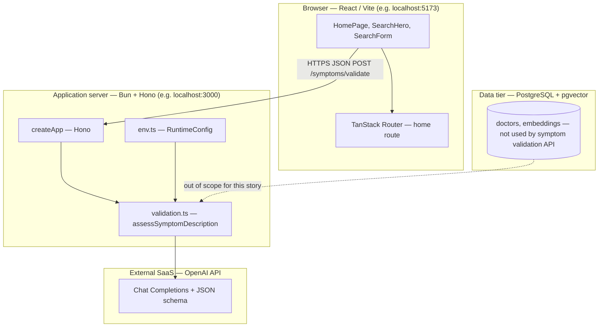
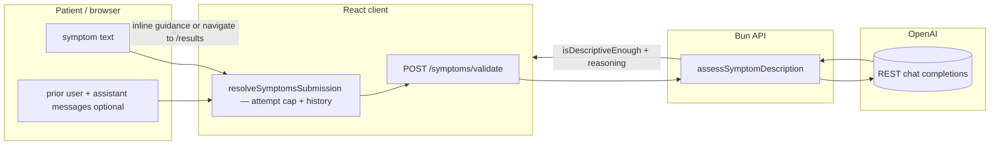

# User Story 3 — Development Specification

**GitHub issue:** [#4](https://github.com/Yuxiang-Huang/DocSeek/issues/4) — tracker for this user story.

**User story:** As a patient who values accuracy, I want the system to recognize when my description is unclear so that I can clarify before receiving a recommendation.

**Engineering reference:** [PR #15](https://github.com/Yuxiang-Huang/DocSeek/pull/15) — adds `POST /symptoms/validate`, an OpenAI **chat completion** flow with **JSON schema** output (`isDescriptiveEnough`, optional `reasoning`), **multi-turn** message `history`, a **three-attempt** client policy with **escape hatch** on the third failure, and UI feedback **under the symptoms textarea** (`client/src/components/App.tsx`, `api/src/validation.ts`).

---

## Story ownership

| Role | Owner | Notes |
| --- | --- | --- |
| **Primary owner** | acee3 ([@acee3](https://github.com/acee3)) | Author of [PR #15](https://github.com/Yuxiang-Huang/DocSeek/pull/15); implemented validation service, API route, and client orchestration. |
| **Secondary owner** | Yuxiang Huang ([@Yuxiang-Huang](https://github.com/Yuxiang-Huang)) | Requested reviewer on PR #15; approved and merged the changes. |

---

## Merge date on `main`

The changes introduced by **PR #15** were merged into `main` on:

**2026-03-25** — merge commit [`013c14a`](https://github.com/Yuxiang-Huang/DocSeek/commit/013c14a) (*Merge pull request #15 from Yuxiang-Huang/acee3/user-story-3-reask*).

---

## Architecture diagram

Execution context: the **browser** runs the Vite/React client where the patient enters symptoms and sees clarification guidance; the **API** runs on **Bun**; **PostgreSQL** with **pgvector** exists for other flows but is **not** on the validation path; **OpenAI** (cloud) serves **chat completions** with structured JSON for **descriptiveness** assessment.

---

## Information flow diagram

Flow shows **plain-language symptom text**, optional **validation chat history**, the **LLM assessment** JSON, and **follow-up copy** shown inline on the home page before navigation to results (unless the third attempt still fails, in which case the client **allows** navigation).

**Data elements:**

| Data | From | To | Purpose |
| --- | --- | --- | --- |
| Symptom string | User | `resolveSymptomsSubmission` → `validateSymptoms` → API | Latest user wording to assess. |
| Validation message history | Client state | Request body `history` | Multi-turn context for the LLM. |
| Assessment JSON | OpenAI → API | Client | `isDescriptiveEnough`; when false, `reasoning` guides the user. |
| Attempt count | Client | `resolveSymptomsSubmission` | Enforces max 3 validation rounds; third failure proceeds to results. |

---

## Class diagram (types, services, and UI components)

The codebase uses **TypeScript** with **functional** modules and **React function components** (no application-level ES6 `class` declarations). The diagram lists **every interface and type alias** on the symptom-clarification path as UML classes. **Hono** is a framework class. Service types use the `«function type»` stereotype. Types marked `«internal»` are not exported from their module. **`SymptomValidationMessage`** is exported from both `api/src/validation.ts` and `client/src/components/App.tsx`; they appear as **SymptomValidationMessageApi** and **SymptomValidationMessageClient**. **`ChatCompletionsResponse`** is the OpenAI response shape in `validation.ts`. **`SymptomValidationResponse`** is the client’s parsed API success type (internal to `App.tsx`). **`SearchDoctorsOptions`** in the client supports shared fetch options for validation and search; **`ValidateSymptomsOptions`** extends that shape with `history`.

```mermaid
classDiagram
  direction TB

  class Hono {
    +constructor()
    +use()
    +get()
    +post()
    +fetch()
  }

  class RuntimeConfig {
    <<api env.ts>>
  }

  class AppDependencies {
    <<internal api index.ts>>
  }

  class SymptomDescriptionAssessment {
    <<internal api validation.ts>>
  }

  class SymptomValidationMessageApi {
    <<api validation.ts>>
  }

  class SymptomValidationRuntimeConfig {
    <<internal api validation.ts>>
  }

  class ChatCompletionsResponse {
    <<internal api validation.ts>>
  }

  class SymptomValidationParams {
    <<internal api validation.ts>>
  }

  class SymptomValidationService {
    <<function type>>
  }

  class SymptomValidationResponse {
    <<internal client App.tsx>>
  }

  class SymptomValidationMessageClient {
    <<client App.tsx>>
  }

  class SearchDoctorsOptionsClient {
    <<internal client App.tsx>>
  }

  class ValidateSymptomsOptions {
    <<internal client App.tsx>>
  }

  class ValidateSymptomsImplementation {
    <<function type>>
  }

  class ResolveSymptomsSubmissionOptions {
    <<internal client App.tsx>>
  }

  class DoctorSearchValidation {
    <<client union type>>
  }

  class SearchFiltersClient {
    <<client App.tsx>>
  }

  class SearchFiltersFormProps {
    <<client props>>
  }

  class SearchPageShellProps {
    <<client props>>
  }

  class SearchFormProps {
    <<client props>>
  }

  class SearchHeroProps {
    <<client props>>
  }

  class HomePageProps {
    <<client props>>
  }

  class SearchPageShell {
    <<client component>>
  }

  class SearchForm {
    <<client component>>
  }

  class SearchHero {
    <<client component>>
  }

  class SearchFiltersForm {
    <<client component>>
  }

  class EmergencyCareAlert {
    <<client component>>
  }

  class HomePage {
    <<client component>>
  }

  class HomeRoute {
    <<function component routes/index.tsx>>
  }

  Hono <-- AppDependencies : createApp
  SymptomValidationService ..> SymptomDescriptionAssessment
  SymptomValidationParams --> SymptomValidationMessageApi
  ValidateSymptomsOptions --|> SearchDoctorsOptionsClient
  SearchHeroProps --|> SearchFormProps
  SymptomValidationMessageApi .. SymptomValidationMessageClient : same structure
  SearchHero ..> SearchForm : renders
  SearchHero ..> SearchFiltersForm : optional
  SearchPageShell ..> HomePage : wraps
  HomeRoute ..> HomePage : renders
  HomePage ..> HomePageProps
```

---

## Implementation reference: types, modules, and components

Below, **public** means exported from the module; **private** means file-scoped (not exported) or implementation detail inside a closure or component. React components are described with **props** as their public contract and **internal state/handlers** where applicable.

---

### `api/src/env.ts` — `RuntimeConfig` and environment loading

**Public**

*Types / configuration (grouped: configuration)*

| Name | Kind | Purpose |
| --- | --- | --- |
| `RuntimeConfig` | type | Includes `openAiValidationModel` (default `gpt-4.1-mini`) used by `assessSymptomDescription`. |

*Functions (grouped: environment)*

| Name | Kind | Purpose |
| --- | --- | --- |
| `loadEnvFile` | function | Optionally loads repo-root `.env` when keys are unset. |
| `getRuntimeConfig` | function | Parses `process.env`; requires `OPENAI_API_KEY`; supplies defaults including `OPENAI_VALIDATION_MODEL`. |

**Private**

*Constants (grouped: defaults)*

| Name | Purpose |
| --- | --- |
| `DEFAULT_PORT`, `DEFAULT_OPENAI_*` | Defaults when env vars are absent; `DEFAULT_OPENAI_VALIDATION_MODEL` is `gpt-4.1-mini`. |

---

### `api/src/validation.ts` — LLM check that plain-language input is specific enough

**Public**

*Types (grouped: validation)*

| Name | Purpose |
| --- | --- |
| `SymptomValidationMessage` | `{ role, content }` for validation chat history on the API. |
| `SymptomValidationService` | Async function from symptoms (+ optional history) to `SymptomDescriptionAssessment`. |

*Functions (grouped: validation pipeline)*

| Name | Purpose |
| --- | --- |
| `normalizeSymptomAssessment` | Strips reasoning when acceptable; supplies default guidance when vague. |
| `assessSymptomDescription` | Calls OpenAI chat with JSON schema output for `isDescriptiveEnough` / `reasoning`. |
| `createSymptomValidationService` | Factory binding `assessSymptomDescription` to validation model config. |

**Private**

*Types (grouped: internal)*

| Name | Purpose |
| --- | --- |
| `SymptomDescriptionAssessment` | Parsed LLM result: `isDescriptiveEnough`, optional `reasoning`. |
| `SymptomValidationRuntimeConfig` | OpenAI key, base URL, validation model id. |
| `ChatCompletionsResponse` | Chat response shape for parsing. |
| `SymptomValidationParams` | `symptoms` and optional `history`. |

*Values / functions (grouped: prompts and parsing)*

| Name | Purpose |
| --- | --- |
| `symptomValidationSystemPrompt` | Instructs the model how strictly to judge **non-clinical** descriptions and how to use `history`. |
| `extractMessageContent` | Normalizes message content from string or structured parts. |

---

### `api/src/index.ts` — HTTP application (`createApp`)

**Public**

*Functions (grouped: HTTP)*

| Name | Purpose |
| --- | --- |
| `createApp` | Hono app with CORS, `POST /symptoms/validate` (symptoms + optional `history` → `symptomValidationService`), plus other routes. |

**Private**

*Types (grouped: dependency injection)*

| Name | Purpose |
| --- | --- |
| `AppDependencies` | Optional `symptomValidationService`, `searchService`, `feedbackService`, CORS origins, `port`. |

---

### `api/src/server.ts` — Bun server entry

**Public**

| Name | Purpose |
| --- | --- |
| Default export `{ port, fetch }` | Bun entry: `fetch` delegates to `createApp` with `createSymptomValidationService(config)` among other services. |

**Private**

_Module-level `config` and `app` wiring._

---

### `client/src/components/App.tsx` — Symptom entry, validation client, inline feedback

**Public**

*Constants (grouped: configuration)*

| Name | Kind | Purpose |
| --- | --- | --- |
| `API_BASE_URL` | const | Base URL for API calls. |
| `SUGGESTED_SYMPTOMS` | const | Example chips including scenarios that trigger clarification (e.g. `"MRI scan"`). |

*Types (grouped: domain and API)*

| Name | Purpose |
| --- | --- |
| `Doctor` | Client physician model (also used after navigation; not central to this story’s validation path). |
| `SearchFilters` | Client filters for location and accepting-new-patients. |
| `SymptomValidationMessage` | Matches server validation message shape for history. |
| `DoctorSearchValidation` | Union: client-side validation ok/fail before LLM validation (empty input, emergency heuristic). |

*Functions — URLs (grouped: routing)*

| Name | Purpose |
| --- | --- |
| `getSymptomValidationUrl` | `/symptoms/validate` URL builder. |
| `getResultsNavigation` | TanStack navigation to `/results` with symptom and filter search params (after clarification succeeds or attempt cap). |

*Functions — normalization and safety (grouped: input)*

| Name | Purpose |
| --- | --- |
| `normalizeSymptoms` | Trims symptom text. |
| `validateSymptomsForDoctorSearch` | Non-empty check and emergency keyword heuristic **before** LLM validation. |
| `symptomsSuggestEmergencyCare` | Blocks normal flow when phrasing suggests emergency care. |

*Functions — API clients (grouped: network)*

| Name | Purpose |
| --- | --- |
| `validateSymptoms` | `POST /symptoms/validate` with optional `history`. |
| `resolveSymptomsSubmission` | Orchestrates validation attempts, history updates, **max 3** rounds, and **proceed on third failure**. |

*Components (grouped: layout and search)*

| Name | Purpose |
| --- | --- |
| `EmergencyCareAlert` | Banner when emergency phrases detected. |
| `SearchPageShell` | Page chrome and skip link. |
| `SearchForm` | Textarea for symptoms, inline **validation** message region, submit. |
| `SearchFiltersForm` | Location and availability filters (paired with hero). |
| `SearchHero` | Hero copy, `SearchForm`, optional filters, suggestions, emergency alert. |
| `HomePage` | Wires symptom state to `resolveSymptomsSubmission` then `navigateToResults` with filters. |

**Private**

*Types (grouped: internal client)*

| Name | Purpose |
| --- | --- |
| `UserLocation` | Browser geolocation coordinates (not used on the validation path). |
| `DoctorSearchResponse` | `{ doctors: Doctor[] }` from search API. |
| `SymptomValidationResponse` | Validation API success shape (`isDescriptiveEnough`, optional `reasoning`). |
| `SearchDoctorsOptions` | Shared options: `apiBaseUrl`, `fetchImpl`, `filters`. |
| `ValidateSymptomsOptions` | Extends search options with optional `history`. |
| `ValidateSymptomsImplementation` | Injectable validation function type. |
| `ResolveSymptomsSubmissionOptions` | Options for `resolveSymptomsSubmission` including injectable impl. |
| `SearchFiltersFormProps` | Props for filter controls. |
| `SearchPageShellProps` | Shell props. |
| `SearchFormProps` | Form props including `validationMessage`. |
| `SearchHeroProps` | Extends `SearchFormProps` with `errorMessage` and optional `filters`. |
| `HomePageProps` | Navigation callback prop. |

*Constants / functions (grouped: heuristics)*

| Name | Purpose |
| --- | --- |
| `EMERGENCY_PHRASES` | Keyword list for triage heuristic. |
| `normalizeSymptomsForMatching` | Normalizes apostrophes and spaces for phrase matching. |

*Component internals (grouped: `HomePage`)*

| State/handlers | Purpose |
| --- | --- |
| `symptoms`, `location`, `onlyAcceptingNewPatients`, `errorMessage`, `isValidating`, `validationAttemptCount`, `validationHistory` | React state for input, LLM validation feedback, and multi-turn history. |
| `handleSymptomsChange`, `handleSubmit` | Clears errors on edit; submit runs `resolveSymptomsSubmission` then navigates when allowed. |

---

### `client/src/routes/index.tsx` — `/` route

**Public**

| Name | Kind | Purpose |
| --- | --- | --- |
| `Route` | TanStack file route | Home route; renders `HomePage` with `navigate` wired to `getResultsNavigation`. |

**Private**

| Name | Purpose |
| --- | --- |
| `HomeRoute` | Connects TanStack `navigate` to `HomePage`. |

---

## Traceability summary

| User-facing need | Mechanism in code |
| --- | --- |
| Detect vague or non-symptom input | `assessSymptomDescription` + JSON schema; `symptomValidationSystemPrompt` rules. |
| Follow-up feels relevant | Model returns `reasoning`; client appends user/assistant turns to `history` for the next call. |
| Easy to respond | Guidance as `validationMessage` / `errorMessage` under the textarea (`SearchForm`); user edits same field. |
| Recommendation delayed until resolved | `resolveSymptomsSubmission` returns `canNavigate: false` until descriptive enough. |
| Not stuck forever | After **3** failed validations, client returns `canNavigate: true` anyway (PR #15 behavior). |
| Machine: generate follow-up | `reasoning` string from LLM when `isDescriptiveEnough` is false. |

---

## Appendix — Per-type public and private members

Each **type** below is a TypeScript `type` or `interface` (or a function type). Object types have only **public** fields at the type level. **Function types** are described as a single callable member. **Components** list props as public fields and internal React state as **private** where applicable.

### `SymptomDescriptionAssessment` (`api/src/validation.ts`, internal)

**Public fields (grouped: assessment)**

| Field | Purpose |
| --- | --- |
| `isDescriptiveEnough` | Whether the text is sufficient to search meaningfully. |
| `reasoning` | Short guidance when more detail is needed. |

**Public methods:** none (data only).

**Private fields / methods:** none at the type level.

---

### `SymptomValidationMessageApi` (`api/src/validation.ts`, exported as `SymptomValidationMessage`)

**Public fields (grouped: chat)**

| Field | Purpose |
| --- | --- |
| `role` | `"user"` or `"assistant"` for transcript segments. |
| `content` | Message text. |

**Public methods:** none.

---

### `SymptomValidationRuntimeConfig` (`api/src/validation.ts`, internal)

**Public fields (grouped: OpenAI)**

| Field | Purpose |
| --- | --- |
| `openAiApiKey` | Bearer token for OpenAI. |
| `openAiBaseUrl` | API base URL (e.g. `https://api.openai.com/v1`). |
| `openAiValidationModel` | Chat model id for validation. |

**Public methods:** none.

---

### `ChatCompletionsResponse` (`api/src/validation.ts`, internal)

**Public fields (grouped: OpenAI payload)**

| Field | Purpose |
| --- | --- |
| `choices` | Optional array with `message.content` as string or structured parts. |

**Public methods:** none.

---

### `SymptomValidationParams` (`api/src/validation.ts`, internal)

**Public fields**

| Field | Purpose |
| --- | --- |
| `symptoms` | Current user symptom string. |
| `history` | Optional prior `{ role, content }[]` before the latest user message. |

**Public methods:** none.

---

### `SymptomValidationService` (function type, `api/src/validation.ts`)

**Public methods (grouped: service)**

| Member | Purpose |
| --- | --- |
| `(params: SymptomValidationParams) => Promise<SymptomDescriptionAssessment>` | Validates whether symptom text is specific enough. |

**Public fields:** none.

---

### Module-level callables and values in `api/src/validation.ts` (not object types)

**Public functions (grouped: validation pipeline)**

| Name | Purpose |
| --- | --- |
| `normalizeSymptomAssessment` | Strips `reasoning` when the assessment passes; supplies default copy when failing without reasoning. |
| `assessSymptomDescription` | Performs the OpenAI request and parses JSON content into `SymptomDescriptionAssessment`. |
| `createSymptomValidationService` | Returns a bound `SymptomValidationService` using runtime config. |

**Private functions (grouped: parsing)**

| Name | Purpose |
| --- | --- |
| `extractMessageContent` | Flattens OpenAI `message.content` whether string or structured parts. |

**Private values (grouped: prompts)**

| Name | Purpose |
| --- | --- |
| `symptomValidationSystemPrompt` | System instructions for the validation model. |

---

### `RuntimeConfig` (`api/src/env.ts`)

**Public fields (grouped: server and AI):** `port`, `databaseUrl`, `corsAllowedOrigins`, `openAiApiKey`, `openAiBaseUrl`, `openAiEmbeddingModel`, `openAiChatModel`, `openAiValidationModel`.

**Public methods:** none on the type.

---

### `AppDependencies` (`api/src/index.ts`, internal)

**Public fields (grouped: DI)**

| Field | Purpose |
| --- | --- |
| `port` | Optional port for health JSON display. |
| `symptomValidationService` | Injected service for `/symptoms/validate`. |
| `searchService`, `feedbackService` | Other flows. |
| `corsAllowedOrigins` | Allowed browser origins for CORS. |

**Public methods:** none.

---

### `Hono` (framework, `hono`)

**Public methods (grouped: HTTP app):** `constructor`, `use`, `get`, `post`, `fetch`.

**Private:** implementation is library-internal.

---

### `SymptomValidationResponse` (`client/src/components/App.tsx`, internal)

**Public fields (grouped: validation result)**

| Field | Purpose |
| --- | --- |
| `isDescriptiveEnough` | Mirrors API assessment. |
| `reasoning` | Optional follow-up text. |

---

### `SymptomValidationMessageClient` (`client/src/components/App.tsx`, exported as `SymptomValidationMessage`)

**Public fields:** `role` (`"user"` \| `"assistant"`), `content` — mirrors server validation messages for multi-turn UI state.

---

### `SearchDoctorsOptionsClient` (`client/src/components/App.tsx`, internal as `SearchDoctorsOptions`)

**Public fields (grouped: HTTP client options)**

| Field | Purpose |
| --- | --- |
| `apiBaseUrl` | Optional API origin override (tests, deployments). |
| `fetchImpl` | Injectable `fetch` for tests. |
| `filters` | Optional `SearchFilters` when shared with doctor search helpers. |

**Public methods:** none (data only).

**Private fields / methods:** none at the type level.

---

### `ValidateSymptomsOptions` (`client/src/components/App.tsx`, internal)

**Public fields (grouped: validation request)**

| Field | Purpose |
| --- | --- |
| `apiBaseUrl` | Inherited: optional API origin. |
| `fetchImpl` | Inherited: injectable `fetch`. |
| `filters` | Inherited: optional filters (unused by `validateSymptoms` but part of the intersection type). |
| `history` | Optional prior `{ role, content }[]` sent as JSON `history`. |

**Public methods:** none.

**Private fields / methods:** none at the type level.

---

### `ValidateSymptomsImplementation` (`client/src/components/App.tsx`, internal)

**Public methods (grouped: service)**

| Member | Purpose |
| --- | --- |
| `(symptoms, options?) => Promise<SymptomValidationResponse>` | Injectable stand-in for `validateSymptoms` in unit tests. |

**Public fields:** none.

**Private fields / methods:** none.

---

### `ResolveSymptomsSubmissionOptions` (`client/src/components/App.tsx`, internal)

**Public fields (grouped: orchestration)**

| Field | Purpose |
| --- | --- |
| `attemptCount` | Current validation round count (default 0). |
| `maxValidationAttempts` | Cap before allowing navigation anyway (default 3). |
| `validationHistory` | Prior turns for the next API call. |
| `validateSymptomsImpl` | Injectable validation function. |

**Public methods:** none.

**Private fields / methods:** none at the type level.

---

### `DoctorSearchValidation` (`client/src/components/App.tsx`, exported union)

**Public fields (grouped: variants)**

| Variant | Fields |
| --- | --- |
| Success | `ok: true`, `normalized: string` |
| Failure | `ok: false`, `message: string` |

---

### `SearchFiltersClient` (`client/src/components/App.tsx`, exported as `SearchFilters`)

**Public fields:** `location`, `onlyAcceptingNewPatients` (optional).

---

### `SearchFiltersFormProps` (`client/src/components/App.tsx`, internal)

**Public fields (grouped: filter controls)**

| Field | Purpose |
| --- | --- |
| `location` | Location filter string. |
| `onlyAcceptingNewPatients` | Accepting-new-patients toggle. |
| `onLocationChange` | Handler for location input. |
| `onOnlyAcceptingChange` | Handler for checkbox. |

**Public methods:** none.

**Private fields / methods:** none at the type level.

---

### `SearchPageShellProps` (`client/src/components/App.tsx`, internal)

**Public fields (grouped: layout)**

| Field | Purpose |
| --- | --- |
| `children` | Page body. |
| `showNav` | Optional flag to hide top nav (e.g. tests). |

**Public methods:** none.

**Private fields / methods:** none at the type level.

---

### `SearchFormProps` (`client/src/components/App.tsx`, internal)

**Public fields (grouped: form)**

| Field | Purpose |
| --- | --- |
| `symptoms` | Controlled textarea value. |
| `onSymptomsChange` | Text change handler. |
| `onSubmit` | Form submit handler. |
| `isLoading` | Optional loading/disabled state. |
| `validationMessage` | Optional LLM follow-up shown under the field. |

**Public methods:** none.

**Private fields / methods:** none at the type level.

---

### `SearchHeroProps` (`client/src/components/App.tsx`, internal)

**Public fields (grouped: hero and filters)**

| Field | Purpose |
| --- | --- |
| `symptoms`, `onSymptomsChange`, `onSubmit`, `isLoading`, `validationMessage` | Same as `SearchFormProps` (intersection inheritance modeled in the class diagram). |
| `errorMessage` | Optional message passed through to the form as `validationMessage`. |
| `filters` | Optional `SearchFiltersFormProps` for the refine block. |

**Public methods:** none.

**Private fields / methods:** none at the type level.

---

### `HomePageProps` (`client/src/components/App.tsx`, internal)

**Public fields (grouped: navigation)**

| Field | Purpose |
| --- | --- |
| `navigateToResults` | Callback to TanStack navigate with symptoms and optional filters after validation allows. |

**Public methods:** none.

**Private fields / methods:** none at the type level.

---

### `HomeRoute` and `Route` (`client/src/routes/index.tsx`)

**Public:** `Route` is the TanStack **file route** export (see [`createFileRoute`](https://tanstack.com/router/latest/docs/framework/react/api/router/createFileRouteFunction)). **`HomeRoute`** is the route component that renders `HomePage` with `navigate` wired to `getResultsNavigation`. No class-style members; **private** implementation is the `navigate` closure from TanStack Router.

---

### `SearchPageShell` (`client/src/components/App.tsx`)

**Public fields (grouped: props — same as `SearchPageShellProps`):** `children`, optional `showNav`.

**Public methods:** none (function component).

**Private fields / methods (grouped: implementation):** none (stateless layout).

---

### `SearchForm` (`client/src/components/App.tsx`)

**Public fields (grouped: props — same as `SearchFormProps`):** `symptoms`, `onSymptomsChange`, `onSubmit`, optional `isLoading`, optional `validationMessage`.

**Public methods:** none.

**Private fields / methods:** none.

---

### `SearchHero` (`client/src/components/App.tsx`)

**Public fields (grouped: props — same as `SearchHeroProps`):** fields from `SearchFormProps` plus optional `errorMessage` and optional `filters`.

**Public methods:** none.

**Private fields / methods:** none.

---

### `SearchFiltersForm` (`client/src/components/App.tsx`)

**Public fields (grouped: props — same as `SearchFiltersFormProps`):** `location`, `onlyAcceptingNewPatients`, `onLocationChange`, `onOnlyAcceptingChange`.

**Public methods:** none.

**Private fields / methods:** none.

---

### `EmergencyCareAlert` (`client/src/components/App.tsx`)

**Public fields:** none (no props).

**Public methods:** none.

**Private fields / methods (grouped: presentation):** static JSX only; no state.

---

### `HomePage` (`client/src/components/App.tsx`)

**Public fields (grouped: props — same as `HomePageProps`):** `navigateToResults`.

**Public methods:** none.

**Private fields / methods (grouped: state):** `symptoms`, `location`, `onlyAcceptingNewPatients`, `errorMessage`, `isValidating`, `validationAttemptCount`, `validationHistory`.

**Private fields / methods (grouped: handlers):** `handleSymptomsChange`, `handleSubmit`.

---

## Summary

This specification documents **User Story 3** ([GitHub issue #4](https://github.com/Yuxiang-Huang/DocSeek/issues/4)) as implemented: the API exposes **`POST /symptoms/validate`**, **`assessSymptomDescription`** calls OpenAI with **JSON schema** output and optional **message history**, and the **React** home flow uses **`resolveSymptomsSubmission`** to cap clarification attempts, show **inline** guidance, and still allow navigation after repeated failure ([PR #15](https://github.com/Yuxiang-Huang/DocSeek/pull/15), merged **2026-03-25**, [`013c14a`](https://github.com/Yuxiang-Huang/DocSeek/commit/013c14a)). **Primary owner:** acee3. **Secondary owner:** Yuxiang-Huang.
