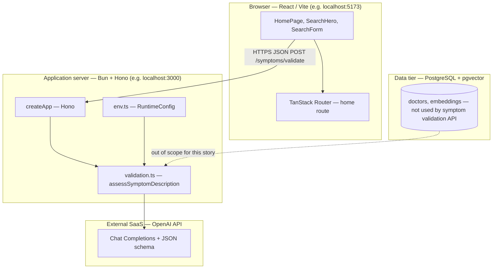
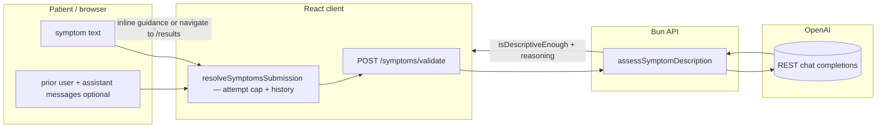

# User Story 3 — Development Specification

**GitHub issue:** [#4](https://github.com/Yuxiang-Huang/DocSeek/issues/4) — tracker for this user story.

**User story:** As a patient who values accuracy, I want the system to recognize when my description is unclear so that I can clarify before receiving a recommendation.

**Engineering reference:** [PR #15](https://github.com/Yuxiang-Huang/DocSeek/pull/15) — adds `POST /symptoms/validate`, an OpenAI **chat completion** flow with **JSON schema** output (`isDescriptiveEnough`, optional `reasoning`), **multi-turn** message `history`, a **three-attempt** client policy with **escape hatch** on the third failure, and UI feedback **under the symptoms textarea** (`client/src/components/App.tsx`, `api/src/validation.ts`).

---

## Story ownership

| Role | Owner | Notes |
| --- | --- | --- |
| **Primary owner** | acee3 ([@acee3](https://github.com/acee3)) | Author of [PR #15](https://github.com/Yuxiang-Huang/DocSeek/pull/15); implemented validation service, API route, and client orchestration. |
| **Secondary owner** | Yuxiang Huang ([@Yuxiang-Huang](https://github.com/Yuxiang-Huang)) | Requested reviewer on PR #15; approved and merged the changes. |

---

## Merge date on `main`

The changes introduced by **PR #15** were merged into `main` on:

**2026-03-25** — merge commit [`013c14a`](https://github.com/Yuxiang-Huang/DocSeek/commit/013c14a) (*Merge pull request #15 from Yuxiang-Huang/acee3/user-story-3-reask*).

---

## Architecture diagram

Execution context: the **browser** runs the Vite/React client where the patient enters symptoms and sees clarification guidance; the **API** runs on **Bun**; **PostgreSQL** with **pgvector** exists for other flows but is **not** on the validation path; **OpenAI** (cloud) serves **chat completions** with structured JSON for **descriptiveness** assessment.

---

## Information flow diagram

Flow shows **plain-language symptom text**, optional **validation chat history**, the **LLM assessment** JSON, and **follow-up copy** shown inline on the home page before navigation to results (unless the third attempt still fails, in which case the client **allows** navigation).

**Data elements:**

| Data | From | To | Purpose |
| --- | --- | --- | --- |
| Symptom string | User | `resolveSymptomsSubmission` → `validateSymptoms` → API | Latest user wording to assess. |
| Validation message history | Client state | Request body `history` | Multi-turn context for the LLM. |
| Assessment JSON | OpenAI → API | Client | `isDescriptiveEnough`; when false, `reasoning` guides the user. |
| Attempt count | Client | `resolveSymptomsSubmission` | Enforces max 3 validation rounds; third failure proceeds to results. |

---

## Class diagram (types, services, and UI components)

The codebase uses **TypeScript** with **functional** modules and **React function components** (no application-level ES6 `class` declarations). The diagram lists **every interface and type alias** on the symptom-clarification path as UML classes. **Hono** is a framework class. Service types use the `«function type»` stereotype. Types marked `«internal»` are not exported from their module. **`SymptomValidationMessage`** is exported from both `api/src/validation.ts` and `client/src/components/App.tsx`; they appear as **SymptomValidationMessageApi** and **SymptomValidationMessageClient**. **`ChatCompletionsResponse`** is the OpenAI response shape in `validation.ts`. **`SymptomValidationResponse`** is the client’s parsed API success type (internal to `App.tsx`). **`SearchDoctorsOptions`** in the client supports shared fetch options for validation and search; **`ValidateSymptomsOptions`** extends that shape with `history`.

---

## Implementation reference: types, modules, and components

Below, **public** means exported from the module; **private** means file-scoped (not exported) or implementation detail inside a closure or component. React components are described with **props** as their public contract and **internal state/handlers** where applicable.

---

### `api/src/env.ts` — `RuntimeConfig` and environment loading

**Public**

*Types / configuration (grouped: configuration)*

| Name | Kind | Purpose |
| --- | --- | --- |
| `RuntimeConfig` | type | Includes `openAiValidationModel` (default `gpt-4.1-mini`) used by `assessSymptomDescription`. |

*Functions (grouped: environment)*

| Name | Kind | Purpose |
| --- | --- | --- |
| `loadEnvFile` | function | Optionally loads repo-root `.env` when keys are unset. |
| `getRuntimeConfig` | function | Parses `process.env`; requires `OPENAI_API_KEY`; supplies defaults including `OPENAI_VALIDATION_MODEL`. |

**Private**

*Constants (grouped: defaults)*

| Name | Purpose |
| --- | --- |
| `DEFAULT_PORT`, `DEFAULT_OPENAI_*` | Defaults when env vars are absent; `DEFAULT_OPENAI_VALIDATION_MODEL` is `gpt-4.1-mini`. |

---

### `api/src/validation.ts` — LLM check that plain-language input is specific enough

**Public**

*Types (grouped: validation)*

| Name | Purpose |
| --- | --- |
| `SymptomValidationMessage` | `{ role, content }` for validation chat history on the API. |
| `SymptomValidationService` | Async function from symptoms (+ optional history) to `SymptomDescriptionAssessment`. |

*Functions (grouped: validation pipeline)*

| Name | Purpose |
| --- | --- |
| `normalizeSymptomAssessment` | Strips reasoning when acceptable; supplies default guidance when vague. |
| `assessSymptomDescription` | Calls OpenAI chat with JSON schema output for `isDescriptiveEnough` / `reasoning`. |
| `createSymptomValidationService` | Factory binding `assessSymptomDescription` to validation model config. |

**Private**

*Types (grouped: internal)*

| Name | Purpose |
| --- | --- |
| `SymptomDescriptionAssessment` | Parsed LLM result: `isDescriptiveEnough`, optional `reasoning`. |
| `SymptomValidationRuntimeConfig` | OpenAI key, base URL, validation model id. |
| `ChatCompletionsResponse` | Chat response shape for parsing. |
| `SymptomValidationParams` | `symptoms` and optional `history`. |

*Values / functions (grouped: prompts and parsing)*

| Name | Purpose |
| --- | --- |
| `symptomValidationSystemPrompt` | Instructs the model how strictly to judge **non-clinical** descriptions and how to use `history`. |
| `extractMessageContent` | Normalizes message content from string or structured parts. |

---

### `api/src/index.ts` — HTTP application (`createApp`)

**Public**

*Functions (grouped: HTTP)*

| Name | Purpose |
| --- | --- |
| `createApp` | Hono app with CORS, `POST /symptoms/validate` (symptoms + optional `history` → `symptomValidationService`), plus other routes. |

**Private**

*Types (grouped: dependency injection)*

| Name | Purpose |
| --- | --- |
| `AppDependencies` | Optional `symptomValidationService`, `searchService`, `feedbackService`, CORS origins, `port`. |

---

### `api/src/server.ts` — Bun server entry

**Public**

| Name | Purpose |
| --- | --- |
| Default export `{ port, fetch }` | Bun entry: `fetch` delegates to `createApp` with `createSymptomValidationService(config)` among other services. |

**Private**

_Module-level `config` and `app` wiring._

---

### `client/src/components/App.tsx` — Symptom entry, validation client, inline feedback

**Public**

*Constants (grouped: configuration)*

| Name | Kind | Purpose |
| --- | --- | --- |
| `API_BASE_URL` | const | Base URL for API calls. |
| `SUGGESTED_SYMPTOMS` | const | Example chips including scenarios that trigger clarification (e.g. `"MRI scan"`). |

*Types (grouped: domain and API)*

| Name | Purpose |
| --- | --- |
| `Doctor` | Client physician model (also used after navigation; not central to this story’s validation path). |
| `SearchFilters` | Client filters for location and accepting-new-patients. |
| `SymptomValidationMessage` | Matches server validation message shape for history. |
| `DoctorSearchValidation` | Union: client-side validation ok/fail before LLM validation (empty input, emergency heuristic). |

*Functions — URLs (grouped: routing)*

| Name | Purpose |
| --- | --- |
| `getSymptomValidationUrl` | `/symptoms/validate` URL builder. |
| `getResultsNavigation` | TanStack navigation to `/results` with symptom and filter search params (after clarification succeeds or attempt cap). |

*Functions — normalization and safety (grouped: input)*

| Name | Purpose |
| --- | --- |
| `normalizeSymptoms` | Trims symptom text. |
| `validateSymptomsForDoctorSearch` | Non-empty check and emergency keyword heuristic **before** LLM validation. |
| `symptomsSuggestEmergencyCare` | Blocks normal flow when phrasing suggests emergency care. |

*Functions — API clients (grouped: network)*

| Name | Purpose |
| --- | --- |
| `validateSymptoms` | `POST /symptoms/validate` with optional `history`. |
| `resolveSymptomsSubmission` | Orchestrates validation attempts, history updates, **max 3** rounds, and **proceed on third failure**. |

*Components (grouped: layout and search)*

| Name | Purpose |
| --- | --- |
| `EmergencyCareAlert` | Banner when emergency phrases detected. |
| `SearchPageShell` | Page chrome and skip link. |
| `SearchForm` | Textarea for symptoms, inline **validation** message region, submit. |
| `SearchFiltersForm` | Location and availability filters (paired with hero). |
| `SearchHero` | Hero copy, `SearchForm`, optional filters, suggestions, emergency alert. |
| `HomePage` | Wires symptom state to `resolveSymptomsSubmission` then `navigateToResults` with filters. |

**Private**

*Types (grouped: internal client)*

| Name | Purpose |
| --- | --- |
| `UserLocation` | Browser geolocation coordinates (not used on the validation path). |
| `DoctorSearchResponse` | `{ doctors: Doctor[] }` from search API. |
| `SymptomValidationResponse` | Validation API success shape (`isDescriptiveEnough`, optional `reasoning`). |
| `SearchDoctorsOptions` | Shared options: `apiBaseUrl`, `fetchImpl`, `filters`. |
| `ValidateSymptomsOptions` | Extends search options with optional `history`. |
| `ValidateSymptomsImplementation` | Injectable validation function type. |
| `ResolveSymptomsSubmissionOptions` | Options for `resolveSymptomsSubmission` including injectable impl. |
| `SearchFiltersFormProps` | Props for filter controls. |
| `SearchPageShellProps` | Shell props. |
| `SearchFormProps` | Form props including `validationMessage`. |
| `SearchHeroProps` | Extends `SearchFormProps` with `errorMessage` and optional `filters`. |
| `HomePageProps` | Navigation callback prop. |

*Constants / functions (grouped: heuristics)*

| Name | Purpose |
| --- | --- |
| `EMERGENCY_PHRASES` | Keyword list for triage heuristic. |
| `normalizeSymptomsForMatching` | Normalizes apostrophes and spaces for phrase matching. |

*Component internals (grouped: `HomePage`)*

| State/handlers | Purpose |
| --- | --- |
| `symptoms`, `location`, `onlyAcceptingNewPatients`, `errorMessage`, `isValidating`, `validationAttemptCount`, `validationHistory` | React state for input, LLM validation feedback, and multi-turn history. |
| `handleSymptomsChange`, `handleSubmit` | Clears errors on edit; submit runs `resolveSymptomsSubmission` then navigates when allowed. |

---

### `client/src/routes/index.tsx` — `/` route

**Public**

| Name | Kind | Purpose |
| --- | --- | --- |
| `Route` | TanStack file route | Home route; renders `HomePage` with `navigate` wired to `getResultsNavigation`. |

**Private**

| Name | Purpose |
| --- | --- |
| `HomeRoute` | Connects TanStack `navigate` to `HomePage`. |

---

## Traceability summary

| User-facing need | Mechanism in code |
| --- | --- |
| Detect vague or non-symptom input | `assessSymptomDescription` + JSON schema; `symptomValidationSystemPrompt` rules. |
| Follow-up feels relevant | Model returns `reasoning`; client appends user/assistant turns to `history` for the next call. |
| Easy to respond | Guidance as `validationMessage` / `errorMessage` under the textarea (`SearchForm`); user edits same field. |
| Recommendation delayed until resolved | `resolveSymptomsSubmission` returns `canNavigate: false` until descriptive enough. |
| Not stuck forever | After **3** failed validations, client returns `canNavigate: true` anyway (PR #15 behavior). |
| Machine: generate follow-up | `reasoning` string from LLM when `isDescriptiveEnough` is false. |

---

## Appendix — Per-type public and private members

Each **type** below is a TypeScript `type` or `interface` (or a function type). Object types have only **public** fields at the type level. **Function types** are described as a single callable member. **Components** list props as public fields and internal React state as **private** where applicable.

### `SymptomDescriptionAssessment` (`api/src/validation.ts`, internal)

**Public fields (grouped: assessment)**

| Field | Purpose |
| --- | --- |
| `isDescriptiveEnough` | Whether the text is sufficient to search meaningfully. |
| `reasoning` | Short guidance when more detail is needed. |

**Public methods:** none (data only).

**Private fields / methods:** none at the type level.

---

### `SymptomValidationMessageApi` (`api/src/validation.ts`, exported as `SymptomValidationMessage`)

**Public fields (grouped: chat)**

| Field | Purpose |
| --- | --- |
| `role` | `"user"` or `"assistant"` for transcript segments. |
| `content` | Message text. |

**Public methods:** none.

---

### `SymptomValidationRuntimeConfig` (`api/src/validation.ts`, internal)

**Public fields (grouped: OpenAI)**

| Field | Purpose |
| --- | --- |
| `openAiApiKey` | Bearer token for OpenAI. |
| `openAiBaseUrl` | API base URL (e.g. `https://api.openai.com/v1`). |
| `openAiValidationModel` | Chat model id for validation. |

**Public methods:** none.

---

### `ChatCompletionsResponse` (`api/src/validation.ts`, internal)

**Public fields (grouped: OpenAI payload)**

| Field | Purpose |
| --- | --- |
| `choices` | Optional array with `message.content` as string or structured parts. |

**Public methods:** none.

---

### `SymptomValidationParams` (`api/src/validation.ts`, internal)

**Public fields**

| Field | Purpose |
| --- | --- |
| `symptoms` | Current user symptom string. |
| `history` | Optional prior `{ role, content }[]` before the latest user message. |

**Public methods:** none.

---

### `SymptomValidationService` (function type, `api/src/validation.ts`)

**Public methods (grouped: service)**

| Member | Purpose |
| --- | --- |
| `(params: SymptomValidationParams) => Promise<SymptomDescriptionAssessment>` | Validates whether symptom text is specific enough. |

**Public fields:** none.

---

### Module-level callables and values in `api/src/validation.ts` (not object types)

**Public functions (grouped: validation pipeline)**

| Name | Purpose |
| --- | --- |
| `normalizeSymptomAssessment` | Strips `reasoning` when the assessment passes; supplies default copy when failing without reasoning. |
| `assessSymptomDescription` | Performs the OpenAI request and parses JSON content into `SymptomDescriptionAssessment`. |
| `createSymptomValidationService` | Returns a bound `SymptomValidationService` using runtime config. |

**Private functions (grouped: parsing)**

| Name | Purpose |
| --- | --- |
| `extractMessageContent` | Flattens OpenAI `message.content` whether string or structured parts. |

**Private values (grouped: prompts)**

| Name | Purpose |
| --- | --- |
| `symptomValidationSystemPrompt` | System instructions for the validation model. |

---

### `RuntimeConfig` (`api/src/env.ts`)

**Public fields (grouped: server and AI):** `port`, `databaseUrl`, `corsAllowedOrigins`, `openAiApiKey`, `openAiBaseUrl`, `openAiEmbeddingModel`, `openAiChatModel`, `openAiValidationModel`.

**Public methods:** none on the type.

---

### `AppDependencies` (`api/src/index.ts`, internal)

**Public fields (grouped: DI)**

| Field | Purpose |
| --- | --- |
| `port` | Optional port for health JSON display. |
| `symptomValidationService` | Injected service for `/symptoms/validate`. |
| `searchService`, `feedbackService` | Other flows. |
| `corsAllowedOrigins` | Allowed browser origins for CORS. |

**Public methods:** none.

---

### `Hono` (framework, `hono`)

**Public methods (grouped: HTTP app):** `constructor`, `use`, `get`, `post`, `fetch`.

**Private:** implementation is library-internal.

---

### `SymptomValidationResponse` (`client/src/components/App.tsx`, internal)

**Public fields (grouped: validation result)**

| Field | Purpose |
| --- | --- |
| `isDescriptiveEnough` | Mirrors API assessment. |
| `reasoning` | Optional follow-up text. |

---

### `SymptomValidationMessageClient` (`client/src/components/App.tsx`, exported as `SymptomValidationMessage`)

**Public fields:** `role` (`"user"` \| `"assistant"`), `content` — mirrors server validation messages for multi-turn UI state.

---

### `SearchDoctorsOptionsClient` (`client/src/components/App.tsx`, internal as `SearchDoctorsOptions`)

**Public fields (grouped: HTTP client options)**

| Field | Purpose |
| --- | --- |
| `apiBaseUrl` | Optional API origin override (tests, deployments). |
| `fetchImpl` | Injectable `fetch` for tests. |
| `filters` | Optional `SearchFilters` when shared with doctor search helpers. |

**Public methods:** none (data only).

**Private fields / methods:** none at the type level.

---

### `ValidateSymptomsOptions` (`client/src/components/App.tsx`, internal)

**Public fields (grouped: validation request)**

| Field | Purpose |
| --- | --- |
| `apiBaseUrl` | Inherited: optional API origin. |
| `fetchImpl` | Inherited: injectable `fetch`. |
| `filters` | Inherited: optional filters (unused by `validateSymptoms` but part of the intersection type). |
| `history` | Optional prior `{ role, content }[]` sent as JSON `history`. |

**Public methods:** none.

**Private fields / methods:** none at the type level.

---

### `ValidateSymptomsImplementation` (`client/src/components/App.tsx`, internal)

**Public methods (grouped: service)**

| Member | Purpose |
| --- | --- |
| `(symptoms, options?) => Promise<SymptomValidationResponse>` | Injectable stand-in for `validateSymptoms` in unit tests. |

**Public fields:** none.

**Private fields / methods:** none.

---

### `ResolveSymptomsSubmissionOptions` (`client/src/components/App.tsx`, internal)

**Public fields (grouped: orchestration)**

| Field | Purpose |
| --- | --- |
| `attemptCount` | Current validation round count (default 0). |
| `maxValidationAttempts` | Cap before allowing navigation anyway (default 3). |
| `validationHistory` | Prior turns for the next API call. |
| `validateSymptomsImpl` | Injectable validation function. |

**Public methods:** none.

**Private fields / methods:** none at the type level.

---

### `DoctorSearchValidation` (`client/src/components/App.tsx`, exported union)

**Public fields (grouped: variants)**

| Variant | Fields |
| --- | --- |
| Success | `ok: true`, `normalized: string` |
| Failure | `ok: false`, `message: string` |

---

### `SearchFiltersClient` (`client/src/components/App.tsx`, exported as `SearchFilters`)

**Public fields:** `location`, `onlyAcceptingNewPatients` (optional).

---

### `SearchFiltersFormProps` (`client/src/components/App.tsx`, internal)

**Public fields (grouped: filter controls)**

| Field | Purpose |
| --- | --- |
| `location` | Location filter string. |
| `onlyAcceptingNewPatients` | Accepting-new-patients toggle. |
| `onLocationChange` | Handler for location input. |
| `onOnlyAcceptingChange` | Handler for checkbox. |

**Public methods:** none.

**Private fields / methods:** none at the type level.

---

### `SearchPageShellProps` (`client/src/components/App.tsx`, internal)

**Public fields (grouped: layout)**

| Field | Purpose |
| --- | --- |
| `children` | Page body. |
| `showNav` | Optional flag to hide top nav (e.g. tests). |

**Public methods:** none.

**Private fields / methods:** none at the type level.

---

### `SearchFormProps` (`client/src/components/App.tsx`, internal)

**Public fields (grouped: form)**

| Field | Purpose |
| --- | --- |
| `symptoms` | Controlled textarea value. |
| `onSymptomsChange` | Text change handler. |
| `onSubmit` | Form submit handler. |
| `isLoading` | Optional loading/disabled state. |
| `validationMessage` | Optional LLM follow-up shown under the field. |

**Public methods:** none.

**Private fields / methods:** none at the type level.

---

### `SearchHeroProps` (`client/src/components/App.tsx`, internal)

**Public fields (grouped: hero and filters)**

| Field | Purpose |
| --- | --- |
| `symptoms`, `onSymptomsChange`, `onSubmit`, `isLoading`, `validationMessage` | Same as `SearchFormProps` (intersection inheritance modeled in the class diagram). |
| `errorMessage` | Optional message passed through to the form as `validationMessage`. |
| `filters` | Optional `SearchFiltersFormProps` for the refine block. |

**Public methods:** none.

**Private fields / methods:** none at the type level.

---

### `HomePageProps` (`client/src/components/App.tsx`, internal)

**Public fields (grouped: navigation)**

| Field | Purpose |
| --- | --- |
| `navigateToResults` | Callback to TanStack navigate with symptoms and optional filters after validation allows. |

**Public methods:** none.

**Private fields / methods:** none at the type level.

---

### `HomeRoute` and `Route` (`client/src/routes/index.tsx`)

**Public:** `Route` is the TanStack **file route** export (see [`createFileRoute`](https://tanstack.com/router/latest/docs/framework/react/api/router/createFileRouteFunction)). **`HomeRoute`** is the route component that renders `HomePage` with `navigate` wired to `getResultsNavigation`. No class-style members; **private** implementation is the `navigate` closure from TanStack Router.

---

### `SearchPageShell` (`client/src/components/App.tsx`)

**Public fields (grouped: props — same as `SearchPageShellProps`):** `children`, optional `showNav`.

**Public methods:** none (function component).

**Private fields / methods (grouped: implementation):** none (stateless layout).

---

### `SearchForm` (`client/src/components/App.tsx`)

**Public fields (grouped: props — same as `SearchFormProps`):** `symptoms`, `onSymptomsChange`, `onSubmit`, optional `isLoading`, optional `validationMessage`.

**Public methods:** none.

**Private fields / methods:** none.

---

### `SearchHero` (`client/src/components/App.tsx`)

**Public fields (grouped: props — same as `SearchHeroProps`):** fields from `SearchFormProps` plus optional `errorMessage` and optional `filters`.

**Public methods:** none.

**Private fields / methods:** none.

---

### `SearchFiltersForm` (`client/src/components/App.tsx`)

**Public fields (grouped: props — same as `SearchFiltersFormProps`):** `location`, `onlyAcceptingNewPatients`, `onLocationChange`, `onOnlyAcceptingChange`.

**Public methods:** none.

**Private fields / methods:** none.

---

### `EmergencyCareAlert` (`client/src/components/App.tsx`)

**Public fields:** none (no props).

**Public methods:** none.

**Private fields / methods (grouped: presentation):** static JSX only; no state.

---

### `HomePage` (`client/src/components/App.tsx`)

**Public fields (grouped: props — same as `HomePageProps`):** `navigateToResults`.

**Public methods:** none.

**Private fields / methods (grouped: state):** `symptoms`, `location`, `onlyAcceptingNewPatients`, `errorMessage`, `isValidating`, `validationAttemptCount`, `validationHistory`.

**Private fields / methods (grouped: handlers):** `handleSymptomsChange`, `handleSubmit`.

---

## Summary

This specification documents **User Story 3** ([GitHub issue #4](https://github.com/Yuxiang-Huang/DocSeek/issues/4)) as implemented: the API exposes **`POST /symptoms/validate`**, **`assessSymptomDescription`** calls OpenAI with **JSON schema** output and optional **message history**, and the **React** home flow uses **`resolveSymptomsSubmission`** to cap clarification attempts, show **inline** guidance, and still allow navigation after repeated failure ([PR #15](https://github.com/Yuxiang-Huang/DocSeek/pull/15), merged **2026-03-25**, [`013c14a`](https://github.com/Yuxiang-Huang/DocSeek/commit/013c14a)). **Primary owner:** acee3. **Secondary owner:** Yuxiang-Huang.

---

## 7. Third-party technologies, libraries, and APIs

The list below is intentionally scoped to the **implemented User Story 3 path**: patient enters symptom text in the browser, the client calls `POST /symptoms/validate`, the Bun/Hono API calls OpenAI, and the client either shows follow-up guidance or proceeds to results. I also call out the persistent storage technologies that exist in the system because steps 8 through 10 refer to long-term storage.

| Technology | Required version in this repo | Used for in this story | Why this was picked here | Source location | Author / maintainer | Documentation |
| --- | --- | --- | --- | --- | --- | --- |
| TypeScript | `5.9.3` resolved in `client/bun.lock`; API sources are also TypeScript | Shared language for client and API modules implementing validation flow and typed contracts such as `SymptomValidationMessage` and `RuntimeConfig` | One typed language across browser and API reduces contract drift and lets the repo model request/response shapes directly in code | [typescript](https://github.com/microsoft/TypeScript) | Microsoft | [TypeScript docs](https://www.typescriptlang.org/docs/) |
| React | `19.2.4` | Renders `HomePage`, `SearchHero`, and `SearchForm`; holds `validationAttemptCount`, `validationHistory`, and inline feedback state in memory | Existing frontend is already React; component state fits the retry-and-edit interaction without adding another state framework | [react](https://github.com/facebook/react) | Meta and community contributors | [React docs](https://react.dev/) |
| React DOM | `19.2.4` | Browser renderer for the React UI that displays clarification prompts under the textarea | Required companion runtime for React in the browser; already part of the app stack | [react-dom](https://github.com/facebook/react/tree/main/packages/react-dom) | Meta and community contributors | [React DOM docs](https://react.dev/reference/react-dom) |
| TanStack React Router | `1.168.2` | Handles navigation from home to `/results` after validation succeeds or after the third failed attempt | Already used by the client app; lets the story integrate with existing route/search-param navigation instead of custom URL code | [tanstack/router](https://github.com/TanStack/router) | Tanner Linsley and contributors | [TanStack Router docs](https://tanstack.com/router/latest) |
| Bun runtime | `1.x` via `oven/bun:1`; typings resolved as `@types/bun 1.3.11` | Runs the API server and API tests for the validation route and OpenAI service module | Bun was already the backend runtime in this repo; it gives a simple TS-first server/test workflow without adding Node-specific server scaffolding | [bun](https://github.com/oven-sh/bun) | Oven | [Bun docs](https://bun.sh/docs) |
| Hono | `4.12.8` | Implements `createApp` and the `POST /symptoms/validate` endpoint | Lightweight HTTP framework already used by the API; concise route setup and easy request/response handling fit this small service well | [hono](https://github.com/honojs/hono) | Hono contributors | [Hono docs](https://hono.dev/docs/) |
| OpenAI Chat Completions API | REST `v1` endpoint; model pinned to `gpt-4.1-mini` | Performs the actual “is this symptom description specific enough?” assessment and returns structured JSON | The user story needs natural-language judgment plus targeted follow-up wording; a hosted LLM is a better fit than rigid keyword rules for vague-input detection | [openai-openapi](https://github.com/openai/openai-openapi) | OpenAI | [OpenAI API docs](https://platform.openai.com/docs/api-reference/chat) |
| OpenAI JSON Schema response format | Used through the chat completions `response_format` contract; no separate package version | Constrains the model output to `isDescriptiveEnough` and optional `reasoning` | Chosen over free-form text parsing because it gives a predictable machine-readable contract and simpler server validation logic | [openai-openapi](https://github.com/openai/openai-openapi) | OpenAI | [Structured outputs docs](https://platform.openai.com/docs/guides/structured-outputs) |
| Vite | `7.3.1` | Frontend dev/build tool used to run the client containing the clarification UI | Existing repo standard; fast local iteration for the React client without changing the build stack for one story | [vite](https://github.com/vitejs/vite) | Vite contributors | [Vite docs](https://vite.dev/guide/) |
| Lucide React | `0.545.0` | UI icons used in the same client component file as the symptom form | Existing design dependency; small icon set already integrated into the app | [lucide](https://github.com/lucide-icons/lucide) | Lucide contributors | [Lucide docs](https://lucide.dev/guide/packages/lucide-react) |
| PostgreSQL | `16` through `pgvector/pgvector:pg16` | Persistent storage used by the broader DocSeek system after this story eventually allows navigation to recommendation results | Existing system database; relational schema already stores physician catalog data used downstream, so no separate datastore was introduced | [postgres](https://github.com/postgres/postgres) | PostgreSQL Global Development Group | [PostgreSQL docs](https://www.postgresql.org/docs/16/) |
| pgvector | bundled in `pgvector/pgvector:pg16` | Stores vector embeddings for doctor search in the broader system; not used during the clarification round-trip itself | Existing search stack already depends on vector similarity inside Postgres, avoiding an extra vector database | [pgvector](https://github.com/pgvector/pgvector) | pgvector contributors | [pgvector docs](https://github.com/pgvector/pgvector#readme) |
| Vitest | `3.0.5` | Client-side tests for `validateSymptoms`, `resolveSymptomsSubmission`, and inline feedback behavior | Existing frontend test runner; close fit for Vite/React unit tests | [vitest](https://github.com/vitest-dev/vitest) | Vitest contributors | [Vitest docs](https://vitest.dev/guide/) |
| Testing Library for React | `16.3.2` resolved in `client/bun.lock` | Verifies the validation message is rendered under the textarea and wired with `aria-describedby` | Chosen over lower-level DOM assertions because it tests user-visible behavior directly | [react-testing-library](https://github.com/testing-library/react-testing-library) | Testing Library contributors | [Testing Library docs](https://testing-library.com/docs/react-testing-library/intro/) |
| JSDOM | `28.1.0` | Browser-like DOM environment for the frontend tests | Standard test DOM for React component tests in this toolchain | [jsdom](https://github.com/jsdom/jsdom) | jsdom contributors | [jsdom docs](https://github.com/jsdom/jsdom#readme) |

Notes specific to this story:

- The only external decision-making dependency on the clarification path is **OpenAI**.
- The story does **not** add a new database, cache, queue, or analytics SDK.
- The story does **not** add a new authentication or identity provider.

---

## 8. Long-term storage used for this user story

### Short answer

For **User Story 3 as implemented in PR #15**, the system stores **no new patient-entered clarification data in long-term storage**.

The feature keeps the following only in **runtime memory**:

- the current symptom text in React state (`symptoms`)
- the validation retry counter (`validationAttemptCount`)
- the temporary clarification transcript (`validationHistory`)
- the latest inline guidance string (`errorMessage`)

When the browser tab refreshes or the frontend process dies, those values are lost. They are **not** written to PostgreSQL, localStorage, cookies, or any server-side database table by this implementation.

### Database objects relevant to this story

Because the prompt asks for long-term storage, the relevant answer is:

| Stored data type | Long-term storage? | Where stored | Purpose | Approximate storage |
| --- | --- | --- | --- | --- |
| Patient-entered symptom description during clarification | No | Runtime only in browser state and in-flight HTTP/OpenAI requests | Temporary validation before recommendation | `0` bytes persisted |
| Validation message history (`history`) | No | Runtime only in browser state and in-flight HTTP/OpenAI requests | Gives the LLM prior turns so follow-up guidance stays relevant | `0` bytes persisted |
| Validation result (`isDescriptiveEnough`, `reasoning`) | No | Runtime only in API response and browser state | Controls whether to block navigation and what message to show | `0` bytes persisted |

### Existing persistent data stores in the system, but not written by this story

The broader DocSeek system still uses PostgreSQL tables such as `doctors`, `locations`, `doctor_search_embeddings`, and `feedback`. However, **User Story 3 does not create, update, or extend any of those tables**. Because no new story-specific database rows or columns are introduced, there are no new per-field byte calculations to provide for this story.

If this feature were later changed to persist clarification transcripts, the schema would need a new table or column family for:

- user/session identifier
- raw symptom text per attempt
- assistant follow-up text per attempt
- timestamps
- retention policy metadata

That persistence does **not** exist in the merged implementation.

---

## 9. Failure-mode effects for the frontend application

The list below is specific to the **User Story 3 clarification flow**.

| Failure | User-visible effects | Internally visible effects |
| --- | --- | --- |
| `a. frontend application crashed its process` | Page disappears, reloads, or becomes unusable; any unsaved symptom text and clarification history are lost; user must re-enter symptoms | In-memory React state is destroyed; no server-side rollback is required because nothing from this story was persisted |
| `b. lost all its runtime state` | Symptom textbox resets, inline clarification message disappears, and retry count resets to zero; user may be able to resubmit from a clean state | `symptoms`, `errorMessage`, `validationAttemptCount`, and `validationHistory` are cleared; API and DB remain unchanged |
| `c. erased all stored data` | For this story specifically, no clarification transcript is lost because it was never stored long-term; broader app recommendation data might degrade if physician catalog tables were erased | PostgreSQL-backed doctor catalog/search data used after validation would become unavailable or incomplete, but the clarification code itself has no story-specific rows to restore |
| `d. noticed that some data in the database appeared corrupt` | Clarification step still works, but later doctor recommendations may be wrong, empty, or fail once navigation reaches search | Internal operators would need to inspect `doctors`, `locations`, and `doctor_search_embeddings`; this story has no persisted symptom-history table to quarantine |
| `e. remote procedure call failed` | `validateSymptoms` throws; user sees `Unable to validate your symptoms right now.` or a server-provided error instead of clarification guidance | Failed `fetch` on client or failed OpenAI call on server; request ends without updating persistent storage |
| `f. client overloaded` | Typing may lag, submit button may feel slow, and inline feedback may appear late | Event loop delay in browser; repeated renders may be delayed, but state model stays correct unless the tab crashes |
| `g. client out of RAM` | Browser tab may freeze or crash; symptom input and history are lost | React tree is terminated by the browser or OS; no durable data corruption because the story uses memory-only state |
| `h. database out of space` | Clarification request can still succeed because it does not write to the DB; later search/recommendation or unrelated writes may fail | Postgres insert/update operations elsewhere fail; this story’s validation route remains DB-independent unless broader app startup/runtime depends on DB health |
| `i. lost its network connectivity` | Browser cannot reach `/symptoms/validate`; user gets an inability-to-validate error and cannot receive model-generated follow-up text | Client `fetch` fails before reaching API; no request reaches OpenAI or PostgreSQL |
| `j. lost access to its database` | Clarification step may still work, but subsequent doctor search and recommendation rendering may fail after navigation | `POST /symptoms/validate` remains operational because it depends on OpenAI, not Postgres; downstream search handlers fail when they need DB access |
| `k. bot signs up and spams users` | Not directly applicable to this story because the clarification flow has no account signup, messaging, or outbound user contact surface | Abuse risk would instead be API spam against `/symptoms/validate`, causing cost or rate-limit pressure rather than user-to-user spam; mitigations would be rate limits, CAPTCHA, and abuse monitoring, none of which are added in PR #15 |

### Additional interpretation notes

- The most important resilience fact for this story is that the clarification transcript is **ephemeral**. This reduces privacy exposure but means crashes and refreshes lose conversational context.
- The most important dependency fact is that validation depends on **network access to the API** and then **network access from the API to OpenAI**.
- The most important non-dependency fact is that this story does **not** require database writes.

---

## 10. PII stored in long-term storage for this story

### Short answer

For **User Story 3 as implemented**, the system stores **no new user PII in long-term storage**.

In particular, the following user-provided items are **not persisted** by this feature:

- raw symptom descriptions typed during clarification
- follow-up question/answer transcript in `validationHistory`
- any direct identifier tied to a clarification attempt

That means the complete list of PII stored long-term **for this story** is:

| PII item | Stored long-term? | Why retained? | How stored? |
| --- | --- | --- | --- |
| Patient-entered symptom text for clarification | No | Not retained | Not stored; held only in runtime state and sent in-flight to API/OpenAI |
| Clarification transcript history | No | Not retained | Not stored; held only in runtime state and sent in-flight to API/OpenAI |

### Required sub-questions, answered explicitly

#### 10.a Justify why you need to keep each data item in storage

No story-specific PII is kept in long-term storage, so no retention justification applies.

#### 10.b How exactly is it stored?

It is **not** stored long-term. During request handling only:

- the browser stores it in React component state
- the client serializes it into a JSON request body
- the API forwards it to OpenAI in a JSON request body

Those are transient runtime/in-flight representations, not durable storage.

#### 10.c How did the data enter your system?

The patient types symptom text into the `SearchForm` textarea in the browser.

#### 10.d Through what modules, components, classes, methods, and fields did it move before entering long-term storage?

For this story, it never enters long-term storage. Its transient movement path is:

1. `client/src/components/App.tsx`
2. `SearchForm` textarea `value`
3. `HomePage` state field `symptoms`
4. `HomePage.handleSubmit`
5. `resolveSymptomsSubmission(symptoms, { validationHistory, attemptCount })`
6. `validateSymptoms(symptoms, { history })`
7. HTTP `POST /symptoms/validate`
8. `api/src/index.ts` route handler
9. `symptomValidationService({ symptoms, history })`
10. `assessSymptomDescription({ symptoms, history }, config)`
11. OpenAI Chat Completions request body

#### 10.e Through what modules, components, classes, methods, and fields will it move after leaving long-term storage?

It does not leave long-term storage because it never enters long-term storage. After the transient OpenAI/API round-trip, only the transient result moves back through:

1. `assessSymptomDescription` return value
2. `POST /symptoms/validate` JSON response
3. `validateSymptoms`
4. `resolveSymptomsSubmission`
5. `HomePage` state fields `errorMessage`, `validationAttemptCount`, `validationHistory`
6. `SearchForm.validationMessage` render path

#### 10.f List the people on your team who have responsibility for securing each unit of long-term storage/database

For this story-specific PII, no long-term storage exists.

For the system database generally, the GitHub evidence for this story supports:

- **Primary owner:** acee3
- **Secondary owner / approver:** Yuxiang Huang

This assignment is inferred from [PR #15](https://github.com/Yuxiang-Huang/DocSeek/pull/15), where acee3 authored the implementation and Yuxiang Huang reviewed/merged it. If the team maintains a separate security ownership roster outside GitHub, that roster should supersede this inference.

#### 10.g Describe your procedures for auditing routine and non-routine access to the PII data

Because this story does not retain PII long-term, there is no story-specific database access log to audit.

For temporary in-flight access, the minimum expected operational procedure is:

- restrict OpenAI API key access to maintainers/operators
- audit server logs to ensure raw symptom text is not being unnecessarily logged
- review code changes affecting `POST /symptoms/validate` and `assessSymptomDescription`
- audit any future observability tooling before enabling request-body capture

If long-term persistence is introduced later, the team should add:

- database access logging
- least-privilege roles
- periodic access review
- incident-specific forensic log review
- data retention/deletion rules

#### 10.h Is the PII of a minor under the age of 18 solicited or stored by the system?

For this story, the system does **not explicitly solicit age** and does **not persist clarification PII** for minors or adults.

#### 10.h.i Why?

The clarification flow only asks for current symptoms in free text so it can decide whether the description is specific enough to continue.

#### 10.h.ii Does your application solicit a guardian’s permission to have that PII?

No. This flow does not implement age collection or guardian-consent handling.

#### 10.h.iii What is your team’s policy for ensuring that minors' PII is not accessible by anyone convicted or suspected of child abuse?

No story-specific policy is implemented in code for this flow. Since the feature does not persist clarification PII, the immediate exposure surface is reduced, but that is **not** a substitute for a formal policy. If the product is intended for minors, the team needs a separate organizational access-control policy, background-check policy, and incident-response policy outside the scope of PR #15.
