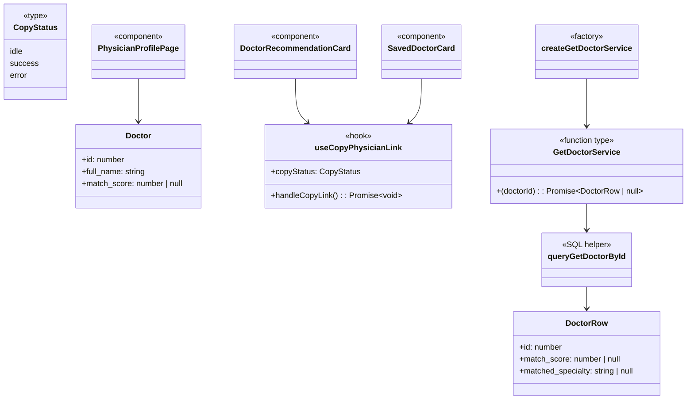

# User Story 99 — Development Specification

## User story

As a patient who values my family’s opinion, I want to copy or share a physician profile link so that I can discuss options with family before deciding.

## Related issue

- Parent user story: [#99](https://github.com/Yuxiang-Huang/DocSeek/issues/99)
- Dev spec stage: [#110](https://github.com/Yuxiang-Huang/DocSeek/issues/110)
- Documents implementation PR: [#111](https://github.com/Yuxiang-Huang/DocSeek/pull/111)
- Documents tests PR: [#113](https://github.com/Yuxiang-Huang/DocSeek/pull/113)

## Story ownership

| Role | Owner | Notes |
| --- | --- | --- |
| **Primary owner** | acee3 ([@acee3](https://github.com/acee3)) | Assignee on stage issues and merger of implementation PR [#111](https://github.com/Yuxiang-Huang/DocSeek/pull/111). |
| **Secondary owner** | Yuxiang-Huang ([@Yuxiang-Huang](https://github.com/Yuxiang-Huang)) | Repository maintainer and reviewer context for story tracking and release workflow. |

## Merge date on `main`

**2026-04-19** — User Story 99 is now represented on `main` through merged PRs [#111](https://github.com/Yuxiang-Huang/DocSeek/pull/111) and [#113](https://github.com/Yuxiang-Huang/DocSeek/pull/113), adding share/copy physician links and validated shared-profile loading/fallback behaviors.

## Architecture diagram

```mermaid
flowchart TB
  subgraph browser["Browser (React 19 + TanStack Router)"]
    ResultsCard[Recommendation/Saved cards]
    ProfileRoute[/physician/$id route]
    Clipboard[navigator.clipboard]
  end

  subgraph api["API (Bun + Hono)"]
    App[createApp]
    GetDoctorRoute[GET /doctors/:id]
    SearchSvc[createGetDoctorService]
    Query[queryGetDoctorById]
  end

  subgraph db["Database (PostgreSQL + pgvector)"]
    Doctors[(doctors)]
    DoctorLocations[(doctor_locations)]
    Locations[(locations)]
  end

  subgraph openai["OpenAI"]
    LLM[Existing embeddings/chat services]
  end

  ResultsCard --> Clipboard
  ResultsCard --> ProfileRoute
  ProfileRoute -->|fetchDoctor| GetDoctorRoute
  App --> GetDoctorRoute
  GetDoctorRoute --> SearchSvc
  SearchSvc --> Query
  Query --> Doctors
  Query --> DoctorLocations
  Query --> Locations
  App -. existing story services .-> LLM
```

## Information flow diagram

```mermaid
flowchart LR
  U[User] --> C[Copy link button on card/profile context]
  C --> CLIP[Clipboard writeText]
  C --> URL[/physician/{doctorId}]
  URL --> P[Shared browser session]
  P --> R[Client route: /physician/$id]
  R --> F[fetchDoctor(doctorId)]
  F --> API[GET /doctors/:id]
  API --> SQL[queryGetDoctorById]
  SQL --> DB[(doctors + primary location)]
  DB --> API
  API --> R
  R --> V[Profile details OR safe unavailable/error state]
```

| Data element | Producer | Consumer | Purpose |
| --- | --- | --- | --- |
| `doctorId` | Card/profile UI state | URL builder + API route param | Ensure shared link points to the intended physician. |
| `/physician/{id}` URL | `getPhysicianProfileUrl` | Clipboard + recipient browser | Shareable, human-readable physician profile link. |
| Clipboard write result | Browser clipboard API | `useCopyPhysicianLink` | Drive success/error UI feedback. |
| `{ doctor }` payload | `GET /doctors/:id` | `fetchDoctor` + profile route | Render profile card for valid physician ID. |
| `404 doctor not found` | API route | Profile route | Show safe unavailable fallback instead of crashing. |
| `4xx/5xx error` message | API route | Profile route | Show error state with user-visible guidance. |

## Class diagram



## Implementation reference: types, modules, and components

### `api/src/index.ts` — HTTP route wiring for physician retrieval

**Public**

| Name | Kind | Purpose |
| --- | --- | --- |
| `createApp` | Function | Registers `GET /doctors/:id` with validation, not-found handling, and error responses. |
| `GetDoctorService` | Type export | Re-exported dependency contract for injected doctor lookup service. |

**Private**

| Name | Purpose |
| --- | --- |
| `AppDependencies` | Internal DI shape now including optional `getDoctorService`. |

---

### `api/src/search.ts` — service factory for single-doctor retrieval

**Public**

| Name | Kind | Purpose |
| --- | --- | --- |
| `DoctorRow.match_score` | Type field | Made nullable so search rows and single-profile rows share a compatible shape. |
| `GetDoctorService` | Type | Async contract returning one doctor row or `null`. |
| `createGetDoctorService` | Function | Creates Bun SQL-backed service using `queryGetDoctorById`. |

**Private**

| Name | Purpose |
| --- | --- |
| `SearchRuntimeConfig.databaseUrl` usage | Existing config field reused for get-by-id SQL service construction. |

---

### `api/src/queries.ts` — SQL query for doctor-by-id

**Public**

| Name | Kind | Purpose |
| --- | --- | --- |
| `queryGetDoctorById` | Function | Selects a doctor by id, joins primary location coordinates, and returns `DoctorRow[]` (0 or 1 row). |

**Private**

_None._

---

### `api/src/server.ts` — runtime composition

**Public**

| Name | Kind | Purpose |
| --- | --- | --- |
| `createGetDoctorService(config)` injection | Module wiring | Attaches the new doctor-by-id service to `createApp`. |

**Private**

_None beyond module-local `config` and `app` wiring._

---

### `client/src/components/App.tsx` — shared URL/fetch helpers and recommendation card action

**Public**

| Name | Kind | Purpose |
| --- | --- | --- |
| `getPhysicianProfileUrl` | Function | Builds canonical share URL `${origin}/physician/{id}`. |
| `getDoctorUrl` | Function | Builds API URL for doctor lookup endpoint. |
| `fetchDoctor` | Function | Fetches physician profile data; returns `Doctor \| null` and throws on non-404 errors. |
| `DoctorRecommendationCard` | Component | Adds copy-link action, success state (`Link copied!`), and fallback guidance on clipboard failure. |

**Private**

| Name | Purpose |
| --- | --- |
| `copyStatus` state usage in card rendering | Drives success/error visual feedback and timed reset behavior via hook. |

---

### `client/src/hooks/useCopyPhysicianLink.ts` — clipboard behavior

**Public**

| Name | Kind | Purpose |
| --- | --- | --- |
| `useCopyPhysicianLink` | Hook | Encapsulates clipboard write, success/error status, and reset timers for copy UX. |

**Private**

| Name | Purpose |
| --- | --- |
| `CopyStatus` | Local union type (`idle | success | error`) for view state. |
| `timerRef` | Clears prior timers on retry/unmount to prevent stale state updates. |

---

### `client/src/routes/saved.tsx` — saved physician copy-link entry point

**Public**

| Name | Kind | Purpose |
| --- | --- | --- |
| `SavedDoctorCard` | Component | Adds copy-link action and fallback “Open profile to share link” guidance in saved context. |

**Private**

_None beyond component-local state/props wiring._

---

### `client/src/routes/physician.$id.tsx` — shared physician profile route

**Public**

| Name | Kind | Purpose |
| --- | --- | --- |
| `Route` (`/physician/$id`) | TanStack file route | Resolves shared URL to a physician profile view. |

**Private**

| Name | Purpose |
| --- | --- |
| `PhysicianProfilePage` | Handles loading, invalid id, not-found, and error states safely. |
| `PhysicianProfileCard` | Renders physician details and external links for successful fetches. |

---

### Test coverage references (merged in PR #113)

**Public**

| Module | Coverage added |
| --- | --- |
| `api/src/tests/index.test.ts` | `GET /doctors/:id` success, invalid-id, not-found, unconfigured service, thrown-error paths. |
| `api/src/tests/queries.test.ts` | `queryGetDoctorById` SQL helper behavior and error propagation. |
| `api/src/tests/search.test.ts` | `createGetDoctorService` null/success behavior. |
| `client/src/tests/useCopyPhysicianLink.test.ts` | Clipboard success/error and timer resets. |
| `client/src/tests/copyLinkUi.test.tsx` | Card-level copy action wiring and fallback UI. |
| `client/src/tests/physician.test.tsx` | `/physician/$id` success and safe fallback/error route states. |

**Private**

_N/A for test modules._

## Technologies table (new dependencies only)

No new dependencies were added in PRs [#111](https://github.com/Yuxiang-Huang/DocSeek/pull/111) and [#113](https://github.com/Yuxiang-Huang/DocSeek/pull/113).

| Technology | Version | Purpose | Why chosen | Docs |
| --- | --- | --- | --- | --- |
| None | — | Story implemented with existing stack modules only. | Avoids dependency churn for a routing/API enhancement. | — |

## Database schema

No schema changes in this story.

The implementation reuses existing tables (`doctors`, `doctor_locations`, `locations`) through a new read query (`queryGetDoctorById`) only.

## Failure-mode effects

| Failure mode | User-visible effect | Internally visible effect |
| --- | --- | --- |
| Clipboard API denied/unavailable | Inline error shown with fallback link (`Open profile to share link`). | `navigator.clipboard.writeText` rejects; hook sets `copyStatus = "error"` and auto-resets. |
| Invalid shared physician ID (non-numeric or `< 1`) | “Physician not found” safe fallback view. | Route short-circuits before fetch; API also returns `400` for invalid ids. |
| Physician no longer exists | “Physician not found” safe fallback view without crash. | API returns `404 { error: "doctor not found" }`; `fetchDoctor` maps 404 to `null`. |
| Backend service misconfigured or throws | “Unable to load profile” message shown. | API returns `500` with error payload; client throws and displays error state. |
| Timer overlap from repeated copy clicks | Status still recovers to idle cleanly. | Hook clears old timeout before setting a new status timer. |

## Personally Identifying Information (PII)

No new user PII is collected or stored by this story.

- Copy/share uses an existing physician identifier in the URL path only.
- Retrieved physician data is existing provider profile data already stored in DocSeek.
- Clipboard operations stay in-browser; no new persistence layer is introduced.
